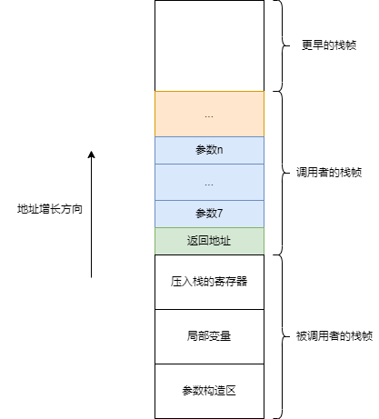

- [可变参函数示例](#可变参函数示例)
- [实现原理](#实现原理)
- [参考资料](#参考资料)

# 可变参函数示例

我们可以通过C标准库`stdarg.h`定义的宏自己实现可变参数函数。

```c
#include <stdio.h>
#include <stdarg.h>

int sum_of(int num, ...)
{
    va_list ap;
    va_start(ap, num); // 用最后一个参数来定位可变参数地址

    int sum = 0;
    for (int i = 0; i < num; i++)
    {
        // 挨个获取可变参数，这里传入的都是int变量类型的参数
        int n = va_arg(ap, int);
        sum += n;
    }

    va_end(ap);

    return sum;
}

int main(void)
{
    int sum = sum_of(3, 1, 2, 3);

    printf("sum = %d", sum); //输出6

    return 0;
}
```

这里有一个小知识点，那就是在作为不定参数的时候，比如调用`printf`，`char`和`short`会直接提升为`int`类型，`float`类型则会直接提升为`double`类型，这也是为什么`printf`中输出`short`和`int`都是用`%d`，`float`和`double`都是用`%f`的原因。

# 实现原理

简单理解就是不变参数都是按顺序压入栈空间的，只要通过最后一个变量名找到不变参数的起始地址即可。然后根据要查找的对象的类型挨个进行解析，所以解析的时候设置的类型一定要和实参匹配。

相当于下面的代码。

```c
// 占用的空间长度，按int大小对齐
#define _INTSIZEOF(n) ( (sizeof(n) + sizeof(int) - 1) & ~(sizeof(int) - 1) )

// 获取可变参数列表的第一个参数的地址
#define va_start(ap,v) ( ap = (va_list)&v + _INTSIZEOF(v) )

// 获取可变参数的当前参数
#define va_arg(ap,t) ( *(t *)((ap += _INTSIZEOF(t)) - _INTSIZEOF(t)) )

// 清空va_list可变参数列表：
#define va_end(ap) ( ap = (va_list)0 )
```

该代码在x86机器上可以运行，但该代码并不是可移植的。因为x86机器一般使用`cdecl`函数调用约定，参数都是压栈传递，并且也是按`int`大小4字节对齐的。

但是如果迁移到x86-64机器上，使用`system v abi`函数调用约定。那么前6个参数通过寄存器传递，后面的参数才压栈传递，也是按8字节对齐了。



这时其实需要靠编译器来实现这个功能了，因为只有编译器才知道参数的布局，实际`<stdarg.h>`中也是这样写的。

```c
typedef __builtin_va_list va_list;

#define va_start(ap, last)  (__builtin_va_start(ap, last))
#define va_arg(ap, type)  (__builtin_va_arg(ap, type))
#define va_end(ap)
```

但原理其实也是一样的。比如gcc在编译可变参数函数时，会将传入寄存器的参数压到被调用者的栈。然后再通过地址偏移来挨个获取参数。只是要复杂一些，因为前6个参数和第7个参数不是连续的，所以需要在`va_list`中多记录调用者栈中的参数起始地址。

以及一些细节，这里就不多写了。

# 参考资料

- [探索X86架构C可变参数函数实现原理](https://blog.csdn.net/m0_50662680/article/details/127709109)
