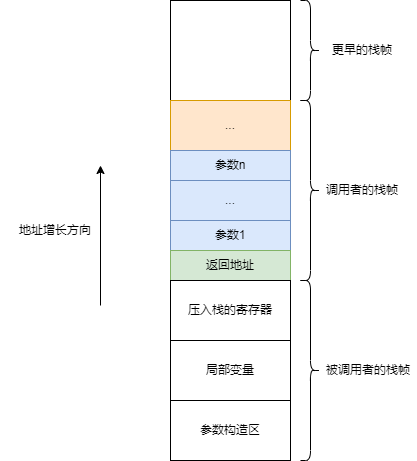

- [函数调用约定](#函数调用约定)
  - [cdecl](#cdecl)
  - [stdcall](#stdcall)
  - [system v abi](#system-v-abi)
- [参考资料](#参考资料)

# 函数调用约定

函数调用约定定义了C/C++程序的二进制接口（ABI Application Binary Interface）。这样函数生成的机器级别代码才可以被正确调用，生成的目标文件才可以被正确链接。

函数调用约定一般规定了：

- 函数参数如何传递（通过寄存器还是压栈，压栈的顺序是怎样的）。
- 哪些寄存器由调用者保存（caller saved），哪些由被调用者保存（callee saved）。
- 函数的返回值如何传递。
- 压栈的参数由谁出栈。

不同的处理器架构调用约定也不一样。在x86架构中，主要有`cdecl`，`stdcall`，`fastcall`这几种调用约定。在x86-64架构中，主要有`system v abi`，`microsoft x64`调用约定。

## cdecl

`cdecl`（C Declaration）是C语言默认的函数调用约定，`cdecl`压栈的参数由调用者出栈，所以适合实现可变参数的函数，比如`printf`。

`cdecl`函数调用约定如下：

- 函数参数从右到左压栈。
- `%eax`，`%ecx`，`%edx`为caller saved寄存器，`%ebx`，`%ebp`，`%esp`，`%esi`，`%edi`为callee saved寄存器。
- 函数返回值通过`%eax`寄存器保存，浮点型结果通过`%st0`保存。
- 压栈的参数由调用者出栈，调用者执行`add $N %esp`。

## stdcall

`stdcall`是32位windows上的函数调用约定，和`cdecl`的主要区别是，压栈的参数由被调用者出栈，以便减少代码量。但这样就不能实现可变参数的函数了。

`stdcall`函数调用约定如下:

- 压栈的参数由被调用者出栈，被调用者执行`ret $N`。

## system v abi

在x86-64机器上使用`system v abi`函数调用约定，由于通用寄存器增加了，所以前6个参数都是通过寄存器传递，提高效率。

`system v abi`函数调用约定如下：

- 函数的前6个参数通过寄存器传递，第1到第6个参数分别存放在`%rdi`, `%rsi`, `%rdx`, `%rcx`, `%r8`, `%r9`，后续的参数从右到左压栈传递。
- `%r10`，`%r11`，`%rax`，`%rdi`，`%rsi`，`%rdx`，`%rcx`，`%8`，`%r9`为caller saved寄存器，`%rbx`，`%rbp`，`%r12`，`%r13`，`%r14`，`%r15`为callee saved寄存器。
- 函数返回值通过`%eax`寄存器保存，浮点型结果通过`%xmm0`保存。
- 压栈的参数由调用者出栈，调用者执行`add $N %esp`。
- 栈内存对齐，在调用`call`指令之前，`%rsp`指针必须是16的倍数。

# 参考资料
