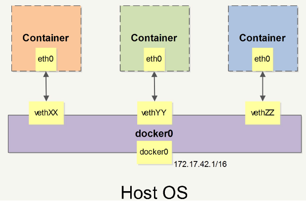

- [docker0网络](#docker0网络)
- [自定义网络](#自定义网络)
- [参考资料](#参考资料)

# docker0网络

docker启动后会自动创建名为`docker0`的虚拟网桥，功能类似于局域网中的交换机。同时，docker会分配一个本地未使用的虚拟网段，比如`172.17.0.0/16`，并将第一个ip`172.17.0.1`作为虚拟网桥的ip。

```bash
rc@rc-virtual-machine:~$ ip addr
3: docker0: <NO-CARRIER,BROADCAST,MULTICAST,UP> mtu 1500 qdisc noqueue state DOWN group default 
    link/ether 02:42:c6:e5:c9:f0 brd ff:ff:ff:ff:ff:ff
    inet 172.17.0.1/16 brd 172.17.255.255 scope global docker0
       valid_lft forever preferred_lft forever
```

每当创建一个容器的时候，默认使用`docker0`网络，这时会为其创建一对`veth pair`接口，用于连接容器和网桥，类似于物理机连接到交换机的网口一样，于是就可以互联互通了。



# 自定义网络

一般用`docker-compose`部署多个容器的时候，会创建自定义的网络，默认也是网桥类型，在这个网络里面还有dns的功能，可以根据容器名找到对方。下面的`docker-compose`部署文件就会创建一个默认的自定义网络，`redis-web`通过域名找到`redis-app`。

```yaml
version: "3.4"
services:
  redis-web:
    image: redis-web:1.0
    container_name: redis-web
    environment:
      REDIS_HOST: redis-app
    ports:
      - 8001:8001
    depends_on:
      - redis-app
  redis-app:
    image: redis:latest
    container_name: redis-app
```

新建的容器会连接到`tmp_default`网桥上，这里命名是根据当前所在文件夹的名字命名的，所以最好还是手动指定网络名词，避免冲突。

```bash
rc@rc-virtual-machine:~/tmp$ docker network ls
NETWORK ID     NAME          DRIVER    SCOPE
5e2e134bc1e5   bridge        bridge    local
1e01eb87e5dc   host          host      local
2c5d99ecc6a1   none          null      local
fc658398071f   tmp_default   bridge    local
```

# 参考资料

- [Docker网络详解](https://www.cnblogs.com/xhyan/p/6235999.html)
- [docker-compose网络配置](https://www.jianshu.com/p/347831f72d1c)
