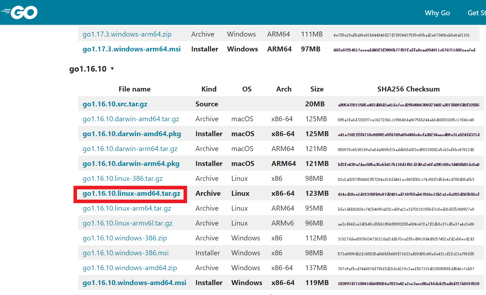

- [安装golang](#安装golang)
- [参考资料](#参考资料)

# 安装golang

登录[Download Golang](https://golang.google.cn/dl/)，选择合适的安装包，这里我的操作系统是linux，芯片是amd64的，然后选择下载`go1.16.10`。



这里直接用命令行下载到centos7主机中。

```bash
wget https://golang.google.cn/dl/go1.16.10.linux-amd64.tar.gz
```

解压安装包到`/usr/local`目录下。

```bash
sudo tar -C /usr/local -xzf go1.16.10.linux-amd64.tar.gz
```

设置环境变量`vi $HOME/.bash_profile`。

```bash
export PATH=$PATH:/usr/local/go/bin
```

重新登录刷新环境变量，测试`go version`，查看版本信息是否正确。

```bash
[rc@localhost ~]$ go version
go version go1.16.10 linux/amd64
```

创建gopath目录。

```bash
mkdir -p ~/go/bin ~/go/src ~/go/pkg
```

# 参考资料

- [Download Golang](https://golang.google.cn/dl/)
- [Install Golang](https://golang.google.cn/doc/install)
