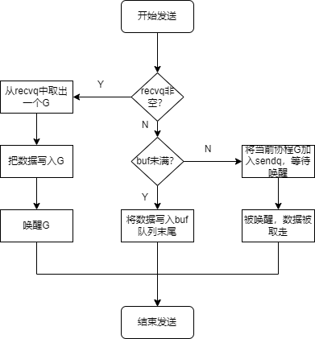
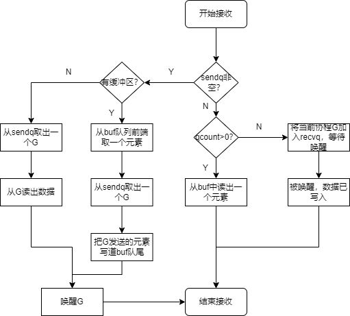

- [channel](#channel)
	- [创建channel](#创建channel)
	- [通道发送和接收数据](#通道发送和接收数据)
	- [channel底层结构](#channel底层结构)
	- [channel复用](#channel复用)
- [参考资料](#参考资料)

# channel

## 创建channel

channel是引用类型，默认初始值是`nil`，需要通过`make(chan type[, 缓冲区大小])`创建实例。

```go
// 无缓冲区的通道
ch := make(chan int)

// 带缓冲区的通道
ch := make(chan int, 10)
```

## 通道发送和接收数据

通道发送和接收数据都是阻塞式的操作。并且使用`close`函数关闭通道之后，后续的发送调用都会`panic`，而后续的接收调用可以正常使用。

但是后续的接收调用在接收完缓冲区中的数据后，再接收就会直接返回通道数据类型的空值，这时可以用`value, ok := <- ch`语法来判断通道是否已经关闭。

```go
// 该操作也是阻塞式的，只是如果读到通道被关闭，那么ok返回false
value, ok := <- ch

// 在循环里面就可以这样判断
for {
	n, ok := <-ch
	fmt.Println(n, ok)
	if !ok {
		break
	}
}
```

使用`for range`也可以到达相同的效果

```go
for n := range ch {
	fmt.Println(n)
}
```

当`close`一个已经close的channel，或者`nil` channel时，都会引起`panic`。

## channel底层结构

channel的底层数据结构是`hchan`，主要用了一个循环队列还有一个互斥锁来实现功能。

```go
type hchan struct {
	qcount   uint                 // 队列中所有数据总数
	dataqsiz uint                 // 循环队列大小
	buf      unsafe.Pointer       // 指向循环队列的指针
	elemsize uint16               // 循环队列中元素的大小
	closed   uint32               // chan是否关闭的标识
	elemtype *_type               // 循环队列中元素的类型
	sendx    uint                 // 已发送元素在循环队列中的位置
	recvx    uint                 // 已接收元素在循环队列中的位置
	recvq    waitq                // 等待接收的goroutine的等待队列
	sendq    waitq                // 等待发送的goroutine的等待队列
	lock mutex                    // 控制chan并发访问的互斥锁
}
```

实现的原理和一般的同步队列差不多，只是在其它语言里面，一般是互斥锁+条件变量来实现读写线程的休眠和通知，在go里面直接就是操作协程来实现休眠和通知功能。

写数据流程：



读数据流程：



## channel复用

go中提供`select`语法，可以对channel进行复用。`select`随机选择一个就绪的可读或者可写的channel执行，如果都没有就绪就会陷入等待，上下面的代码会随机输出0和1的序列。

```go
func main() {
	ch := make(chan int, 1)
	for {
		select {
		case ch <- 0:
		case ch <- 1:
		}
		i := <-ch
		fmt.Println(i)
	}
}
```

`select`的原理跟`channel`也差不多，也是将当前的协程添加到通道的等待队列中，等待唤醒不过是对多个`channel`一起来操作。步骤如下：

1. 获取`case`数组，每一个`case`底层结构记录了对应的`channel`。
2. 将`case`数组顺序随机打乱（实现随机选择就绪的`channel`的效果）。
3. 将`case`数组内的每个`channel`全部上锁。
4. 遍历所有的`case`数组元素, 查看其是否可读或可写。
5. 如果有可读或可写`case`, 解锁所有的`chan`, 返回对应的`channel`数据。
6. 如果没有可读或可写, 有`defalut`, 解锁所有的`channel`, 返回`default`对应的`case`。
7. 如果两者都没有, 则将当前的协程G加入所有`channel`的等待队列中, 然后所有`channel`解锁。
8. 等待协程被唤醒。

# 参考资料

- [Go Channel的基本使用及底层原理详解](https://blog.csdn.net/y1391625461/article/details/124292119)
