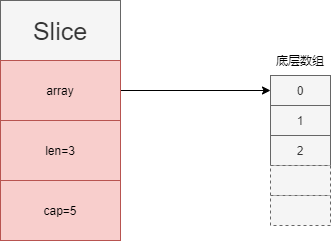

- [go数组](#go数组)
	- [初始化](#初始化)
	- [访问下标大于等于`length`的元素会panic](#访问下标大于等于length的元素会panic)
	- [for range遍历数组](#for-range遍历数组)
	- [数组的比较](#数组的比较)
- [go切片](#go切片)
	- [初始化](#初始化-1)
	- [访问下标大于等于`length`的元素会panic](#访问下标大于等于length的元素会panic-1)
	- [for range遍历数组](#for-range遍历数组-1)
	- [截取子切片](#截取子切片)
	- [切片的比较](#切片的比较)
	- [nil切片和空切片](#nil切片和空切片)
	- [append追加元素](#append追加元素)
	- [copy拷贝切片](#copy拷贝切片)
- [参考资料](#参考资料)

# go数组

数组是一组相同类型元素的线性序列，在go中，数组是值类型，所以拷贝时效率较低。并且数组的大小也是类型的一部分，所以`[5]T`和`[10]T`是不同的数组类型。

## 初始化

|                 方式                 |           代码示例            |
| :----------------------------------: | :---------------------------: |
|    默认值初始化，所有元素为默认值    |       `var arr [10]int`       |
|             字面值初始化             |  `var arr = [3]int{1, 2, 3}`  |
|        也可以自动推导数组长度        | `var arr = [...]int{1, 2, 3}` |
| 指定特定元素的值，其余元素还是默认值 |   `var arr = [3]int{2: 1}`    |

## 访问下标大于等于`length`的元素会panic

```go
nums := [10]int{}
length := len(nums)

// panic: runtime error: index out of range [10] with length 10
fmt.Println(nums[length])
```

## for range遍历数组

```go
var ns [10]int
for idx, n := range ns {
	fmt.Println(idx, n)
}
```

## 数组的比较

若两个数组的类型是一样的，并且数组元素是可比较的，那么该数组也是可以比较的，`==`操作符会自动判断数组中的元素是否一一相等。

```go
var ns [10]int
var ns2 [10]int
fmt.Println(ns == ns2)
```

# go切片

切片slice是对数组的引用，多个slice可以指向相同的底层数组，并且支持动态扩展长度。slice中记录了底层数组的地址，包含的元素个数，总的容量信息。



## 初始化

|                方式                |             代码示例             |
| :--------------------------------: | :------------------------------: |
|         默认初始化为`nil`          |        `var slice []int`         |
|     字面值，相当于从数组中截取     |    `slice := []int{1, 2, 3}`     |
|               `make`               | `slice := make([]int, len, cap)` |
| 从数组中截取，表示截取[start, end) |   `slice := array[start:end]`    |
| 从切片中截取，表示截取[start, end) |   `slice := slice[start:end]`    |

## 访问下标大于等于`length`的元素会panic

同数组类似。

## for range遍历数组

同数组类似。

## 截取子切片

`s[low:high]`表示截取[low,high)范围的数据，`low <= len(str)`并且`high <= cap(str)`，否则会`panic`。

```go
nums := [10]int{0, 1, 2, 3, 4, 5, 6, 7, 8, 9}
s1 := nums[0:1]

fmt.Println(len(s1), cap(s1)) // 输出 1 10s

s2 := s1[0:cap(s1)]

fmt.Println(len(s2), cap(s2)) // 输出 10 10
fmt.Println(s2)               // 输出 [0 1 2 3 4 5 6 7 8 9]
```

## 切片的比较

切片类型是不能相互比较的，只能和`nil`进行比较，判断是否为`nil`切片。要实现包含的元素是否相等就要自己写个循环判断。

```go
var ns []int
fmt.Println(ns == nil) // true
```

对于`[]byte`类型切片，可以利用`bytes.Equal`函数来比较。

```go
b1 := []byte{1, 2, 3}
b2 := []byte{1, 2, 4}

fmt.Println(bytes.Equal(b1, b2)) // false
```

对于其他类型的切片，也可以利用`reflect.DeepEqual`来实现。

```go
n1 := []int{1, 2, 3}
n2 := []int{1, 2, 4}

fmt.Println(reflect.DeepEqual(n1, n2)) // false
```

## nil切片和空切片

`nil`切片和空切片是不一样的，`nil`切片表示这个切片对象为空，空切片表示切片中包含的元素为空。

```go
var s2 []int  // nil切片
s1 := []int{} // 空切片
```

## append追加元素

使用内置的append函数来给切片追加元素，当超出当前容量（`cap(s)`）时，会以2倍的增速重新申请空间，得到一个新的底层数组，然后将原切片中的元素拷贝到新的切片中。

```go
s1 := []int{}
s1 = append(s1, 1, 2, 3)
fmt.Println(s1) // [1 2 3]
```

## copy拷贝切片

`copy(dest, src)`将`src`切片拷贝到`dest`切片中。拷贝的数量为`min(len(src), len(dest))`。

```go
s1 := []int{1, 2, 3}
s2 := make([]int, 10)
copy(s2, s1)
fmt.Println(s2) // 输出 [1 2 3 0 0 0 0 0 0 0]
```

# 参考资料

- [Golang 入门 : 数组](https://blog.csdn.net/dupeng0811/article/details/89876287)
