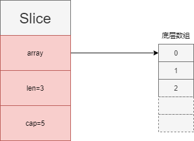

- [go数组](#go数组)
	- [初始化](#初始化)
	- [访问不存在的元素会panic](#访问不存在的元素会panic)
	- [for range遍历数组](#for-range遍历数组)
	- [数组的比较](#数组的比较)
- [go切片](#go切片)
	- [初始化](#初始化-1)
	- [访问不存在的元素会panic](#访问不存在的元素会panic-1)
	- [for range遍历数组](#for-range遍历数组-1)
	- [切片的比较](#切片的比较)
	- [nil切片和空切片](#nil切片和空切片)
	- [append追加元素](#append追加元素)
- [参考资料](#参考资料)

# go数组

数组是一组相同类型元素的线性序列，在go中，数组是值类型，所以拷贝时效率较低。并且数组的大小也是类型的一部分，所以`[5]T`和`[10]T`是不同的数组类型。

## 初始化

|                 方式                 |           代码示例            |
| :----------------------------------: | :---------------------------: |
|    默认值初始化，所有元素为默认值    |       `var arr [10]int`       |
|             字面值初始化             |  `var arr = [3]int{1, 2, 3}`  |
|        也可以自动推导数组长度        | `var arr = [...]int{1, 2, 3}` |
| 指定特定元素的值，其余元素还是默认值 |   `var arr = [3]int{2: 1}`    |

## 访问不存在的元素会panic

```go
func main() {
	var ns [10]int
	for i := 0; i <= len(ns); i++ {
		// 当i等于10时，抛出panic: runtime error: index out of range [10] with length 10
		fmt.Println(ns[i])
	}
}
```

## for range遍历数组

```go
func main() {
	var ns [10]int
	for idx, n := range ns {
		fmt.Println(idx, n)
	}
}
```

## 数组的比较

若两个数组的类型是一样的，并且数组元素是可比较的，那么该数组也是可以比较的，`==`操作符会自动判断数组中的元素是否一一相等。

```go
func main() {
	var ns [10]int
	var ns2 [10]int
	fmt.Println(ns == ns2)
}
```

# go切片

切片slice是对数组的引用，多个slice可以指向相同的底层数组，并且支持动态扩展长度。slice中记录了底层数组的地址，slice包含的元素个数，slice支持的总的容量。



## 初始化

|                   方式                   |             代码示例              |
| :--------------------------------------: | :-------------------------------: |
|            默认初始化为`nil`             |         `var slice []int`         |
|        字面值，相当于从数组中截取        |     `slice := []int{1, 2, 3}`     |
|                  `make`                  | `slice := make([]int, len, cap)`  |
| 从数组中截取，表示截取[startIdx, endIdx) | `slice := array[startIdx:endIdx]` |
| 从切片中截取，表示截取[startIdx, endIdx) | `slice := slice[startIdx:endIdx]` |

## 访问不存在的元素会panic

同数组类似。

## for range遍历数组

同数组类似。

## 切片的比较

切片类型是不能相互比较的，只能和`nil`进行比较，判断是否为`nil`切片。要实现包含的元素是否相等就要自己写个循环判断。

```go
func main() {
	var ns []int
	fmt.Println(ns == nil) // true
}
```

对于`[]byte`类型切片，可以利用`bytes.Equal`函数来比较。

```go
package main

import (
	"bytes"
	"fmt"
)

func main() {
	b1 := []byte{1, 2, 3}
	b2 := []byte{1, 2, 3}
	b3 := []byte{4, 5, 6}

	fmt.Println(bytes.Equal(b1, b2)) // true
	fmt.Println(bytes.Equal(b1, b3)) // false
}

```

对于其他类型的切片，也可以利用`reflect.DeepEqual`来实现。

```go
package main

import (
	"fmt"
	"reflect"
)

func main() {
	b1 := []int{1, 2, 3}
	b2 := []int{1, 2, 3}
	b3 := []int{4, 5, 6}

	fmt.Println(reflect.DeepEqual(b1, b2)) // true
	fmt.Println(reflect.DeepEqual(b1, b3)) // false
}

```

## nil切片和空切片

`nil`切片和空切片是不一样的，`nil`切片表示这个切片对象为空，空切片表示切片中包含的元素为空。

```go
    s1 := []int{} // 空切片
    var s2 []int  // nil切片
```

## append追加元素

使用系统的append函数，超出当前容量后（`cap`），会以2倍的增速重新申请空间，得到一个新的底层数组，然后将原切片中的元素拷贝到新的切片中。

```go
func main() {
    s1 := []int{}
    s1 = append(s1, 1, 2, 3)
    fmt.Println(s1) // [1 2 3]
}
```

# 参考资料

- [Golang 入门 : 数组](https://blog.csdn.net/dupeng0811/article/details/89876287)
