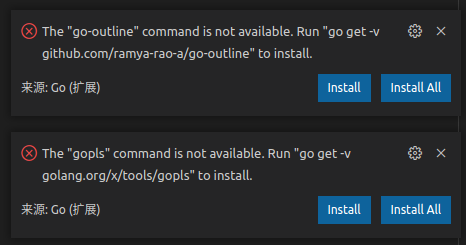
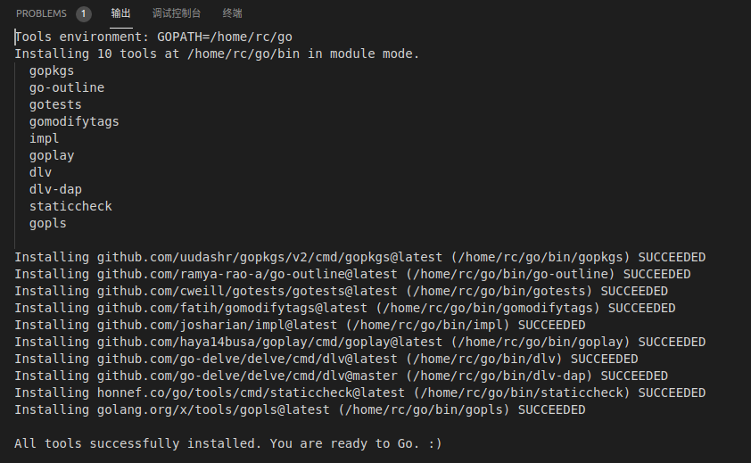

- [安装go插件](#安装go插件)
- [参考资料](#参考资料)

# 安装go插件

go插件提供了代码高亮，补全，跳转，格式化等功能。


然后随便打开一个go语言文件，vscode就会提醒还需要下载各种go工具，这里点`install All`。或者按`ctrl+shift+p`调出命令面板，输入`Go: Install/Update Tools`。



但是在国内会出现下载失败的现象，这个时候需要设置以下go的代理，从指定的代理那里下载go工具。

```bash
go env -w GO111MODULE="on"
go env -w GOPROXY=https://goproxy.io
```

然后重新点击`install All`即可成功（我当前是ubuntu环境，有的工具依赖gcc，所以需要先安装好gcc）。



# 参考资料

- [一招完美解决vscode安装go插件失败问题](https://blog.csdn.net/qq_41065919/article/details/107710144)
