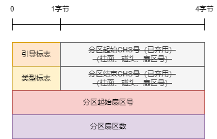

- [mbr分区](#mbr分区)
- [参考资料](#参考资料)

# mbr分区

主引导记录（Master Boot Record）分区，在磁盘的第一个扇区（512字节）记录引导程序和分区表，结构如下。

|       字段        |  大小   |                             说明                             |
| :---------------: | :-----: | :----------------------------------------------------------: |
| 主引导记录（MBR） | 446字节 |                                                              |
| 磁盘分区表（DPT） | 64字节  | 每个分区16字节，最多支持4个主分区，或者3个主分区+1个扩展分区 |
|     结束标志      |  2字节  |                        固定为`55 aa`                         |

扩展分区可以创建多个逻辑分区，每个逻辑分区的第一个扇区记录着当前分区和下一个逻辑分区信息。

对于分区表中的每一个分区，结构如下。

- 引导标志：80H表示活动分区，00H表示非活动分区。
- 类型标志

| 类型标志 |        说明         |
| :------: | :-----------------: |
|   0fH    | LBA寻址模式extended |
|   83H    |    Linux nature     |
|   85H    |   Linux extended    |
|   8eH    |      Linux lvm      |

- 分区起始扇区号：最大只能计算到2TB，所以MBR最大只支持2TB的磁盘分区。并且需要考虑扇区对齐，因为物理扇区的大小不一定等于逻辑扇区的大小，所以要让划分的逻辑扇区和物理扇区对齐，linux和window中默认对齐扇区数为2048（一般为1MB）。

# 参考资料

- [磁盘MBR分区理解](https://blog.csdn.net/lijiewen2017/article/details/123903780)
- [分区4K对齐那些事](https://www.diskgenius.cn/exp/about-4k-alignment.php)
