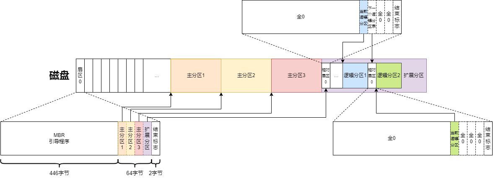

- [mbr分区](#mbr分区)
  - [mbr分区结构](#mbr分区结构)
  - [创建mbr分区测试](#创建mbr分区测试)
  - [查看mbr分区表](#查看mbr分区表)
- [参考资料](#参考资料)

# mbr分区

## mbr分区结构

主引导记录（Master Boot Record）分区，在磁盘的第一个扇区（512字节）记录引导程序和分区表，结构如下。

|       字段        |  大小   |                             说明                             |
| :---------------: | :-----: | :----------------------------------------------------------: |
| 主引导记录（MBR） | 446字节 |                                                              |
| 磁盘分区表（DPT） | 64字节  | 每个分区16字节，最多支持4个主分区，或者3个主分区+1个扩展分区 |
|     结束标志      |  2字节  |                        固定为`55 aa`                         |

在扩展分区中可以创建多个逻辑分区，扩展分区指向第一个逻辑分区表，每个逻辑分区表记录着当前逻辑分区和下一个逻辑分区表信息。



对于分区表中的每一个分区，结构如下。


- 引导标志：80H表示活动分区，00H表示非活动分区。
- 类型标志

| 类型  |        说明         | 类型  |       说明        | 类型  |         说明          | 类型  |       说明        |
| :---: | :-----------------: | :---: | :---------------: | :---: | :-------------------: | :---: | :---------------: |
|  00   |       `Empty`       |  24   |     `NEC DOS`     |  81   |   `Minix/old Linux`   |  bf   |     `Solaris`     |
|  01   |       `FAT12`       |  27   | `Hidden NTFS Win` |  82   |     `Linux swap`      |  c1   |    `DRDOS/sec`    |
|  02   |    `XENIX root`     |  39   |     `Plan 9`      |  83   |        `Linux`        |  c4   |    `DRDOS/sec`    |
|  03   |     `XENIX usr`     |  3c   | `PartitionMagic`  |  84   |   `OS/2 hidden C:`    |  c6   |    `DRDOS/sec`    |
|  04   |    `FAT16 <32M`     |  40   |   `Venix 80286`   |  85   |   `Linux extended`    |  c7   |     `Syrinx`      |
|  05   |     `Extended`      |  41   |  `PPC PReP Boot`  |  86   |   `NTFS volume set`   |  da   |   `Non-FS data`   |
|  06   |       `FAT16`       |  42   |       `SFS`       |  87   |   `NTFS volume set`   |  db   |    `CP/M/CTOS`    |
|  07   |  `HPFS/NTFS/exFAT`  |  4d   |     `QNX4.x`      |  88   |   `Linux plaintext`   |  de   |  `Dell Utility`   |
|  08   |        `AIX`        |  4e   | `QNX4.x 2nd part` |  8e   |      `Linux LVM`      |  df   |     `BootIt`      |
|  09   |   `AIX bootable`    |  4f   | `QNX4.x 3rd part` |  93   |       `Amoeba`        |  e1   |   `DOS access`    |
|  0a   | `OS/2 Boot Manage`  |  50   |   `OnTrack DM`    |  94   |     `Amoeba BBT`      |  e3   |     `DOS R/O`     |
|  0b   |     `W95 FAT32`     |  51   | `OnTrack DM6 Aux` |  9f   |       `BSD/OS`        |  e4   |    `SpeedStor`    |
|  0c   |  `W95 FAT32 (LBA)`  |  52   |      `CP/M`       |  a0   | `IBM Thinkpad hidden` |  eb   |     `BeOS fs`     |
|  0e   |  `W95 FAT16 (LBA)`  |  53   | `OnTrack DM6 Aux` |  a5   |       `FreeBSD`       |  ee   |       `GPT`       |
|  0f   |  `W95 Ext'd (LBA)`  |  54   |   `OnTrackDM6`    |  a6   |       `OpenBSD`       |  ef   |       `EFI`       |
|  10   |       `OPUS`        |  55   |    `EZ-Drive`     |  a7   |      `NeXTSTEP`       |  f0   | `Linux/PA-RISC b` |
|  11   |   `Hidden FAT12`    |  56   |   `Golden Bow`    |  a8   |     `Darwin UFS`      |  f1   |    `SpeedStor`    |
|  12   |  `Compaq diagnost`  |  5c   |   `Priam Edisk`   |  a9   |       `NetBSD`        |  f4   |    `SpeedStor`    |
|  14   | `Hidden FAT16 <32M` |  61   |    `SpeedStor`    |  ab   |     `Darwin boot`     |  f2   |  `DOS secondary`  |
|  16   |   `Hidden FAT16`    |  63   | `GNU HURD or Sys` |  af   |      `HFS/HFS+`       |  fb   |   `VMware VMFS`   |
|  17   |  `Hidden HPFS/NTF`  |  64   | `Novell Netware`  |  b7   |       `BSDI fs`       |  fc   | `VMware VMKCORE`  |
|  18   |  `AST SmartSleep`   |  65   | `Novell Netware`  |  b8   |      `BSDI swap`      |  fd   | `Linux raid auto` |
|  1b   | `Hidden W95 FAT32`  |  70   | `DiskSecure Mult` |  bb   | `Boot Wizard hidden`  |  fe   |     `LANstep`     |
|  1c   | `Hidden W95 FAT32`  |  75   |      `PC/IX`      |  be   |    `Solaris boot`     |  ff   |       `BBT`       |
|  1e   | `Hidden W95 FAT16`  |  80   |    `Old Minix`    |       |                       |       |                   |

- 分区起始扇区号：最大只能计算到2TB，所以MBR最大只支持2TB的磁盘分区。并且需要考虑扇区对齐，因为物理扇区的大小不一定等于逻辑扇区的大小，所以要让划分的逻辑扇区和物理扇区对齐，linux和window中默认对齐扇区数为2048（一般为1MB）。

## 创建mbr分区测试

下面尝试对一个块设备进行分区，3个主分区+1个扩展分区，扩展分区中包含2个逻辑分区。

```bash
[rc@centos ~]$ sudo fdisk /dev/sdb
Welcome to fdisk (util-linux 2.23.2).

Changes will remain in memory only, until you decide to write them.
Be careful before using the write command.

# 划分第1个主分区
Command (m for help): n
Partition type:
   p   primary (0 primary, 0 extended, 4 free)
   e   extended
Select (default p): p
Partition number (1-4, default 1): 1
First sector (2048-120176639, default 2048):
Using default value 2048
Last sector, +sectors or +size{K,M,G} (2048-120176639, default 120176639): +16G
Partition 1 of type Linux and of size 16 GiB is set

# 划分第2个主分区
Command (m for help): n
Partition type:
   p   primary (1 primary, 0 extended, 3 free)
   e   extended
Select (default p): p
Partition number (2-4, default 2): 2
First sector (33556480-120176639, default 33556480):
Using default value 33556480
Last sector, +sectors or +size{K,M,G} (33556480-120176639, default 120176639): +16G
Partition 2 of type Linux and of size 16 GiB is set

# 划分第3个主分区
Command (m for help): n
Partition type:
   p   primary (2 primary, 0 extended, 2 free)
   e   extended
Select (default p): p
Partition number (3,4, default 3): 3
First sector (67110912-120176639, default 67110912):
Using default value 67110912
Last sector, +sectors or +size{K,M,G} (67110912-120176639, default 120176639): +16G
Partition 3 of type Linux and of size 16 GiB is set

# 划分扩展分区
Command (m for help): n
Partition type:
   p   primary (3 primary, 0 extended, 1 free)
   e   extended
Select (default e): e
Selected partition 4
First sector (100665344-120176639, default 100665344):
Using default value 100665344
Last sector, +sectors or +size{K,M,G} (100665344-120176639, default 120176639):
Using default value 120176639
Partition 4 of type Extended and of size 9.3 GiB is set

# 划分第1个逻辑分区
Command (m for help): n
All primary partitions are in use
Adding logical partition 5
First sector (100667392-120176639, default 100667392):
Using default value 100667392
Last sector, +sectors or +size{K,M,G} (100667392-120176639, default 120176639): +8G
Partition 5 of type Linux and of size 8 GiB is set

# 划分第2个逻辑分区
Command (m for help): n
All primary partitions are in use
Adding logical partition 6
First sector (117446656-120176639, default 117446656):
Using default value 117446656
Last sector, +sectors or +size{K,M,G} (117446656-120176639, default 120176639):
Using default value 120176639
Partition 6 of type Linux and of size 1.3 GiB is set

# 查看划分好的分区
Command (m for help): p

Disk /dev/sdb: 61.5 GB, 61530439680 bytes, 120176640 sectors
Units = sectors of 1 * 512 = 512 bytes
Sector size (logical/physical): 512 bytes / 512 bytes
I/O size (minimum/optimal): 512 bytes / 512 bytes
Disk label type: dos
Disk identifier: 0x0007ec62

   Device Boot      Start         End      Blocks   Id  System
/dev/sdb1            2048    33556479    16777216   83  Linux
/dev/sdb2        33556480    67110911    16777216   83  Linux
/dev/sdb3        67110912   100665343    16777216   83  Linux
/dev/sdb4       100665344   120176639     9755648    5  Extended
/dev/sdb5       100667392   117444607     8388608   83  Linux
/dev/sdb6       117446656   120176639     1364992   83  Linux

# 保存分区表到磁盘
Command (m for help): w
The partition table has been altered!

Calling ioctl() to re-read partition table.
Syncing disks.
[rc@centos ~]$
```

## 查看mbr分区表

首先查看扇区0，可以看到3个主分区和1个扩展分区信息。

```bash
[rc@centos ~]$ sudo dd if=/dev/sdb bs=512 count=1 2>/dev/null | hexdump -Cv
00000000  fa b8 00 10 8e d0 bc 00  b0 b8 00 00 8e d8 8e c0  |................|
00000010  fb be 00 7c bf 00 06 b9  00 02 f3 a4 ea 21 06 00  |...|.........!..|
00000020  00 be be 07 38 04 75 0b  83 c6 10 81 fe fe 07 75  |....8.u........u|
00000030  f3 eb 16 b4 02 b0 01 bb  00 7c b2 80 8a 74 01 8b  |.........|...t..|
00000040  4c 02 cd 13 ea 00 7c 00  00 eb fe 00 00 00 00 00  |L.....|.........|
00000050  00 00 00 00 00 00 00 00  00 00 00 00 00 00 00 00  |................|
00000060  00 00 00 00 00 00 00 00  00 00 00 00 00 00 00 00  |................|
00000070  00 00 00 00 00 00 00 00  00 00 00 00 00 00 00 00  |................|
00000080  00 00 00 00 00 00 00 00  00 00 00 00 00 00 00 00  |................|
00000090  00 00 00 00 00 00 00 00  00 00 00 00 00 00 00 00  |................|
000000a0  00 00 00 00 00 00 00 00  00 00 00 00 00 00 00 00  |................|
000000b0  00 00 00 00 00 00 00 00  00 00 00 00 00 00 00 00  |................|
000000c0  00 00 00 00 00 00 00 00  00 00 00 00 00 00 00 00  |................|
000000d0  00 00 00 00 00 00 00 00  00 00 00 00 00 00 00 00  |................|
000000e0  00 00 00 00 00 00 00 00  00 00 00 00 00 00 00 00  |................|
000000f0  00 00 00 00 00 00 00 00  00 00 00 00 00 00 00 00  |................|
00000100  00 00 00 00 00 00 00 00  00 00 00 00 00 00 00 00  |................|
00000110  00 00 00 00 00 00 00 00  00 00 00 00 00 00 00 00  |................|
00000120  00 00 00 00 00 00 00 00  00 00 00 00 00 00 00 00  |................|
00000130  00 00 00 00 00 00 00 00  00 00 00 00 00 00 00 00  |................|
00000140  00 00 00 00 00 00 00 00  00 00 00 00 00 00 00 00  |................|
00000150  00 00 00 00 00 00 00 00  00 00 00 00 00 00 00 00  |................|
00000160  00 00 00 00 00 00 00 00  00 00 00 00 00 00 00 00  |................|
00000170  00 00 00 00 00 00 00 00  00 00 00 00 00 00 00 00  |................|
00000180  00 00 00 00 00 00 00 00  00 00 00 00 00 00 00 00  |................|
00000190  00 00 00 00 00 00 00 00  00 00 00 00 00 00 00 00  |................|
000001a0  00 00 00 00 00 00 00 00  00 00 00 00 00 00 00 00  |................|
000001b0  00 00 00 00 00 00 00 00  62 ec 07 00 00 00 00 00  |........b.......|
000001c0  01 01 83 3f 20 00 00 08  00 00 00 00 00 02 00 00  |...? ...........|
000001d0  01 01 83 3f 20 00 00 08  00 02 00 00 00 02 00 00  |...? ...........|
000001e0  01 01 83 3f 20 00 00 08  00 04 00 00 00 02 00 00  |...? ...........|
000001f0  01 01 05 3f 60 37 00 08  00 06 00 b8 29 01 55 aa  |...?`7......).U.|
```

这里需要注意分区的起始扇区值是小端序保存的，实际上要倒过来看。

可以看到第1个主分区，是从第2048扇区（00 00 08 00）开始的，按1MB对齐。

然后查看扩展分区指向的第1个逻辑分区，需要用到dd命令的skip参数，跳过指定的扇区数。

可以看到第1个逻辑分区是从第2048扇区（00 00 08 00）开始的，按1MB对齐，这里的扇区编号是相对于扩展分区而言的。

```bash
# 100665344对应16进制的06 00 08 00
[rc@centos ~]$ sudo dd if=/dev/sdb bs=512 count=1 skip=100665344 2>/dev/null | hexdump -Cv
00000000  00 00 00 00 00 00 00 00  00 00 00 00 00 00 00 00  |................|
00000010  00 00 00 00 00 00 00 00  00 00 00 00 00 00 00 00  |................|
00000020  00 00 00 00 00 00 00 00  00 00 00 00 00 00 00 00  |................|
00000030  00 00 00 00 00 00 00 00  00 00 00 00 00 00 00 00  |................|
00000040  00 00 00 00 00 00 00 00  00 00 00 00 00 00 00 00  |................|
00000050  00 00 00 00 00 00 00 00  00 00 00 00 00 00 00 00  |................|
00000060  00 00 00 00 00 00 00 00  00 00 00 00 00 00 00 00  |................|
00000070  00 00 00 00 00 00 00 00  00 00 00 00 00 00 00 00  |................|
00000080  00 00 00 00 00 00 00 00  00 00 00 00 00 00 00 00  |................|
00000090  00 00 00 00 00 00 00 00  00 00 00 00 00 00 00 00  |................|
000000a0  00 00 00 00 00 00 00 00  00 00 00 00 00 00 00 00  |................|
000000b0  00 00 00 00 00 00 00 00  00 00 00 00 00 00 00 00  |................|
000000c0  00 00 00 00 00 00 00 00  00 00 00 00 00 00 00 00  |................|
000000d0  00 00 00 00 00 00 00 00  00 00 00 00 00 00 00 00  |................|
000000e0  00 00 00 00 00 00 00 00  00 00 00 00 00 00 00 00  |................|
000000f0  00 00 00 00 00 00 00 00  00 00 00 00 00 00 00 00  |................|
00000100  00 00 00 00 00 00 00 00  00 00 00 00 00 00 00 00  |................|
00000110  00 00 00 00 00 00 00 00  00 00 00 00 00 00 00 00  |................|
00000120  00 00 00 00 00 00 00 00  00 00 00 00 00 00 00 00  |................|
00000130  00 00 00 00 00 00 00 00  00 00 00 00 00 00 00 00  |................|
00000140  00 00 00 00 00 00 00 00  00 00 00 00 00 00 00 00  |................|
00000150  00 00 00 00 00 00 00 00  00 00 00 00 00 00 00 00  |................|
00000160  00 00 00 00 00 00 00 00  00 00 00 00 00 00 00 00  |................|
00000170  00 00 00 00 00 00 00 00  00 00 00 00 00 00 00 00  |................|
00000180  00 00 00 00 00 00 00 00  00 00 00 00 00 00 00 00  |................|
00000190  00 00 00 00 00 00 00 00  00 00 00 00 00 00 00 00  |................|
000001a0  00 00 00 00 00 00 00 00  00 00 00 00 00 00 00 00  |................|
000001b0  00 00 00 00 00 00 00 00  00 00 00 00 00 00 00 00  |................|
000001c0  01 02 83 3f 20 01 00 08  00 00 00 00 00 01 00 00  |...? ...........|
000001d0  01 02 05 3f 60 37 00 08  00 01 00 b0 29 00 00 00  |...?`7......)...|
000001e0  00 00 00 00 00 00 00 00  00 00 00 00 00 00 00 00  |................|
000001f0  00 00 00 00 00 00 00 00  00 00 00 00 00 00 55 aa  |..............U.|
```

然后查看第2个逻辑分区。

可以看到第2个逻辑分区是从第2048扇区（00 00 08 00）开始的，按1MB对齐，这里的扇区编号是相对于剩余的扩展分区而言的。

```bash
# 117444608对应16进制的06 00 08 00加上01 00 08 00
[rc@centos ~]$ sudo dd if=/dev/sdb bs=512 count=1 skip=117444608 2>/dev/null | hexdump -Cv
00000000  00 00 00 00 00 00 00 00  00 00 00 00 00 00 00 00  |................|
00000010  00 00 00 00 00 00 00 00  00 00 00 00 00 00 00 00  |................|
00000020  00 00 00 00 00 00 00 00  00 00 00 00 00 00 00 00  |................|
00000030  00 00 00 00 00 00 00 00  00 00 00 00 00 00 00 00  |................|
00000040  00 00 00 00 00 00 00 00  00 00 00 00 00 00 00 00  |................|
00000050  00 00 00 00 00 00 00 00  00 00 00 00 00 00 00 00  |................|
00000060  00 00 00 00 00 00 00 00  00 00 00 00 00 00 00 00  |................|
00000070  00 00 00 00 00 00 00 00  00 00 00 00 00 00 00 00  |................|
00000080  00 00 00 00 00 00 00 00  00 00 00 00 00 00 00 00  |................|
00000090  00 00 00 00 00 00 00 00  00 00 00 00 00 00 00 00  |................|
000000a0  00 00 00 00 00 00 00 00  00 00 00 00 00 00 00 00  |................|
000000b0  00 00 00 00 00 00 00 00  00 00 00 00 00 00 00 00  |................|
000000c0  00 00 00 00 00 00 00 00  00 00 00 00 00 00 00 00  |................|
000000d0  00 00 00 00 00 00 00 00  00 00 00 00 00 00 00 00  |................|
000000e0  00 00 00 00 00 00 00 00  00 00 00 00 00 00 00 00  |................|
000000f0  00 00 00 00 00 00 00 00  00 00 00 00 00 00 00 00  |................|
00000100  00 00 00 00 00 00 00 00  00 00 00 00 00 00 00 00  |................|
00000110  00 00 00 00 00 00 00 00  00 00 00 00 00 00 00 00  |................|
00000120  00 00 00 00 00 00 00 00  00 00 00 00 00 00 00 00  |................|
00000130  00 00 00 00 00 00 00 00  00 00 00 00 00 00 00 00  |................|
00000140  00 00 00 00 00 00 00 00  00 00 00 00 00 00 00 00  |................|
00000150  00 00 00 00 00 00 00 00  00 00 00 00 00 00 00 00  |................|
00000160  00 00 00 00 00 00 00 00  00 00 00 00 00 00 00 00  |................|
00000170  00 00 00 00 00 00 00 00  00 00 00 00 00 00 00 00  |................|
00000180  00 00 00 00 00 00 00 00  00 00 00 00 00 00 00 00  |................|
00000190  00 00 00 00 00 00 00 00  00 00 00 00 00 00 00 00  |................|
000001a0  00 00 00 00 00 00 00 00  00 00 00 00 00 00 00 00  |................|
000001b0  00 00 00 00 00 00 00 00  00 00 00 00 00 00 00 00  |................|
000001c0  01 03 83 3f 60 37 00 08  00 00 00 a8 29 00 00 00  |...?`7......)...|
000001d0  00 00 00 00 00 00 00 00  00 00 00 00 00 00 00 00  |................|
000001e0  00 00 00 00 00 00 00 00  00 00 00 00 00 00 00 00  |................|
000001f0  00 00 00 00 00 00 00 00  00 00 00 00 00 00 55 aa  |..............U.|
```


# 参考资料

- [磁盘MBR分区理解](https://blog.csdn.net/lijiewen2017/article/details/123903780)
- [分区4K对齐那些事](https://www.diskgenius.cn/exp/about-4k-alignment.php)
