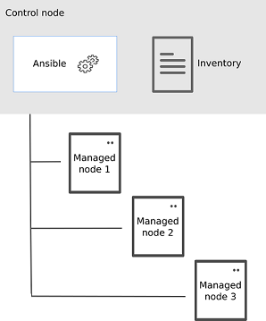

- [ansible](#ansible)
  - [安装ansible](#安装ansible)
  - [inventory文件](#inventory文件)
    - [查看分组包含哪些主机](#查看分组包含哪些主机)
    - [all分组](#all分组)
    - [分组嵌套](#分组嵌套)
    - [生成范围主机](#生成范围主机)
    - [设置变量](#设置变量)
  - [ansible.cfg配置文件](#ansiblecfg配置文件)
  - [命令行模式操作（ad-hoc模式）](#命令行模式操作ad-hoc模式)
  - [常用模块](#常用模块)
    - [ping模块](#ping模块)
    - [setup模块](#setup模块)
    - [copy](#copy)
    - [fetch](#fetch)
    - [file](#file)
    - [unarchive](#unarchive)
    - [archive](#archive)
    - [cron](#cron)
    - [service](#service)
    - [yum](#yum)
  - [脚本操作模式（playbook模式）](#脚本操作模式playbook模式)
    - [常用语法](#常用语法)
  - [roles](#roles)
  - [变量优先级](#变量优先级)
- [参考资料](#参考资料)

# ansible

ansible是一个用于集群自动化部署的工具。

ansible工作的架构很简单，分为一个主控结点（control node）和多个被控结点（managed node），主控节点和被控结点之间通过SSH和python来协作。inventory是被控机器的列表文件，用来管理分类被控机器。



## 安装ansible

在主控结点上需要安装ansible，python，ssh。在被控结点只需要python，ssh。

ssh一般都自带了，然后需要考虑ansible版本对应需要的python版本。

| ansible版本 |        控制结点python        |           被控结点python            |
| :---------: | :--------------------------: | :---------------------------------: |
|    2.11     | Python 2.7, Python 3.5 - 3.9 | Python 2.6 - 2.7, Python 3.5 - 3.9  |
|    2.12     |      Python 3.8 - 3.10       | Python 2.6 - 2.7, Python 3.5 - 3.10 |
|    2.13     |      Python 3.8 - 3.10       |    Python 2.7, Python 3.5 - 3.10    |
|    2.14     |      Python 3.9 - 3.11       |    Python 2.7, Python 3.5 - 3.11    |

在centos7中自带了python2.7，再直接通过yum下载ansible就行。

```bash
sudo yum install -y epel-release
sudo yum install -y ansible
```

## inventory文件

inventory文件用来记录被控结点主机信息，并对其进行分组管理。可以在ansible命令行通过`-i`设置inventory文件路径，也可以写在配置文件`ansible.cfg`中，都没有那默认就是`/etc/ansible/hosts`文件。

inventory中按照group划分主机，示例如下

```ini
# 保存在./hosts文件中
mail.example.com

[webservers]
foo.example.com
bar.example.com
one.example.com

[dbservers]
one.example.com
two.example.com
three.example.com
```

### 查看分组包含哪些主机

可以通过`ansible xx --list-hosts`命令查看当前选中的`xx`组都包含哪些主机：

```bash
[rc@cos201 hello-ansible]$ ansible webservers -i ./hosts --list-hosts
  hosts (3):
    foo.example.com
    bar.example.com
    one.example.com
```

### all分组

有一个特殊的`all`分组，包含所有的出现在inventory中的主机，重复的主机名只会出现一次：

```bash
[rc@cos201 hello-ansible]$ ansible all -i ./hosts --list-hosts
  hosts (6):
    mail.example.com
    foo.example.com
    bar.example.com
    one.example.com
    two.example.com
    three.example.com
```

### 分组嵌套

分组group是可以嵌套的，可以用`[xx:children]`语法来指定属于`xx`分组的子分组，示例如下：

```ini
# 保存在./hosts文件中
mail.example.com

[webservers]
foo.example.com
bar.example.com
one.example.com

[dbservers]
one.example.com
two.example.com
three.example.com

[servers]
four.example.com

[servers:children]
webservers
dbservers
```

这个时候查询servers分组，就是自己本身的主机再加上webservers和dbservers之和：

```bash
[rc@cos201 hello-ansible]$ ansible servers -i ./hosts --list-hosts
  hosts (6):
    four.example.com
    foo.example.com
    bar.example.com
    one.example.com
    two.example.com
    three.example.com
```

### 生成范围主机

自动生成某个范围的主机，示例语法`[0:10:1]`，`[a:z]`：

```ini
[servers]
# 从01生成到10，步长为1
www[01:10:1].example.com
```

这个时候查询就有10个主机信息了：

```bash
[rc@cos201 hello-ansible]$ ansible servers -i ./hosts --list-hosts
  hosts (10):
    www01.example.com
    www02.example.com
    www03.example.com
    www04.example.com
    www05.example.com
    www06.example.com
    www07.example.com
    www08.example.com
    www09.example.com
    www10.example.com
```

### 设置变量

还可以为主机或者分组设置变量，常用变量如下

|            变量名            |                        说明                         |
| :--------------------------: | :-------------------------------------------------: |
|         ansible_host         |                       主机名                        |
|         ansible_port         |                      连接端口                       |
|         ansible_user         |                  执行远程登录用户                   |
|       ansible_password       |                      登录密码                       |
| ansible_ssh_private_key_file | ssh密钥登陆对应的密钥文件（连接的时候不需要密码了） |
|        ansible_become        |         连接后是否自动在受管主机上切换用户          |
|     ansible_become_user      |             要在受管主机上切换到的用户              |
|   ansible_become_password    |                   切换用户的密码                    |

给主机设置变量：

```ini
[dbservers]
one.example.com ansible_host=192.168.135.202 ansible_user=rc ansible_password=123456
```

给分组设置变量

```ini
[all:vars]
ansible_user=rc
ansible_password=123456
```

## ansible.cfg配置文件

在运行ansible命令时，会加载`ansible.cfg`配置文件，查找顺序如下：

1. `ANSIBLE_CFG`：首先，ansible命令会先检查环境变量，及这个环境变量将指向的配置文件。
2. **`./ansible.cfg`**：其次，将会检查当前目录下的`ansible.cfg`配置文件。
3. **`~/.ansible.cfg`**：再次，将会检查当前用户home目录下的`ansible.cfg`配置文件。
4. **`/etc/ansible/ansible.cfg`**：最后，将会检查在安装ansible时自动生产的配置文件。

defaults配置（查看配置可以用`ansible-config list`命令）：

|      配置项       |                         说明                         |        默认值        |
| :---------------: | :--------------------------------------------------: | :------------------: |
|     inventory     |              ansible inventory文件路径               | `/etc/ansible/hosts` |
|    remote_user    |               ansible执行远程登录用户                |       当前用户       |
|     ask_pass      |                 是否提示输入SSH密码                  |       `false`        |
|      become       | 连接后是否自动在受管主机上切换用户（通常切换为root） |       `false`        |
|   become_method   |                     如何切换用户                     |        `sudo`        |
|    become_user    |              要在受管主机上切换到的用户              |        `root`        |
|  become_ask_pass  |         是否需要为become_method提示输入密码          |       `false`        |
|    roles_path     |                 ansible role存放路径                 | `/etc/ansible/roles` |
| host_key_checking |      ansible第一次连接客户端时是否要检查ssh密钥      |        `true`        |

配置文件示例：

```ini
[defaults]
inventory=./hosts
remote_user=rc
ask_pass=true
host_key_checking=false
```

## 命令行模式操作（ad-hoc模式）

直接使用`ansible`命令来执行简单的部署命令。官方把这种模式叫做ad-hoc命令模式。也就是临时命令模式。

命令行模式的语法如下，`-m`表示要用的模块名，如果模块需要参数需要用`-a`传进参数：

```bash
ansible [pattern] -m [module] -a "[module options]"
```

示例：`ansible all -m ping`，使用`ping`模块来测试被控主机是否能连通。

`-e "ansible_user=rc ansible_password=123456"`可以设置变量，通过命令行设置的变量优先级最高。

## 常用模块

可以用`ansible-doc -s ping`命令查看具体模块的详细说明。

### ping模块

`ping`一下被控主机，如果可以通过ansible成功连接，那么返回`pong`。

```bash
[rc@cos201 hello-ansible]$ ansible all -m ping
SSH password:
192.168.135.202 | SUCCESS => {
    "ansible_facts": {
        "discovered_interpreter_python": "/usr/bin/python"
    },
    "changed": false,
    "ping": "pong"
}
```

### setup模块

用于收集被控主机的信息。`setup`的参数如下：

- `filter`：对返回的主机信息进行过滤，支持shell通配符，仅展示匹配到的信息。
  - `ansible_architecture`：显示机器架构，比如x86，x86_64。
  - `ansible_distribution`：显示是什么发行版，例如centos，ubuntu。
  - `ansible_distribution_major_version`：发行版主版本号。
  - `ansible_hostname`：主机名。
  - `ansible_kernel`：内核信息。
  - `ansible_memory_mb`：显示内存数据。

```bash
[rc@cos201 hello-ansible]$ ansible all -m setup -a "filter=ansible_distribution"
SSH password:
192.168.135.203 | SUCCESS => {
    "ansible_facts": {
        "ansible_distribution": "CentOS",
        "discovered_interpreter_python": "/usr/bin/python"
    },
    "changed": false
}
```

### copy

从本地拷贝文件到远程节点，如果目的文件内容和要拷贝的一样那么不做改变。`copy`的参数如下：

- `src`：本地文件路径。
- `dest`：要拷贝到的被控主机的路径。
- `owner`：文件属主。
- `group`：文件属组。
- `mode`：读写权限。
- `backup`：当受控主机中存在文件时备份原文件，默认yes。
- `content`：指定文本内容直接在受控主机中生成文件。

```bash
[rc@cos201 hello-ansible]$ ansible all -m copy -a 'dest=/home/rc/text.txt content="hello ansible"'
SSH password:
192.168.135.202 | CHANGED => {
    "ansible_facts": {
        "discovered_interpreter_python": "/usr/bin/python"
    },
    "changed": true,
    "checksum": "7b320b1dc0c867516cf00728df488daa3532bc1f",
    "dest": "/home/rc/text.txt",
    "gid": 1000,
    "group": "rc",
    "md5sum": "37bc018071eae9a0e879c31b2f9aa554",
    "mode": "0664",
    "owner": "rc",
    "secontext": "unconfined_u:object_r:user_home_t:s0",
    "size": 13,
    "src": "/home/rc/.ansible/tmp/ansible-tmp-1677258597.47-19058-13947958580310/source",
    "state": "file",
    "uid": 1000
}
```

### fetch

从受控主机把文件复制到ansible主机,但不支持目录。`fetch`的参数如下：

- `src`：受控主机的源文件。
- `dest`：本机目录。
- `flat`：为yes那么直接复制文件过来，为no那么嵌套源文件原本的目录路径。

当`flat`为yes，且受控主机有多个，有多个同名文件要获取的时候，那么文件会覆盖。

```bash
[rc@cos201 hello-ansible]$ ansible all -m fetch -a "src=/home/rc/text.txt dest=./ flat=yes"
SSH password:
192.168.135.202 | CHANGED => {
    "changed": true,
    "checksum": "7b320b1dc0c867516cf00728df488daa3532bc1f",
    "dest": "/home/rc/work/hello-ansible/text.txt",
    "md5sum": "37bc018071eae9a0e879c31b2f9aa554",
    "remote_checksum": "7b320b1dc0c867516cf00728df488daa3532bc1f",
    "remote_md5sum": null
}

```

### file

文件操作。`file`的参数如下：

- `path`：文件路径。
- `state`：指定操作状态
  - `file`：获取文件信息。
  - `touch`：文件不存在创建文件，文件存在更新时间。
  - `absent`：删除文件或目录。
  - `directory` 递归创建文件夹。
  - `link`：建立软链接。
  - `hard`：建立硬链接。
- `src`：对于`link`和`hard`生效，指定要链接的源文件。
- `mode`：文件读写权限。
- `owner`：文件属主。
- `group`：文件属组。
- `recurse`：为yes时，且`state`为`directory`，那么递归设置文件属性。默认为yes。

### unarchive

将文件解压缩到受控主机。`unarchive`的参数如下：

- `remote_src`：要解压的源文件是否在受控主机上，为yes表示在受控主机上，为no表示在控制主机上。
- `src`：要解压的源文件路径，如果路径带`://`还将自动从这个url下载文件来解压。
- `dest`：解压目的路径。
- `mode`：文件读写权限。
- `owner`：文件属主。
- `group`：文件属组。

### archive

压缩文件。`archive`参数如下：

- `path`：要压缩文件的路径。
- `dest`：压缩目的路径。
- `remove`：压缩完之后，删除之前的源文件。
- `mode`：文件读写权限。
- `owner`：文件属主。
- `group`：文件属组。

### cron

给受控主机设置定时任务。`cron`参数如下：

- `minute`：分钟。
- `hour`：小时。
- `day`：天。
- `month`：月。
- `weekday`：周。
- `name`：任务名称。
- `job`：任务脚本或命令。
- `disabled`：yes禁用计划任务。

### service

后台服务管理。`service`参数如下：

- `name`：指定服务名称。
- `state`：指定对服务的操作。
  - `started`：开启服务。
  - `stopped`：停止服务。
  - `restarted`：重启服务。
  - `reload`：重新加载服务。
- `enabled`：yes开机自启动，no开机不启动。

### yum

yum安装软件。`yum`参数如下：

- `name`：软件包名。
- `state`：指定对软件包的操作。
  - `present`：安装。
  - `latest`：更新。
  - `absent`：卸载。


## 脚本操作模式（playbook模式）

只有脚本才可以重用，避免总敲重复的代码。ansible脚本的名字叫playbook，使用的是yaml的格式。

ansible提供了一个单独的命令：ansible-playbook命令，我们可以通过这个命令来执行yaml脚本：

```sh
ansible-playbook demo.yaml
```

最基本的playbook脚本分为三个部分：

1. 在哪些机器上以什么身份执行。
2. 执行的任务有哪些。
3. 善后任务有哪些。

比如下面的playbook（在单一playbook文件中，可以用“---”区分多个play。还有“...”用来表示play的结尾，也可省略）：

```yaml
---
- name: reload apache
  hosts: server1
  remote_user: root
  vars:
    http_port: 80
    max_clients: 200

  tasks:
    - name: Write apache config file
      template: src=/home/test1/httpd.j2 dest=/home/test2/httpd.conf
      notify:
        - restart apache
    - name: Ensure apache is running
      service: name=httpd state=started

  handlers:
    - name: restart apache
      service: name=httpd state=restarted
```

- **主机和用户**：

|      key      |                  含义                   |
| :-----------: | :-------------------------------------: |
|     hosts     | 为主机的IP，或者主机组名，或者关键字all |
|  remote_user  |           以哪个身份登录远端            |
|    become     |  切换成其他用户身份执行，值为yes或者no  |
| become_method |   与become一起使用，值可以为sudo/su等   |
|  become_user  |     要切换成的用户身份，默认为root      |

为了安全一般是不允许用root登录ssh的，所以一般是先用普通用户登录ssh，然后再切换为root用户（sudo）。

- **Tasks任务列表**：

tasks是从上到下顺序执行，如果中间发生错误，那么整个playbook会中止。你可以改修文件后，再重新执行。每一个任务都是对模块的一次调用，只是使用不同的参数和变量而已。每一个任务最好有一个name属性，这样在执行yaml脚本时，可以看到执行进度信息。

task中每个action会调用一个module，在module中会去检查当前系统状态是否需要重新执行。

- **响应事件Handler**：

Handlers里面的每一个handler，也是对module的一次调用。而handlers与tasks不同，tasks会默认的按定义顺序执行每一个task，handlers则不会，它需要在tasks中被调用，才有可能被执行。

Tasks中的任务都是有状态的，changed或者ok。 在Ansible中，只在task的执行状态为changed的时候，才会执行该task调用的handler，这也是handler与普通的event机制不同的地方。
在所有的任务里表执行之后执行，如果有多个task notify同一个handler,那么只执行一次。

handlers是按照在handlers中定义个顺序执行的，而不是安装notify的顺序执行的。
下面的例子定义的顺序是1>2>3，notify的顺序是3>2>1，实际执行顺序：1>2>3：

```yaml
---
- hosts: lb
  remote_user: root
  gather_facts: no
  vars:
      random_number1: "{{ 10000 | random }}"
      random_number2: "{{ 10000000000 | random }}"
  tasks:
  - name: Copy the /etc/hosts to /tmp/hosts.{{ random_number1 }}
    copy: src=/etc/hosts dest=/tmp/hosts.{{ random_number1 }}
    notify:
      - define the 3nd handler
  - name: Copy the /etc/hosts to /tmp/hosts.{{ random_number2 }}
    copy: src=/etc/hosts dest=/tmp/hosts.{{ random_number2 }}
    notify:
      - define the 2nd handler
      - define the 1nd handler
  handlers:
  - name: define the 1nd handler
    debug: msg="define the 1nd handler"
  - name: define the 2nd handler
    debug: msg="define the 2nd handler"
  - name: define the 3nd handler
    debug: msg="define the 3nd handler"
```

### 常用语法

**ignore_errors**：ansible的playbook在执行任务出现错误的时候会停止运行，如果需要忽略错误继续运行可以用该语法：

```yaml
# 当没有docker服务的时候也不报错
- name: stop docker service
  systemd:
    name: docker
    daemon_reload: yes
    state: stopped
    enabled: yes
  ignore_errors: true
```

**connection: local**：如果希望在控制主机本地运行一个特定的任务，可以使用local_action语句：

```yaml
# 等待被控端sshd端口开启
- name: wait for ssh server to be running
  wait_for
      port: 22 
      host: "{{ inventory_hostname }}" 
      search_regex: OpenSSH
  connection: local
```

**delegate_to**：可以使用delegate_to语句来在另一台主机上运行task，注意这里delegate_to不是只在指定的机器上执行一次任务，而是在指定机器上执行所有任务，比如上面的`connection: local`等价于`delegate_to: 127.0.0.1`：

```yaml
- name: enable alerts for web servers
  hosts: webservers
  tasks:
    - name: enable alerts
      nagios: action=enable_alerts service=web host="{{ inventory_hostname }}"
      delegate_to: nagios.example.com
```

**run_once**：当有多台主机要执行任务时，那么只有一台机器会执行任务，可以和`delegate_to`搭配指定在哪台机器上执行任务：

```yaml
- name: run the task locally, only once
  command: /opt/my-custom-command
  run_once: true
  delegate_to: app.a1-61-105.dev.unp
```

## roles

roles 用于层次性、结构化地组织playbook。
在ansible中,通过遵循特定的目录结构,就可以实现对role的定义：

```sh
site.yml
roles/
├── myrole
    ├── tasks
    │   └── main.yml
    ├── handlers
    │   └── main.yml
    ├── defaults
    │   └── main.yml
    ├── vars
    │   └── main.yml
    ├── files
    ├── templates
    ├── README.md
    ├── meta
    │   └── main.yml
    └── tests
        ├── inventory
        └── test.yml
```

ansible并不要求role包含上述所有的目录及文件，根据role的功能需要加入对应的目录和文件。下面是每个目录和文件的功能：

- 如果`roles/x/tasks/main.yml`存在, 其中列出的 tasks 将被添加到 play 中，所以这个文件也可以视作role的入口文件，想看role做了什么操作，可以从此文件看起。
- 如果`roles/x/handlers/main.yml`存在, 其中列出的 handlers 将被添加到 play 中
- 如果`roles/x/vars/main.yml`存在, 其中列出的 variables 将被添加到 play 中
- 如果`roles/x/meta/main.yml`存在, 其中列出的 “角色依赖” 将被添加到 roles 列表中
- `roles/x/tasks/main.yml`中所有tasks，可以引用`roles/x/{files,templates,tasks}`中的文件，不需要指明文件的路径。

roles和tasks的执行顺序：

- pre_tasks > role > tasks > post_tasks

## 变量优先级

下面是变量的优先级，由高到低：

- extra vars：通过命令行穿进去的变量，例如`-e "user=my_user"`。
- include params
- role (and include_role) params
- set_facts / registered vars
- include_vars
- task vars (only for the task)：在task中定义的变量。
- block vars (only for tasks in block)
- role vars (defined in role/vars/main.yml)
- play vars_files
- play vars_prompt
- play vars
- host facts / cached set_facts
- playbook host_vars/*playbook group_vars/all
- inventory host_vars/*
- inventory file or script host vars
- playbook group_vars/*
- inventory group_vars/*
- playbook group_vars/all
- inventory group_vars/all
- inventory file or script group vars
- role defaults (defined in role/defaults/main.yml)
- command line values (for example, -u my_user, these are not variables)

group_vars 存放的是组变量，group_vars/all.yml 表示所有主机有效，等同于[all:vars]，grous_vars/etcd.yml 表示etcd组主机有效，等同于[etcd:vars]。

# 参考资料

- [Ansible自动化运维教程](https://www.w3cschool.cn/automate_with_ansible/)
- [ansible官方文档](https://docs.ansible.com/ansible/latest/index.html)
- [Ansible入门](https://www.bookstack.cn/read/ansible-first-book/README.md)
- [Ansible常用模块基本操作](https://www.cnblogs.com/vipygd/p/11625142.html)
- [初窥Ansible playbook](https://www.cnblogs.com/vipygd/p/13034739.html)
- [ansible官网变量优先级文档](https://docs.ansible.com/ansible/latest/user_guide/playbooks_variables.html#variable-precedence-where-should-i-put-a-variable)
- [Ansible16：Playbook高级用法](https://www.cnblogs.com/breezey/p/10996651.html)
