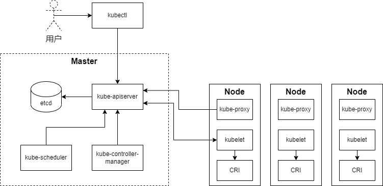

- [k8s简介](#k8s简介)
- [k8s架构](#k8s架构)
    - [控制平面组件](#控制平面组件)
    - [node相关组件](#node相关组件)
- [参考资料](#参考资料)

# k8s简介

k8s（kubernetes）在希腊语中是领航员的意思。它是一个由google开源的容器编排引擎，支持容器应用的自动部署，水平伸缩，和管理等功能。

在容器编排这一领域，打败了docker swarm，apache mesos，成为了事实上的标准。

# k8s架构

一个k8s集群由控制平面（control plane）和一群工作结点（nodes）组成。在生产环境中，控制平面一般运行在多台机器上，并且和工作结点之间是相互独立的，这些结点被叫做master结点。

### 控制平面组件

- **kube-apiserver**：提供了k8s资源对象的唯一操作入口，其它所有组件都必须通过它提供的API来操作资源对象。k8s的资源对象都会存储在`etcd`中，只有`kube-apiserver`与`etcd`通信。这样一来保证了资源的安全，也方便日后升级后端存储。

- **kube-controller-manager**：用于k8s资源对象的故障检测和恢复的自动化工作，本身由多个独立的控制器组成，为了更好管理就打包成为一个二进制程序。
  - `replication controller`：定期关联`replication controller`资源与`pod`资源，保证`rc`所关联的`pod`副本数与期望数值一致。
  - `node controller`：`kubelet`在启动时会通过`kube-apiserver`注册自身所在结点的信息，并定时向`kube-apiserver`汇报状态信息。`node controller`实现监控和管理集群中所有node结点。
  - `resource quota controller`：资源配额控制器，用于保证资源对象在任何时候都不会超量占用系统物理资源。
  - `namespace controller`：负责管理`namspace`资源，比如删除`namespace`资源时自动标记为`terminating`状态，然后再自动删除`namespace`下的`deployment`，`service`等资源。
  - `service account controller`：主要管理命名空间内的服务账号，比如为每个命名空间创建default的`serviceAccount`。
  - `token controller`：监听`serviceAccount`的创建和删除动作以及监听`secret`的添加、删除动作。
  - `service controller`：服务控制器主要用作监听`service`的变化。比如：创建的是一个 `loadBalancer`类型的`service`，`service controller`则要确保外部的云平台上对该 `service`对应的`loadBalancer`实例被创建、删除以及相应的路由转发表被更新。
  - `endpoint controller`：`endpoints`表示了一个`service`对应的所有`pod`副本的访问地址，而`endpoints controller`是负责生成和维护所有`endpoints`对象的控制器。

- **kube-schduler**：负责整个集群的资源调度的，主要的职责如下。
  - 主要用于收集和分析当前k8s集群中所有node节点的资源 (包括内存、CPU等) 负载情况，然后依据资源占用情况分发新建的`pod`到k8s集群中可用的节点。
  - 实时监测k8s集群中未分发和已分发的所有运行的`pod`。
  - 实时监测node节点信息，在分发`pod`到指定的node节点后，会把`pod`相关的绑定信息写回 `kube-apiserver`，以方便其它组件使用。

### node相关组件

- **kubelet**：是负责容器真正运行的核心组件，主要的职责如下。
  - 负责node节点上`pod`的创建、修改、监控、删除等全生命周期的管理。
  - 定时上报本地node的状态信息给`kube-apiserver`。
  - `kubelet`是master和node之间的桥梁，接收`kube-apiserver`分配给它的任务并执行。
  - `kubelet`在node上做的主要工作具体包括：设置容器的环境变量、给容器绑定`volume`、给容器绑定`port`、同步`pod`的状态，在容器中运行命令、杀死容器、删除`pod`的所有容器。

- **kube-proxy**：是为了解决外部网络能够访问集群中容器提供的应用服务而设计的，`kube-proxy`运行在每个node上。每创建一个`service`，当接收到外部请求时，`kube-proxy`会根据`loadBalancer`将请求分发到后端正确的容器处理。

# 参考资料

- [k8s简介](https://www.cnblogs.com/l-uz/p/16521278.html)
