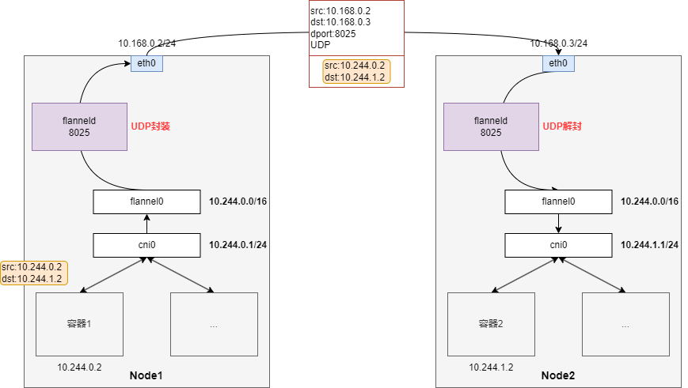

- [同一台宿主机上的容器怎么通信](#同一台宿主机上的容器怎么通信)
- [容器如何访问外网](#容器如何访问外网)
- [不同宿主机容器怎么通信](#不同宿主机容器怎么通信)
  - [纯三层网络模式](#纯三层网络模式)
  - [隧道模式——通过TUN设备](#隧道模式通过tun设备)
  - [隧道模式——通过VTEP设备](#隧道模式通过vtep设备)

# 同一台宿主机上的容器怎么通信

以docker为例，安装docker的时候会在宿主机创建一个docker0的网桥，ip默认为`172.17.0.1`。

然后为每个新建的容器创建`veth pair`一对虚拟网卡，一端插到容器，另一端插到docker0网桥。`veth pair`的特点就是一端发出的数据总是输出到另一端，并且插入到网桥的veth会变为从设备，只是作为一个网桥的一个端口。

然后将容器的veth的ip设置在相同的`172.17.0.0/16`网段即可，这样所有的容器处于同一个二层网络，且在同一个网段，就可以互通了。


# 容器如何访问外网

docker容器访问外网是通过在iptables写入SNAT规则实现的。

```bash
Chain POSTROUTING (policy ACCEPT 19 packets, 1144 bytes)
    pkts      bytes target     prot opt in     out     source             destination
       0        0 MASQUERADE   all   --  *  !docker0  172.17.0.0/16        0.0.0.0/0
```


# 不同宿主机容器怎么通信

k8s通过在已有的宿主机网络基础上，用软件构建一个虚拟的网络将所有容器连通起来，这一技术称为覆盖网络（overlay network）。


## 纯三层网络模式

所谓纯三层网络模式，就是将宿主机当作一个边缘路由器，里面维护包括容器子网的路由信息。

这里以flannel的host-gw模式举例，会将每个容器子网的下一跳地址设置为子网所在宿主机的ip，也就是宿主机会充当不同网段间网关的作用，所以叫做host-gw模式。


当Node1上的容器1要访问Node2上的容器2，那么在路由表信息中查询到`10.244.1.0/24`子网对应的网关为Node2的ip，直接发给Node2进行消息转发即可。

优点：

1. 性能高，和常规的网络通信没啥区别。

缺点：

1. 需要宿主机处于同一个二层网络。

## 隧道模式——通过TUN设备

隧道模式不需要宿主机处于同一个二层网络，只要三层互通就行。

这里以flannel的UDP模式举例，flannel会起一个flanneld进程监听8025端口，并在进程里面创建一个TUN设备flannel0，

TUN设备的特点就是会将接收到的数据报递交给创建TUN设备的进程。然后flannel会在宿主机上增加一条路由规则，将访问容器网络的流量都导向flannel0，然后交给自己作封装和解封处理。

```bash
$ ip route
default via 10.168.0.1 dev eth0
10.244.0.0/16 dev flannel0 proto kernel scope link src 10.244.0.0
10.244.0.0/24 dev cni0 proto kernel scope link src 10.244.0.1
10.168.0.0/24 dev eth0 proto kernel scope link src 10.168.0.2
```



当Node1上的容器1要访问Node2上的容器2，那么查询路由表，会走flannel0这个TUN设备，然后就交由flanneld进程对消息包进行UDP封装，flanneld知道你要访问的目的容器在哪个宿主机上，所以将UDP包的目的ip设置为目的宿主机的ip，源ip设置为源宿主机ip即可。

等消息包到了目的宿主机，还会经过flanneld进程的UDP解封操作，将真正的消息包转发给对应的容器，就完成了消息的传递。

优点：

- 不需要宿主机处于同一个二层网络，只要三层互通就行。

缺点：

- 性能差，隧道封装和解封消耗性能。
- 性能差，UDP模式的封装解封操作，需要将数据包从内核态和用户态来回拷贝。

## 隧道模式——通过VTEP设备

为了解决UDP模式数据报来回从用户态和内核态拷贝，可以使用VTEP设备来创建隧道，VTEP隧道全程都是在内核态执行。

这里以flannel的VXLAN模式举例，和UDP模式类似，都是通过隧道来传递容器子网间的数据包。但VXLAN模式封装的是二层数据，里面的目的MAC地址是目的宿主机上的VTEP设备的MAC地址。从原理上就相当于为不同的容器子网创建一个网关设备flannel.1（VTEP设备），然后将所有网关设备通过隧道打通，这样它们就好像处于同一个二层网络一样。


优点：

- 不需要宿主机处于同一个二层网络，只要三层互通就行。

缺点：

- 性能差，隧道封装和解封消耗性能。
