- [ipip模式](#ipip模式)
  - [黑洞路由](#黑洞路由)
  - [arp代理](#arp代理)
  - [手动模拟ipip隧道网络](#手动模拟ipip隧道网络)

# ipip模式

Calico IPIP 模式通过将 Pod 的原始 IP 报文封装在宿主机 IP 隧道中，实现跨子网节点间的三层路由转发。

```mermaid
flowchart LR
    subgraph NodeA [Kubernetes Node A]
        direction TB
        PodA["Pod A<br/>10.244.1.2"]
        vethA["veth"]
        RouteA["路由表<br/>10.244.2.0/24 → tunl0"]
        tunl0A["tunl0<br/>IPIP隧道"]
        eth0A["eth0<br/>192.168.1.10"]
        PodA --> vethA --> RouteA --> tunl0A --> eth0A
    end

    subgraph NodeB [Kubernetes Node B]
        direction TB
        eth0B["eth0<br/>192.168.2.20"]
        tunl0B["tunl0<br/>IPIP隧道"]
        RouteB["路由表<br/>10.244.1.0/24 → tunl0"]
        vethB["veth"]
        PodB["Pod B<br/>10.244.2.2"]
        eth0B --> tunl0B --> RouteB --> vethB --> PodB
    end

    subgraph PhysNet [Underlay 网络]
        direction LR
        NetNode["物理交换机/路由器"]
    end

    eth0A -- "IPIP封装包<br/>外层(192.168.1.10→192.168.2.20) 协议4<br/>内层(10.244.1.2→10.244.2.2)" --> NetNode
    NetNode -- "封装包" --> eth0B

    style NodeA fill:#e6f3ff,stroke:#3399ff
    style NodeB fill:#e6f3ff,stroke:#3399ff
    style PhysNet fill:#f9f9e0,stroke:#cccc00
    style PodA fill:#d4f1d4,stroke:#2e7d32
    style PodB fill:#d4f1d4,stroke:#2e7d32
    style tunl0A fill:#ffe0b3,stroke:#ff9900
    style tunl0B fill:#ffe0b3,stroke:#ff9900
    style eth0A fill:#f0c0c0,stroke:#c00
    style eth0B fill:#f0c0c0,stroke:#c00
```



## 黑洞路由

在 Calico 的 IPIP 模式下，黑洞路由是一条特殊的静态路由，它的核心作用是为分配给当前节点的 Pod CIDR（网段）设置一个“安全网”。

```bash
blackhole 10.233.94.0/24 proto bird
```

- **防止路由环路**：确保发往本节点 Pod IP 段但 目标 Pod 实际已不存在 的“僵尸流量”被直接丢弃，而不是在集群中循环，造成网络拥堵。
- **精确通信**：明确宣告“本节点上的所有 Pod IP 都在此范围内”，保证数据包不会被错误地转发给外部网关或其他节点，从而确保 Pod 间通信的精准性。
- **BGP 路由通告**：Felix 组件利用黑洞路由作为“信号”，告知 BIRD 客户端向对等节点宣告该 CIDR。这种机制避免了为不存在的 Pod 分配路由，也有效降低了 BGP 网络的开销。

## arp代理

Calico 给 Pod 设置了一个不存在的“虚拟网关” 169.254.1.1。当 Pod 把数据包发给这个网关时，宿主机上的 cali 虚拟网卡主动“冒名顶替”自己就是这个网关，并用自己的 MAC 地址回应，从而“骗”Pod 将数据包乖乖交给它。

```bash
# 查看网卡MAC地址
ip link show caliXXXXXX
# 查看代理ARP是否开启
cat /proc/sys/net/ipv4/conf/caliXXXXXX/proxy_arp
```

- **避免 IP 地址冲突**：169.254.1.1 属于链路本地地址，不占用宝贵的 Pod 或节点 IP 网段。
- **无视网络拓扑变化**：宿主机 IP 可能因网络重配置而变，但 169.254.1.1 这个“虚拟网关”地址则永恒不变。
- **仅代答特定 IP**：Calico 通过 arp_ignore 等参数严格限制 cali 网卡的响应范围，只为 169.254.1.1 做代理 ARP，确保不会影响宿主机其他正常的网络通信。

## 手动模拟ipip隧道网络

```bash
# 启用ipip模块（会自动创建tunl0设备）
sudo modprobe ipip
sudo ip link set tunl0 up

# tunl0设备默认是remote any local any的，不对目标端和源端做限定，只需要给其添加需要的路由就可以实现连接任意节点的隧道
sudo ip tunnel show
tunl0: any/ip remote any local any ttl inherit nopmtudisc

# node-0添加tunl0的ip，并添加隧道路由，并且添加本控子网的黑洞路由
sudo ip addr add 10.1.0.0/32 dev tunl0
sudo ip route add 10.2.0.0/24 via 192.168.135.201 dev tunl0 onlink
sudo ip route add blackhole 10.1.0.0/24

# node-1添加tunl0的ip，并添加隧道路由
sudo ip addr add 10.2.0.0/32 dev tunl0
sudo ip route add 10.1.0.0/24 via 192.168.135.101 dev tunl0 onlink
sudo ip route add blackhole 10.2.0.0/24

# node-0添加容器a的网络，创建veth-pair连接到宿主机，并且设置路由
sudo ip netns add container_a
sudo ip link add veth_a type veth peer name host_veth_a
sudo ip link set veth_a netns container_a
sudo ip netns exec container_a ip link set veth_a name eth0
sudo ip netns exec container_a ip addr add 10.1.0.1/32 dev eth0
sudo ip netns exec container_a ip link set eth0 up
sudo ip link set host_veth_a up
sudo ip route add 10.1.0.1/32 dev host_veth_a scope link

# 设置连接容器a的eth口使用代理arp
sudo bash -c "echo 1 > /proc/sys/net/ipv4/conf/host_veth_a/proxy_arp"
sudo ip netns exec container_a ip route add 169.254.1.1 dev eth0 scope link
sudo ip netns exec container_a ip route add default via 169.254.1.1 dev eth0

# node-1添加容器b的网络，创建veth-pair连接到宿主机，并且设置路由
sudo ip netns add container_b
sudo ip link add veth_b type veth peer name host_veth_b
sudo ip link set veth_b netns container_b
sudo ip netns exec container_b ip link set veth_b name eth0
sudo ip netns exec container_b ip addr add 10.2.0.1/32 dev eth0
sudo ip netns exec container_b ip link set eth0 up
sudo ip link set host_veth_b up
sudo ip route add 10.2.0.1/32 dev host_veth_b scope link

# 设置连接容器a的eth口使用代理arp
sudo bash -c "echo 1 > /proc/sys/net/ipv4/conf/host_veth_b/proxy_arp"
sudo ip netns exec container_b ip route add 169.254.1.1 dev eth0 scope link
sudo ip netns exec container_b ip route add default via 169.254.1.1 dev eth0
```

