- [ipip模式](#ipip模式)
  - [手动模拟ipip隧道网络](#手动模拟ipip隧道网络)

# ipip模式

Calico IPIP 模式通过将 Pod 的原始 IP 报文封装在宿主机 IP 隧道中，实现跨子网节点间的三层路由转发。

```mermaid
flowchart LR
    subgraph NodeA [Kubernetes Node A]
        direction TB
        PodA["Pod A<br/>10.244.1.2"]
        vethA["veth"]
        RouteA["路由表<br/>10.244.2.0/24 → tunl0"]
        tunl0A["tunl0<br/>IPIP隧道"]
        eth0A["eth0<br/>192.168.1.10"]
        PodA --> vethA --> RouteA --> tunl0A --> eth0A
    end

    subgraph NodeB [Kubernetes Node B]
        direction TB
        eth0B["eth0<br/>192.168.2.20"]
        tunl0B["tunl0<br/>IPIP隧道"]
        RouteB["路由表<br/>10.244.1.0/24 → tunl0"]
        vethB["veth"]
        PodB["Pod B<br/>10.244.2.2"]
        eth0B --> tunl0B --> RouteB --> vethB --> PodB
    end

    subgraph PhysNet [Underlay 网络]
        direction LR
        NetNode["物理交换机/路由器"]
    end

    eth0A -- "IPIP封装包<br/>外层(192.168.1.10→192.168.2.20) 协议4<br/>内层(10.244.1.2→10.244.2.2)" --> NetNode
    NetNode -- "封装包" --> eth0B

    style NodeA fill:#e6f3ff,stroke:#3399ff
    style NodeB fill:#e6f3ff,stroke:#3399ff
    style PhysNet fill:#f9f9e0,stroke:#cccc00
    style PodA fill:#d4f1d4,stroke:#2e7d32
    style PodB fill:#d4f1d4,stroke:#2e7d32
    style tunl0A fill:#ffe0b3,stroke:#ff9900
    style tunl0B fill:#ffe0b3,stroke:#ff9900
    style eth0A fill:#f0c0c0,stroke:#c00
    style eth0B fill:#f0c0c0,stroke:#c00
```



## 手动模拟ipip隧道网络

```bash
# 启用ipip模块（会自动创建tunl0设备）
sudo modprobe ipip
sudo ip link set tunl0 up

# tunl0设备默认是remote any local any的，不对目标端和源端做限定，只需要给其添加需要的路由就可以实现连接任意节点的隧道
sudo ip tunnel show
tunl0: any/ip remote any local any ttl inherit nopmtudisc

# node-0添加隧道路由
sudo ip route add 10.1.0.0/24 via 192.168.135.101 dev tunl0 onlink

# node-1添加隧道路由
sudo ip route add 10.2.0.0/24 via 192.168.135.201 dev tunl0 onlink

# node-0添加容器a的网络
sudo ip netns add container_a
sudo ip link add veth_a type veth peer name host_veth_a
sudo ip link set veth_a netns container_a
sudo ip netns exec container_a ip link set veth_a name eth0
sudo ip netns exec container_a ip addr add 10.1.0.1/24 dev eth0
sudo ip netns exec container_a ip link set eth0 up
sudo ip route add 10.2.0.1/32 dev host_veth_a

# node-1添加容器b的网络
sudo ip netns add container_b
sudo ip link add veth_a type veth peer name host_veth_a
sudo ip link set host_veth_a up
sudo ip link set veth_a netns container_b
sudo ip netns exec container_b ip link set veth_a name eth0
sudo ip netns exec container_b ip addr add 10.2.0.1/24 dev eth0
sudo ip netns exec container_b ip link set eth0 up
sudo ip route add 10.1.0.1/32 dev host_veth_a
```

