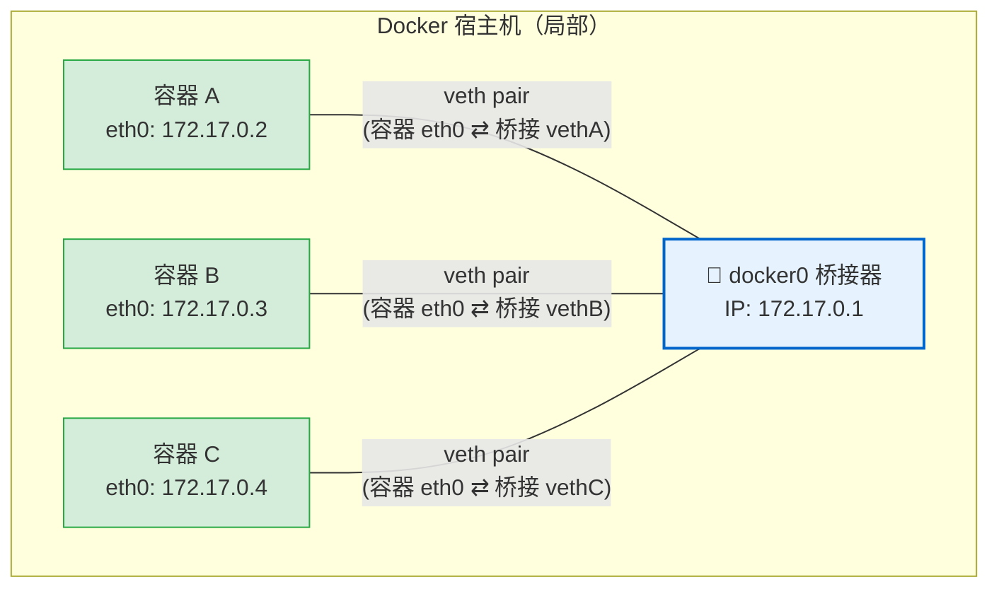

- [docker桥接网络拓扑](#docker桥接网络拓扑)
  - [手动模拟桥接网络](#手动模拟桥接网络)
  - [访问外网原理](#访问外网原理)

# docker桥接网络拓扑

docker会创建一个`docker0`的`bridge`网桥设备，并且设置ip为`172.17.0.1/16`，创建的每个容器都会通过`veth pair`设备与网桥连接，从而构建一个连通的子网。



## 手动模拟桥接网络

```bash
# 创建网桥
sudo ip link add br0 type bridge
sudo ip addr add 172.17.0.1/16 dev br0
sudo ip link set br0 up

# 创建容器的netns
sudo ip netns add container_a
sudo ip netns add container_b
sudo ip netns add container_c

# 创建每个容器到网桥的veth pair
sudo ip link add veth_a type veth peer name br_veth_a
sudo ip link add veth_b type veth peer name br_veth_b
sudo ip link add veth_c type veth peer name br_veth_c

# 将veth pair的一端添加到容器网络命名空间
sudo ip link set veth_a netns container_a
sudo ip netns exec container_a ip link set veth_a name eth0
sudo ip netns exec container_a ip addr add 172.17.0.2/16 dev eth0
sudo ip netns exec container_a ip link set eth0 up
sudo ip link set veth_b netns container_b
sudo ip netns exec container_b ip link set veth_b name eth0
sudo ip netns exec container_b ip addr add 172.17.0.3/16 dev eth0
sudo ip netns exec container_b ip link set eth0 up
sudo ip link set veth_c netns container_c
sudo ip netns exec container_c ip link set veth_c name eth0
sudo ip netns exec container_c ip addr add 172.17.0.4/16 dev eth0
sudo ip netns exec container_c ip link set eth0 up

# 顺便把容器网络命名空间的lo设备开启
sudo ip netns exec container_a ip link set lo up
sudo ip netns exec container_b ip link set lo up
sudo ip netns exec container_c ip link set lo up

# 将veth pair的一端添加到网桥
sudo ip link set br_veth_a master br0
sudo ip link set br_veth_a up
sudo ip link set br_veth_b master br0
sudo ip link set br_veth_b up
sudo ip link set br_veth_c master br0
sudo ip link set br_veth_c up
```

## 访问外网原理

docker会配置SNAT规则，以便容器可以访问外网

```bash
Chain POSTROUTING (policy ACCEPT 450 packets, 32317 bytes)
    pkts      bytes target     prot opt in     out     source               destination
       0        0 MASQUERADE  all  --  *      !docker0  172.17.0.0/16        0.0.0.0/0
```

