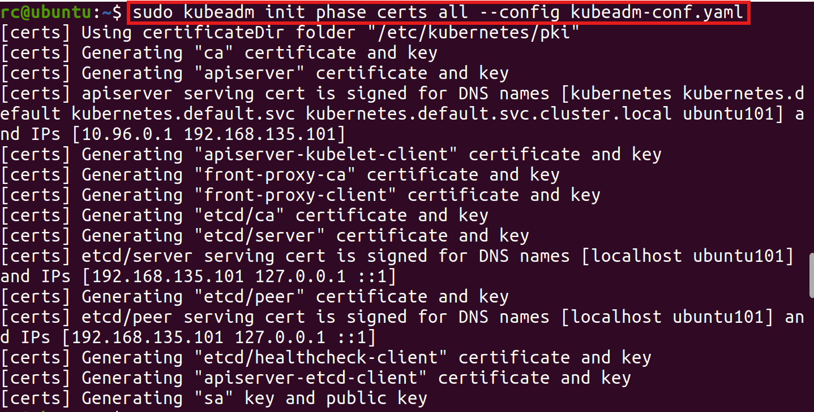
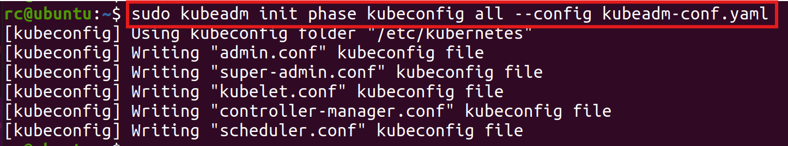

- [kubeadm init](#kubeadm-init)
	- [certs](#certs)
	- [kubeconfig](#kubeconfig)
	- [etcd](#etcd)
	- [control-plane](#control-plane)
	- [kubelet-start](#kubelet-start)
	- [wait-control-plane](#wait-control-plane)
- [kubeadm join](#kubeadm-join)
- [参考资料](#参考资料)

参考1.33.1 linux环境代码

# kubeadm init

初始化一个k8s控制平面节点。

```text
preflight                    预检
  /IsPrivilegedUser            检查为root用户
  /NumCPU                      检查cpu至少为2核
  /Mem                         检查mem至少为1700MB
  /KubernetesVersion           检查kubeadm的版本不低于要部署的k8s控制平面的版本
  /Firewalld                   检查firewalld服务已关闭
  /Port-xx                     检查:xx端口未被占用（apiserver、controller、scheduler端口）
  /FileAvailable-xx            检查xx文件不存在（apiserver、controller、scheduler、etcd静态pod yaml文件）
  /HTTPProxy                   检查访问apiserver的本地监听地址没有走系统代理
  /HTTPProxyCIDR               检查访问service网段和pod网段没有走系统代理
  /CRI                         检查cri是否在运行（连接cri-socket地址）
  /Swap                        检查swap分区已关闭
  /FileExisting-xx             检查xx可执行文件存在（conntrack、ip、iptables、mount、nsenter命令必须存在，crictl、ebtables、ethtool、socat、tc、touch命令可选）
  /SystemVerification          检查内核版本（至少3.10+），config，cgroup子系统配置是否符合要求
  /Hostname                    检查节点名称是否合法
  /KubeletVersion              检查kubelet的版本最多比kubeadm的版本小3个次要版本，并且不能比k8s控制平面的版本大
  /Service-xx                  检查xx服务存在（kubelet）
  /Port-xx                     检查0.0.0.0:xx端口未被占用（kubelet端口）
  /FileContent-xx              检查xx文件的内容（/proc/sys/net/ipv4/ip_forward为1、/proc/sys/net/ipv6/conf/default/forwarding为1）
  /Port-xx                     检查0.0.0.0:xx端口未被占用（etcd listen端口和peer端口）
  /DirAvailable-xx             检查目录存在，并且为空目录（etcd数据目录）
  /ImagePull                   拉取镜像（apiserver、controller、scheduler、etcd、pause、kube-proxy、coredns），imagePullPolicy可以设置为never跳过下载
                               ${imageRepository}/pause:3.10
                               ${imageRepository}/kube-apiserver:${kubernetesVersion}
                               ${imageRepository}/kube-controller-manager:${kubernetesVersion}
                               ${imageRepository}/kube-scheduler:${kubernetesVersion}
                               ${imageRepository}/kube-proxy:${kubernetesVersion}
                               ${dns.imageRepository}/coredns:${dns.imageTag} 内部默认v1.11.3
                               ${etcd.local.imageRepository}/etcd:${etcd.local.imageTag} 内部默认3.5.15-0
certs                        生成证书
  /ca                          生成自签名根 CA 用于配置其他 kubernetes 组件
  /apiserver                   生成 apiserver 的证书
  /apiserver-kubelet-client    生成 apiserver 连接到 kubelet 的证书
  /front-proxy-ca              生成前端代理自签名CA(扩展apiserver)
  /front-proxy-client          生成前端代理客户端的证书（扩展 apiserver）
  /etcd-ca                     生成 etcd 自签名 CA
  /etcd-server                 生成 etcd 服务器证书
  /etcd-peer                   生成 etcd 节点相互通信的证书
  /etcd-healthcheck-client     生成 etcd 健康检查的证书
  /apiserver-etcd-client       生成 apiserver 访问 etcd 的证书
  /sa                          生成用于签署服务帐户令牌的私钥和公钥
kubeconfig                   生成建立控制平面和管理所需的所有 kubeconfig 文件
  /admin                       生成一个 kubeconfig 文件供管理员使用以及供 kubeadm 本身使用
  /super-admin                 为超级管理员生成 kubeconfig 文件
  /kubelet                     为 kubelet 生成一个 kubeconfig 文件，*仅*用于集群引导
  /controller-manager          生成 kubeconfig 文件供控制器管理器使用
  /scheduler                   生成 kubeconfig 文件供调度程序使用
etcd                         为本地 etcd 生成静态 Pod 清单文件
  /local                       为本地单节点本地 etcd 实例生成静态 Pod 清单文件
control-plane                生成建立控制平面所需的所有静态 Pod 清单文件
  /apiserver                   生成 kube-apiserver 静态 Pod 清单
  /controller-manager          生成 kube-controller-manager 静态 Pod 清单
  /scheduler                   生成 kube-scheduler 静态 Pod 清单
kubelet-start                写入 kubelet 设置并启动（或重启） kubelet
upload-config                将 kubeadm 和 kubelet 配置上传到 ConfigMap
  /kubeadm                     将 kubeadm 集群配置上传到 ConfigMap
  /kubelet                     将 kubelet 组件配置上传到 ConfigMap
upload-certs                 将证书上传到 kubeadm-certs
mark-control-plane           将节点标记为控制面
bootstrap-token              生成用于将节点加入集群的引导令牌
kubelet-finalize             在 TLS 引导后更新与 kubelet 相关的设置
  /experimental-cert-rotation  启用 kubelet 客户端证书轮换
addon                        安装用于通过一致性测试所需的插件
  /coredns                     将 CoreDNS 插件安装到 Kubernetes 集群
  /kube-proxy                  将 kube-proxy 插件安装到 Kubernetes 集群
show-join-command            显示控制平面和工作节点的加入命令
```

```yaml
---
apiVersion: kubeadm.k8s.io/v1beta4
kind: InitConfiguration
bootstrapTokens:
- token:
    id: randBytes(6)
    secret: randBytes(16)
  description: "The default bootstrap token generated by 'kubeadm init'."
  ttl: "24h"
  expires:
  usages: ["signing", "authentication"]
  groups: ["system:bootstrappers:kubeadm:default-node-token"]
dryRun: false                                            # 演练模式
nodeRegistration:
  name: os.Hostname()                                    # 节点名称
  criSocket: "npipe:////./pipe/containerd-containerd"    # 容器运行时socket路径
  taints:                                                # 初始给节点添加的污点（默认添加control-plane污点，pod默认不允许调度到控制平面）
  - key: "node-role.kubernetes.io/control-plane"
    value:
    effect: "NoSchedule"
    timeAdded:
#   kubeletExtraArgs:
#   - name:
#     value:
  ignorePreflightErrors: []
  imagePullPolicy: "IfNotPresent"                        # 镜像拉取策略，如果设置为never那么kubeadm会跳过下载镜像
  imagePullSerial: true                                  # 串行拉取镜像
localAPIEndpoint:                                        # apiserver监听地址和端口（用于本地访问）
  advertiseAddress: ""
  bindPort: 6443
certificateKey: ""                                       # 用来加密上传到kubeadm-certs secret中的证书密钥的AES密钥
skipPhases: []
# patches:
#   directory:
timeouts:
  controlPlaneComponentHealthCheck: 4m                   # 等待控制平面pod ready的时间
  kubeletHealthCheck: 4m                                 # 等待kubelet ready的时间
  kubernetesAPICall: 1m                                  # kubeadm访问apiserver接口的超时时间
  etcdAPICall: 2m                                        # kubeadm访问etcd接口的超时时间
  tlsBootstrap: 5m                                       # kubelet完成tls启动的超时时间
  discovery: 5m                                          # kubeadm验证apiserver实体超时时间
  upgradeManifests: 5m                                   # 更新静态pod static的超时时间
---
apiVersion: kubeadm.k8s.io/v1beta4
kind: ClusterConfiguration
etcd:
  local:
    imageRepository: ${imageRepository}                  # etcd镜像仓库名
    imageTag: "3.5.15-0"                                 # etcd镜像tag名
    dataDir: "/var/lib/etcd"                             # etcd数据目录
    extraArgs: []
    extraEnvs: []
    serverCertSANs: []
    peerCertSANs: []
  # external:
  #   endpoints:
  #   caFile:
  #   certFile:
  #   keyFile:
networking:
  serviceSubnet: "10.96.0.0/12"                          # service网段
  podSubnet: ""                                          # pod网段
  dnsDomain: "cluster.local"                             # k8s集群域名（证书和域名解析使用）
kubernetesVersion: "stable-1"                            # 要部署的k8s控制平面版本
controlPlaneEndpoint: ""                                 # 控制平面的地址（用于集群访问）
# apiServer:                                             # controller-manager额外参数、挂载和环境变量
#   extraArgs:
#   - name:
#     value:
#   extraVolumes:
#   - name:
#     hostPath:
#     mountPath:
#     readOnly:
#     pathType:
#   extraEnvs:
#   - name:
#     value:
#     valueFrom:
#   certSANs: []                                         # apiserver证书额外的SANs
# controllerManager:                                     # controller-manager额外参数、挂载和环境变量
#   extraArgs:
#   extraVolumes:
#   extraEnvs:
# scheduler:                                             # scheduler额外参数、挂载和环境变量
#   extraArgs:
#   extraVolumes:
#   extraEnvs:
dns:
  imageRepository: ${imageRepository}
  imageTag: "v1.11.3"
  disabled: false                                        # 是否禁用coredns插件
proxy:
  disabled: false                                        # 是否禁用kube-proxy插件
certificatesDir: "/etc/kubernetes/pki"                   # 存放k8s证书的目录
imageRepository: "registry.k8s.io"                       # 镜像仓库名
featureGates:
  EtcdLearnerMode: true
  WaitForAllControlPlaneComponents: false
  ControlPlaneKubeletLocalMode: false                    # 
clusterName: "kubernetes"                                # 集群名称
encryptionAlgorithm: "RSA-2048"                          # 生成证书密钥时使用的加密算法（推荐ECDSA-P256，优势：高效、兼容现代生态、等效 RSA-3072 安全性）
certificateValidityPeriod: "8760h"                       # 生成证书的有效期（1年）
caCertificateValidityPeriod: "87600h"                    # 生成ca证书的有效期（10年）
---
kind: KubeletConfiguration
apiVersion: kubelet.config.k8s.io/v1beta1
enableServer: true
staticPodPath: ""
cgroupDriver: systemd
---
kind: KubeletConfiguration
apiVersion: kubeproxy.config.k8s.io/v1alpha1
```

## certs

```go
// k8s集群ca
KubeadmCert{
	Name:     "ca",
	LongName: "self-signed Kubernetes CA to provision identities for other Kubernetes components",
	BaseName: kubeadmconstants.CACertAndKeyBaseName,  // "ca"
	config: pkiutil.CertConfig{
		Config: certutil.Config{
			CommonName: "kubernetes",
		},
	},
}

// apiserver证书密钥
KubeadmCert{
	Name:     "apiserver",
	LongName: "certificate for serving the Kubernetes API",
	BaseName: kubeadmconstants.APIServerCertAndKeyBaseName,             // apiserver
	CAName:   "ca",
	config: pkiutil.CertConfig{
		Config: certutil.Config{
			CommonName: kubeadmconstants.APIServerCertCommonName,       // "kube-apiserver"
			Usages:     []x509.ExtKeyUsage{x509.ExtKeyUsageServerAuth},
		},
	},
	configMutators: []configMutatorsFunc{
		// 添加各种SANs
		makeAltNamesMutator(pkiutil.GetAPIServerAltNames),
	},
}

// apiserver证书添加各种SANs，ssl握手时会校验
func GetAPIServerAltNames(cfg *kubeadmapi.InitConfiguration) (*certutil.AltNames, error) {
	...
	altNames := &certutil.AltNames{
		DNSNames: []string{
			cfg.NodeRegistration.Name,
			"kubernetes",
			"kubernetes.default",
			"kubernetes.default.svc",
			fmt.Sprintf("kubernetes.default.svc.%s", cfg.Networking.DNSDomain),
		},
		IPs: []net.IP{
			internalAPIServerVirtualIP,  // cfg.Networking.ServiceSubnet中第一个ip（kubernetes service的ip）
			advertiseAddress,            // cfg.LocalAPIEndpoint.AdvertiseAddress
		},
	}

	// 添加可选的controlPlaneEndpoint
	if len(cfg.ControlPlaneEndpoint) > 0 {
		...
	}

	// 添加额外的${apiServer.certSANs}
	appendSANsToAltNames(altNames, cfg.APIServer.CertSANs, kubeadmconstants.APIServerCertName)

	return altNames, nil
}

// apiserver访问kubelet的证书密钥
KubeadmCert{
	Name:     "apiserver-kubelet-client",
	LongName: "certificate for the API server to connect to kubelet",
	BaseName: kubeadmconstants.APIServerKubeletClientCertAndKeyBaseName,                      // "apiserver-kubelet-client"
	CAName:   "ca",
	config: pkiutil.CertConfig{
		Config: certutil.Config{
			CommonName:   kubeadmconstants.APIServerKubeletClientCertCommonName,              // "kube-apiserver-kubelet-client"
			Organization: []string{kubeadmconstants.ClusterAdminsGroupAndClusterRoleBinding}, // "kubeadm:cluster-admins"
			Usages:       []x509.ExtKeyUsage{x509.ExtKeyUsageClientAuth},
		},
	},
}

KubeadmCert{
	Name:     "front-proxy-ca",
	LongName: "self-signed CA to provision identities for front proxy",
	BaseName: kubeadmconstants.FrontProxyCACertAndKeyBaseName,           // "front-proxy-ca"
	config: pkiutil.CertConfig{
		Config: certutil.Config{
			CommonName: "front-proxy-ca",
		},
	},
}

KubeadmCert{
	Name:     "front-proxy-client",
	BaseName: kubeadmconstants.FrontProxyClientCertAndKeyBaseName,       // "front-proxy-client"
	LongName: "certificate for the front proxy client",
	CAName:   "front-proxy-ca",
	config: pkiutil.CertConfig{
		Config: certutil.Config{
			CommonName: kubeadmconstants.FrontProxyClientCertCommonName, // "front-proxy-client"
			Usages:     []x509.ExtKeyUsage{x509.ExtKeyUsageClientAuth},
		},
	},
}

KubeadmCert{
	Name:     "etcd-ca",
	LongName: "self-signed CA to provision identities for etcd",
	BaseName: kubeadmconstants.EtcdCACertAndKeyBaseName,      // "etcd/ca"
	config: pkiutil.CertConfig{
		Config: certutil.Config{
			CommonName: "etcd-ca",
		},
	},
}

KubeadmCert{
	Name:     "etcd-server",
	LongName: "certificate for serving etcd",
	BaseName: kubeadmconstants.EtcdServerCertAndKeyBaseName,  // "etcd/server"
	CAName:   "etcd-ca",
	config: pkiutil.CertConfig{
		Config: certutil.Config{
			Usages: []x509.ExtKeyUsage{x509.ExtKeyUsageServerAuth, x509.ExtKeyUsageClientAuth},
		},
	},
	configMutators: []configMutatorsFunc{
		makeAltNamesMutator(pkiutil.GetEtcdAltNames),
		setCommonNameToNodeName(),
	},
}

KubeadmCert{
	Name:     "etcd-peer",
	LongName: "certificate for etcd nodes to communicate with each other",
	BaseName: kubeadmconstants.EtcdPeerCertAndKeyBaseName, // "etcd/peer"
	CAName:   "etcd-ca",
	config: pkiutil.CertConfig{
		Config: certutil.Config{
			Usages: []x509.ExtKeyUsage{x509.ExtKeyUsageServerAuth, x509.ExtKeyUsageClientAuth},
		},
	},
	configMutators: []configMutatorsFunc{
		makeAltNamesMutator(pkiutil.GetEtcdPeerAltNames),
		setCommonNameToNodeName(),
	},
}

// etcd-server和etcd-peer添加各种SANs
func getAltNames(cfg *kubeadmapi.InitConfiguration, certName string) (*certutil.AltNames, error) {
	...
	// 添加${localAPIEndpoint.advertiseAddress}
	altNames := &certutil.AltNames{
		DNSNames: []string{cfg.NodeRegistration.Name, "localhost"},
		IPs:      []net.IP{advertiseAddress, net.IPv4(127, 0, 0, 1), net.IPv6loopback},
	}

	// 添加额外的certSANs
	if cfg.Etcd.Local != nil {
		if certName == kubeadmconstants.EtcdServerCertName {
			appendSANsToAltNames(altNames, cfg.Etcd.Local.ServerCertSANs, kubeadmconstants.EtcdServerCertName)
		} else if certName == kubeadmconstants.EtcdPeerCertName {
			appendSANsToAltNames(altNames, cfg.Etcd.Local.PeerCertSANs, kubeadmconstants.EtcdPeerCertName)
		}
	}
	return altNames, nil
}

KubeadmCert{
	Name:     "etcd-healthcheck-client",
	LongName: "certificate for liveness probes to healthcheck etcd",
	BaseName: kubeadmconstants.EtcdHealthcheckClientCertAndKeyBaseName,       // "etcd/healthcheck-client"
	CAName:   "etcd-ca",
	config: pkiutil.CertConfig{
		Config: certutil.Config{
			CommonName: kubeadmconstants.EtcdHealthcheckClientCertCommonName, // "kube-etcd-healthcheck-client"
			Usages:     []x509.ExtKeyUsage{x509.ExtKeyUsageClientAuth},
		},
	},
}

KubeadmCert{
	Name:     "apiserver-etcd-client",
	LongName: "certificate the apiserver uses to access etcd",
	BaseName: kubeadmconstants.APIServerEtcdClientCertAndKeyBaseName,         // "apiserver-etcd-client"
	CAName:   "etcd-ca",
	config: pkiutil.CertConfig{
		Config: certutil.Config{
			CommonName: kubeadmconstants.APIServerEtcdClientCertCommonName,   // "kube-apiserver-etcd-client"
			Usages:     []x509.ExtKeyUsage{x509.ExtKeyUsageClientAuth},
		},
	},
}
```



## kubeconfig

生成`admin.conf`，`super-admin.conf`，`kubelet.conf`，`controller-manager.conf`，`scheduler.conf`

```go
func getKubeConfigSpecsBase(cfg *kubeadmapi.InitConfiguration) (map[string]*kubeConfigSpec, error) {
	...
	// 生成kubeconfig文件的配置，里面会包含ca的证书，客户端证书密钥
	// 访问apiserver的配置优先使用controlplane地址，没有则使用本地apiserver地址
	// 权限区分靠证书中写入不同的预置Organizations
	return map[string]*kubeConfigSpec{
		kubeadmconstants.AdminKubeConfigFileName: {
			APIServer:  controlPlaneEndpoint,
			ClientName: "kubernetes-admin",
			ClientCertAuth: &clientCertAuth{
				Organizations: []string{kubeadmconstants.ClusterAdminsGroupAndClusterRoleBinding},         // "kubeadm:cluster-admins"
			},
			ClientCertNotAfter:  notAfter,
			EncryptionAlgorithm: cfg.ClusterConfiguration.EncryptionAlgorithmType(),
		},
		kubeadmconstants.SuperAdminKubeConfigFileName: {
			APIServer:  controlPlaneEndpoint,
			ClientName: "kubernetes-super-admin",
			ClientCertAuth: &clientCertAuth{
				Organizations: []string{kubeadmconstants.SystemPrivilegedGroup},                           // "system:masters"
			},
			ClientCertNotAfter:  notAfter,
			EncryptionAlgorithm: cfg.ClusterConfiguration.EncryptionAlgorithmType(),
		},
		kubeadmconstants.KubeletKubeConfigFileName: {
			APIServer:  controlPlaneEndpoint,
			ClientName: fmt.Sprintf("%s%s", kubeadmconstants.NodesUserPrefix, cfg.NodeRegistration.Name),  // "system:node:"
			ClientCertAuth: &clientCertAuth{
				Organizations: []string{kubeadmconstants.NodesGroup},                                      // "system:nodes"
			},
			ClientCertNotAfter:  notAfter,
			EncryptionAlgorithm: cfg.ClusterConfiguration.EncryptionAlgorithmType(),
		},
		kubeadmconstants.ControllerManagerKubeConfigFileName: {
			APIServer:           localAPIEndpoint,
			ClientName:          kubeadmconstants.ControllerManagerUser,                                   // "system:kube-controller-manager"
			ClientCertAuth:      &clientCertAuth{},
			ClientCertNotAfter:  notAfter,
			EncryptionAlgorithm: cfg.ClusterConfiguration.EncryptionAlgorithmType(),
		},
		kubeadmconstants.SchedulerKubeConfigFileName: {
			APIServer:           localAPIEndpoint,
			ClientName:          kubeadmconstants.SchedulerUser,                                           // "system:kube-scheduler"
			ClientCertAuth:      &clientCertAuth{},
			ClientCertNotAfter:  notAfter,
			EncryptionAlgorithm: cfg.ClusterConfiguration.EncryptionAlgorithmType(),
		},
	}, nil
}
```



## etcd

生成etcd静态pod的yaml文件

```go
// GetEtcdPodSpec returns the etcd static Pod actualized to the context of the current configuration
// NB. GetEtcdPodSpec methods holds the information about how kubeadm creates etcd static pod manifests.
func GetEtcdPodSpec(cfg *kubeadmapi.ClusterConfiguration, endpoint *kubeadmapi.APIEndpoint, nodeName string, initialCluster []etcdutil.Member) v1.Pod {
	pathType := v1.HostPathDirectoryOrCreate
	etcdMounts := map[string]v1.Volume{
		etcdVolumeName:  staticpodutil.NewVolume(etcdVolumeName, cfg.Etcd.Local.DataDir, &pathType),
		certsVolumeName: staticpodutil.NewVolume(certsVolumeName, cfg.CertificatesDir+"/etcd", &pathType),
	}
	componentHealthCheckTimeout := kubeadmapi.GetActiveTimeouts().ControlPlaneComponentHealthCheck

	// probeHostname returns the correct localhost IP address family based on the endpoint AdvertiseAddress
	probeHostname, probePort, probeScheme := staticpodutil.GetEtcdProbeEndpoint(&cfg.Etcd, utilsnet.IsIPv6String(endpoint.AdvertiseAddress))
	return staticpodutil.ComponentPod(
		v1.Container{
			Name:            kubeadmconstants.Etcd,
			Command:         getEtcdCommand(cfg, endpoint, nodeName, initialCluster),
			Image:           images.GetEtcdImage(cfg),
			ImagePullPolicy: v1.PullIfNotPresent,
			// Mount the etcd datadir path read-write so etcd can store data in a more persistent manner
			VolumeMounts: []v1.VolumeMount{
				staticpodutil.NewVolumeMount(etcdVolumeName, cfg.Etcd.Local.DataDir, false),
				staticpodutil.NewVolumeMount(certsVolumeName, cfg.CertificatesDir+"/etcd", false),
			},
			Resources: v1.ResourceRequirements{
				Requests: v1.ResourceList{
					v1.ResourceCPU:    resource.MustParse("100m"),
					v1.ResourceMemory: resource.MustParse("100Mi"),
				},
			},
			// The etcd probe endpoints are explained here:
			// https://github.com/kubernetes/kubeadm/issues/3039
			LivenessProbe:  staticpodutil.LivenessProbe(probeHostname, "/livez", probePort, probeScheme),
			ReadinessProbe: staticpodutil.ReadinessProbe(probeHostname, "/readyz", probePort, probeScheme),
			StartupProbe:   staticpodutil.StartupProbe(probeHostname, "/readyz", probePort, probeScheme, componentHealthCheckTimeout),
			Env:            kubeadmutil.MergeKubeadmEnvVars(cfg.Etcd.Local.ExtraEnvs),
		},
		etcdMounts,
		// etcd will listen on the advertise address of the API server, in a different port (2379)
		map[string]string{kubeadmconstants.EtcdAdvertiseClientUrlsAnnotationKey: etcdutil.GetClientURL(endpoint)},
	)
}
```

## control-plane

生成`kube-apiserver`，`kube-controller-manager`，`kube-scheduler`

```go
// GetStaticPodSpecs returns all staticPodSpecs actualized to the context of the current configuration
// NB. this method holds the information about how kubeadm creates static pod manifests.
func GetStaticPodSpecs(cfg *kubeadmapi.ClusterConfiguration, endpoint *kubeadmapi.APIEndpoint, proxyEnvs []kubeadmapi.EnvVar) map[string]v1.Pod {
	// Get the required hostpath mounts
	mounts := getHostPathVolumesForTheControlPlane(cfg)
	if proxyEnvs == nil {
		proxyEnvs = kubeadmutil.GetProxyEnvVars()
	}
	componentHealthCheckTimeout := kubeadmapi.GetActiveTimeouts().ControlPlaneComponentHealthCheck

	// Prepare static pod specs
	staticPodSpecs := map[string]v1.Pod{
		kubeadmconstants.KubeAPIServer: staticpodutil.ComponentPod(v1.Container{
			Name:            kubeadmconstants.KubeAPIServer,
			Image:           images.GetKubernetesImage(kubeadmconstants.KubeAPIServer, cfg),
			ImagePullPolicy: v1.PullIfNotPresent,
			Command:         getAPIServerCommand(cfg, endpoint),
			VolumeMounts:    staticpodutil.VolumeMountMapToSlice(mounts.GetVolumeMounts(kubeadmconstants.KubeAPIServer)),
			LivenessProbe:   staticpodutil.LivenessProbe(staticpodutil.GetAPIServerProbeAddress(endpoint), "/livez", endpoint.BindPort, v1.URISchemeHTTPS),
			ReadinessProbe:  staticpodutil.ReadinessProbe(staticpodutil.GetAPIServerProbeAddress(endpoint), "/readyz", endpoint.BindPort, v1.URISchemeHTTPS),
			StartupProbe:    staticpodutil.StartupProbe(staticpodutil.GetAPIServerProbeAddress(endpoint), "/livez", endpoint.BindPort, v1.URISchemeHTTPS, componentHealthCheckTimeout),
			Resources:       staticpodutil.ComponentResources("250m"),
			Env:             kubeadmutil.MergeKubeadmEnvVars(proxyEnvs, cfg.APIServer.ExtraEnvs),
		}, mounts.GetVolumes(kubeadmconstants.KubeAPIServer),
			map[string]string{kubeadmconstants.KubeAPIServerAdvertiseAddressEndpointAnnotationKey: endpoint.String()}),
		kubeadmconstants.KubeControllerManager: staticpodutil.ComponentPod(v1.Container{
			Name:            kubeadmconstants.KubeControllerManager,
			Image:           images.GetKubernetesImage(kubeadmconstants.KubeControllerManager, cfg),
			ImagePullPolicy: v1.PullIfNotPresent,
			Command:         getControllerManagerCommand(cfg),
			VolumeMounts:    staticpodutil.VolumeMountMapToSlice(mounts.GetVolumeMounts(kubeadmconstants.KubeControllerManager)),
			LivenessProbe:   staticpodutil.LivenessProbe(staticpodutil.GetControllerManagerProbeAddress(cfg), "/healthz", kubeadmconstants.KubeControllerManagerPort, v1.URISchemeHTTPS),
			StartupProbe:    staticpodutil.StartupProbe(staticpodutil.GetControllerManagerProbeAddress(cfg), "/healthz", kubeadmconstants.KubeControllerManagerPort, v1.URISchemeHTTPS, componentHealthCheckTimeout),
			Resources:       staticpodutil.ComponentResources("200m"),
			Env:             kubeadmutil.MergeKubeadmEnvVars(proxyEnvs, cfg.ControllerManager.ExtraEnvs),
		}, mounts.GetVolumes(kubeadmconstants.KubeControllerManager), nil),
		kubeadmconstants.KubeScheduler: staticpodutil.ComponentPod(v1.Container{
			Name:            kubeadmconstants.KubeScheduler,
			Image:           images.GetKubernetesImage(kubeadmconstants.KubeScheduler, cfg),
			ImagePullPolicy: v1.PullIfNotPresent,
			Command:         getSchedulerCommand(cfg),
			VolumeMounts:    staticpodutil.VolumeMountMapToSlice(mounts.GetVolumeMounts(kubeadmconstants.KubeScheduler)),
			LivenessProbe:   staticpodutil.LivenessProbe(staticpodutil.GetSchedulerProbeAddress(cfg), "/healthz", kubeadmconstants.KubeSchedulerPort, v1.URISchemeHTTPS),
			StartupProbe:    staticpodutil.StartupProbe(staticpodutil.GetSchedulerProbeAddress(cfg), "/healthz", kubeadmconstants.KubeSchedulerPort, v1.URISchemeHTTPS, componentHealthCheckTimeout),
			Resources:       staticpodutil.ComponentResources("100m"),
			Env:             kubeadmutil.MergeKubeadmEnvVars(proxyEnvs, cfg.Scheduler.ExtraEnvs),
		}, mounts.GetVolumes(kubeadmconstants.KubeScheduler), nil),
	}
	return staticPodSpecs
}
```

## kubelet-start

生成`/var/lib/kubelet/kubeadm-flags.env`，用来给kubelet传递启动参数

```go
// WriteKubeletDynamicEnvFile writes an environment file with dynamic flags to the kubelet.
// Used at "kubeadm init" and "kubeadm join" time.
func WriteKubeletDynamicEnvFile(cfg *kubeadmapi.ClusterConfiguration, nodeReg *kubeadmapi.NodeRegistrationOptions, registerTaintsUsingFlags bool, kubeletDir string) error {
	flagOpts := kubeletFlagsOpts{
		nodeRegOpts:              nodeReg,
		pauseImage:               images.GetPauseImage(cfg),
		registerTaintsUsingFlags: registerTaintsUsingFlags,
	}
	stringMap := buildKubeletArgs(flagOpts)
	argList := kubeadmutil.ArgumentsToCommand(stringMap, nodeReg.KubeletExtraArgs)
	envFileContent := fmt.Sprintf("%s=%q\n", constants.KubeletEnvFileVariableName, strings.Join(argList, " "))

	return writeKubeletFlagBytesToDisk([]byte(envFileContent), kubeletDir)
}
```

生成`/var/lib/kubelet/config.yaml`

```go
// writeConfigBytesToDisk writes a byte slice down to disk at the specific location of the kubelet config file
func writeConfigBytesToDisk(b []byte, kubeletDir string) error {
	configFile := filepath.Join(kubeletDir, kubeadmconstants.KubeletConfigurationFileName)
	fmt.Printf("[kubelet-start] Writing kubelet configuration to file %q\n", configFile)

	// creates target folder if not already exists
	if err := os.MkdirAll(kubeletDir, 0700); err != nil {
		return errors.Wrapf(err, "failed to create directory %q", kubeletDir)
	}

	if err := os.WriteFile(configFile, b, 0644); err != nil {
		return errors.Wrapf(err, "failed to write kubelet configuration to the file %q", configFile)
	}
	return nil
}
```

## wait-control-plane

等待控制平面ready

```go

```

# kubeadm join

节点加入k8s集群。

```text
preflight                    预检
  /IsPrivilegedUser            检查为root用户
  /FileAvailable-xx            检查xx文件不存在（kubelet.conf、bootstrap-kubelet.conf文件）
  /CRI                         检查cri是否在运行（连接cri-socket地址）
  /Swap                        检查swap分区已关闭
  /FileExisting-xx             检查xx可执行文件存在（conntrack、ip、iptables、mount、nsenter命令必须存在，crictl、ebtables、ethtool、socat、tc、touch命令可选）
  /SystemVerification          检查内核版本（至少3.10+），config，cgroup子系统配置是否符合要求
  /Hostname                    检查节点名称是否合法
  /KubeletVersion              检查kubelet的版本最多比kubeadm的版本小3个次要版本，并且不能比k8s控制平面的版本大
  /Service-xx                  检查xx服务存在（kubelet）
  /Port-xx                     检查0.0.0.0:xx端口未被占用（kubelet端口）
  /FileAvailable-xx            检查xx文件不存在（/etc/kubernetes/pki/ca.crt文件）(worker节点)
  /HTTPProxy                   检查访问token中apiserver的地址没有走系统代理
  /FileContent-xx              检查xx文件的内容（/proc/sys/net/ipv4/ip_forward为1、/proc/sys/net/ipv6/conf/default/forwarding为1）
  (如果是控制平面节点，那么会再跑一边init节点的所有检查项)
control-plane-prepare：准备用作控制平面的机器
download-certs：从 kubeadm-certs Secret 下载控制平面节点之间共享的证书
certs：为新的控制平面组件生成证书
kubeconfig：为新的控制平面组件生成 kubeconfig
control-plane：生成新控制平面组件的清单
kubelet-start：写入 kubelet 设置、证书并（重新）启动 kubelet
etcd-join：将 etcd 加入控制平面节点
kubelet-wait-bootstrap：等待 kubelet 完成引导过程
control-plane-join：将机器加入为控制平面实例
etcd：添加新的本地 etcd 成员
wait-control-plane：等待控制平面启动
```

```yaml
apiVersion: kubeadm.k8s.io/v1beta4
kind: JoinConfiguration
dryRun: false
nodeRegistration:
  name: os.Hostname()                                    # 节点名称
  criSocket: "npipe:////./pipe/containerd-containerd"    # 容器运行时socket路径
  taints:                                                # 初始给节点添加的污点（默认添加control-plane污点，pod默认不允许调度到控制平面）（master节点）
  - key: "node-role.kubernetes.io/control-plane"
    value:
    effect: "NoSchedule"
    timeAdded:
#   kubeletExtraArgs:
#   - name:
#     value:
  ignorePreflightErrors: []
  imagePullPolicy: "IfNotPresent"                        # 镜像拉取策略，如果设置为never那么kubeadm会跳过下载镜像
  imagePullSerial: true                                  # 串行拉取镜像
caCertPath: "/etc/kubernetes/pki/ca.crt"
discovery:
  bootstrapToken:                                        # 启动token（需要在args中传入要访问的apiserver的endpoint才会有默认值）
    token: ""                                            # 认证使用的token（从--discovery-token或者--token参数获取）
    apiServerEndpoint: ""                                # 认证连接的apiserver（从传入的args[0]获取）
    caCertHashes: ""                                     # ca的hash检验值
    unsafeSkipCAVerification: false
  file:
    kubeConfigPath: ""
  tlsBootstrapToken: ""
controlPlane:                                            # 作为控制平面节点加入的配置（需要设置--control-plane参数才会有默认值）
  localAPIEndpoint:
    advertiseAddress: ""
    bindPort: 6443
  certificateKey: ""                                     # 用来解压从secret中下载的ca相关证书密钥，如果没有设置，那么会在本地检查ca相关证书密钥
skipPhases: []
# patches:
#   directory:
timeouts:
  controlPlaneComponentHealthCheck: 4m                   # 等待控制平面pod ready的时间
  kubeletHealthCheck: 4m                                 # 等待kubelet ready的时间
  kubernetesAPICall: 1m                                  # kubeadm访问apiserver接口的超时时间
  etcdAPICall: 2m                                        # kubeadm访问etcd接口的超时时间
  tlsBootstrap: 5m                                       # kubelet完成tls启动的超时时间
  discovery: 5m                                          # kubeadm验证apiserver实体超时时间
  upgradeManifests: 5m                                   # 更新静态pod static的超时时间
```

# 参考资料

- [k8s组件版本偏差策略](https://kubernetes.io/zh-cn/releases/version-skew-policy/)

