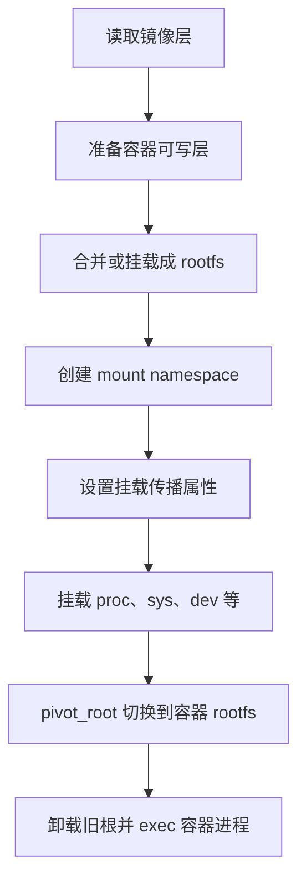

# 容器是怎么实现根目录隔离的

一句话：**容器看到的根目录不是宿主机根目录的简单副本，而是运行时为进程准备的一棵独立挂载树；再通过 mount namespace 隔离挂载视图，并用 `pivot_root`（或特定情况下的 `chroot`）把进程的根切换到容器 rootfs。**

要注意，镜像分层负责提供文件内容，mount namespace 负责隔离挂载视图，`pivot_root` 负责切换进程根目录。这几件事配合起来，才构成容器看到的文件系统视图。

## 一、先区分几个概念

### 1. rootfs

rootfs 是进程看到的根文件系统内容，通常包括 `/bin`、`/etc`、`/lib`、`/usr` 等目录。容器运行时可以用 OverlayFS 把镜像只读层和容器可写层合并成一个目录，再把这个合并目录作为容器 rootfs。

rootfs 描述的是“有哪些文件”，并不单独提供安全隔离。两个容器甚至可能使用同一份只读镜像层，但各自拥有不同的可写层和挂载视图。

### 2. mount namespace

mount namespace 隔离进程能看到的挂载树。容器可以有自己的 `/proc`、`/sys`、`/dev`、`/run` 等挂载；在一个 mount namespace 中新增或卸载挂载，通常不会改变宿主机或其他 namespace 的挂载视图。

创建 namespace 后，运行时通常还会把挂载传播属性设为私有或从属，避免容器内的挂载操作意外传播到宿主机。

### 3. `chroot` 与 `pivot_root`

- `chroot(new_root)` 修改调用进程的根目录解析起点，机制简单，但它本身不是安全边界，也不会创建 mount namespace。
- `pivot_root(new_root, put_old)` 在 mount namespace 中把新的根挂载切换为 `/`，并把旧根挂载移到新根下的 `put_old`，随后运行时通常卸载旧根。
- 容器运行时还要处理工作目录、挂载传播、伪文件系统、设备节点、能力集等；仅调用其中一个系统调用并不能得到完整容器隔离。

## 二、容器启动时发生了什么

典型启动过程可以概括为：



更具体地说：

1. **准备 rootfs**：运行时解包镜像层，建立容器可写层。常见存储驱动会用 OverlayFS 合并镜像只读层与容器可写层。
2. **创建隔离视图**：运行时通过 `clone`、`unshare` 等创建 mount namespace，并设置适当的挂载传播属性。
3. **布置容器挂载**：把 rootfs 挂载到目标位置，并按配置挂载 `/proc`、`/sys`、`/dev`、`/run`、秘密文件和卷等。卷挂载会覆盖 rootfs 中对应路径。
4. **切换根目录**：运行时在新 mount namespace 中调用 `pivot_root`，使容器 rootfs 成为进程看到的 `/`，然后卸载旧根挂载。
5. **启动容器进程**：设置工作目录、环境、用户和安全策略后，执行容器的入口进程。

因此，容器里的 `/` 通常是 rootfs 的视图，而非宿主机的 `/`。但容器与宿主机仍共享同一个 Linux 内核，根目录隔离不等于虚拟机隔离。

## 三、动手实践：用 `pivot_root` 做一个最小根目录

下面的实验面向 Debian/Ubuntu，需要 Linux 主机、root 权限及 `util-linux`。它会在 `/tmp` 创建临时 rootfs，在新的 mount namespace 中切换根目录；不会修改宿主机的挂载树。不要把实验目录替换成宿主机的重要目录。

### 1. 安装工具并准备静态 BusyBox

```bash
sudo apt-get update
sudo apt-get install -y busybox-static util-linux

ROOTFS=$(mktemp -d /tmp/rootfs-lab.XXXXXX)
mkdir -p "$ROOTFS/bin"
sudo install -m 0755 /bin/busybox "$ROOTFS/bin/busybox"
```

`busybox-static` 提供不依赖 rootfs 内动态链接库的 BusyBox，这样切根后仍能启动 shell。

### 2. 进入新的挂载 namespace 并切根

```bash
sudo env ROOTFS="$ROOTFS" unshare --mount --fork sh -c '
  set -eu
  mount --make-rprivate /
  mount --bind "$ROOTFS" "$ROOTFS"
  mkdir -p "$ROOTFS/.oldroot"
  cd "$ROOTFS"
  pivot_root . ./.oldroot
  cd /
  /bin/busybox umount -l /.oldroot
  /bin/busybox rmdir /.oldroot
  exec /bin/busybox sh
'
```

在新 shell 中执行：

```sh
pwd
ls /
echo inside > /from-container.txt
ls -l /from-container.txt
exit
```

你看到的 `/` 只有实验准备的最小内容。`exit` 后回到宿主机，再检查文件：

```bash
cat "$ROOTFS/from-container.txt"
sudo rm -rf -- "$ROOTFS"
```

这里写入的文件仍然能从宿主机通过 `$ROOTFS/from-container.txt` 访问。这说明切根改变了进程的路径解析视图，并没有把文件变成另一台机器上的数据。

### 3. 实验中的关键动作

- `unshare --mount` 创建新的 mount namespace。
- `mount --make-rprivate /` 让后续挂载变化不向其他挂载树传播。
- `mount --bind "$ROOTFS" "$ROOTFS"` 让实验目录成为独立挂载点，满足 `pivot_root` 的条件。
- `pivot_root . ./.oldroot` 将新 rootfs 设为 `/`，并把旧根移到 `/.oldroot`。
- `umount -l /.oldroot` 从当前挂载视图移除旧根，避免新根下仍能访问它。

本实验为了短小，没有挂载 `/proc`、`/sys` 和设备节点，也没有创建 PID、网络、用户等其他 namespace，更没有配置 cgroup、seccomp 或 capabilities，因此不是一个完整或安全的容器。

## 四、Docker 中观察容器根目录

如果已有 Docker 环境，可以直接观察容器文件系统和挂载信息：

```bash
docker run --rm alpine:3.20 sh -c '
  echo "容器中的根目录："
  ls /
  echo "PID 1 的 root 链接："
  readlink /proc/1/root
  echo "部分挂载信息："
  head -n 10 /proc/1/mountinfo
'
```

`/proc/1/mountinfo` 展示该进程所在 mount namespace 的挂载树。Docker 的具体存储驱动和挂载布局取决于主机配置；不要假设所有 Docker 安装都一定使用 OverlayFS。

也可以在宿主机查容器 init 进程的 PID，再检查它的根目录链接：

```bash
docker inspect --format '{{.State.Pid}}' <容器名或ID>
sudo readlink /proc/<上一步得到的PID>/root
```

`/proc/<pid>/root` 是宿主机观察另一个进程根目录的一种方式。它不表示容器可以看到宿主机的 `/proc` 路径。

## 五、容易混淆的地方

### 镜像层不等于根目录隔离

镜像层提供文件内容和分层复用；OverlayFS 等存储机制可以把多层呈现为一个目录。真正让进程看到独立挂载视图的是 mount namespace，而 `pivot_root`（或回退路径中的 `chroot`）完成进程根目录切换。

### `chroot` 不等于容器

`chroot` 不会隔离挂载、进程、网络或资源。具备足够权限的进程还可能通过保留的目录文件描述符、当前工作目录等方式逃出预期目录。因此不能把单独的 `chroot` 当作不可信代码的安全沙箱。

### 容器 root 不一定是真正的宿主机 root

容器中显示 UID 0，只说明进程在自己的用户身份映射和权限上下文中是 root。user namespace、capabilities、seccomp、LSM（如 AppArmor、SELinux）等会进一步限制权限；具体限制取决于运行配置。

### 卷挂载会覆盖镜像目录

若把宿主机目录挂载到容器 `/data`，容器看到的 `/data` 内容来自这个挂载，而不是镜像原本的 `/data`。挂载目标路径会被挂载内容遮蔽，容器停止后镜像层中的原目录仍然存在。

## 六、面试加分问题

### Q1：容器根目录隔离依赖哪个 namespace？

主要依赖 **mount namespace** 隔离挂载树，再由 `pivot_root` 或 `chroot` 设置进程看到的根。mount namespace 不负责隔离 PID、网络或资源，这些分别由其他 namespace 和 cgroup 等机制承担。

### Q2：`pivot_root` 和 `chroot` 有什么区别？

`chroot` 只修改进程路径解析的根目录，不改变挂载树，也不是安全隔离边界。`pivot_root` 作用于 mount namespace，把新的根挂载切换为 `/`，并将旧根移到新根内，便于随后卸载旧根。容器运行时优先采用适合其挂载布局的切根流程。

### Q3：为什么运行时通常在 `pivot_root` 后卸载旧根？

如果旧根仍挂载在新根下，进程可能仍能通过 `/.oldroot` 访问宿主机原来的目录树。卸载它可以清除这条挂载路径；实际运行时还要检查其他挂载点、文件描述符和权限配置，不能只凭这一步推导出完整安全性。

### Q4：rootfs 是怎么从镜像来的？

镜像由只读层组成，运行时再创建容器可写层，并通过 OverlayFS 等存储机制组合成 rootfs。存储驱动负责文件层的呈现和写时复制，namespace 与切根操作负责进程看到的隔离视图，两者是不同职责。

### Q5：容器里的 `/proc` 为什么要单独挂载？

`/proc` 是 procfs，不是普通镜像文件。容器运行时通常在容器 mount namespace 中重新挂载它，并结合 PID namespace 限制可见进程。若错误地复用宿主机的 procfs 或挂载传播配置不当，可能暴露不该看到的信息。

### Q6：容器 rootfs 隔离足以保证安全么？

不够。容器共享宿主机内核，安全边界还涉及 namespace、cgroup、capabilities、seccomp、LSM、设备访问控制、内核漏洞和运行时配置。对抗强威胁或运行不可信工作负载时，还需评估沙箱容器、虚拟机等更强隔离方案。

### Q7：容器停止后，可写层里的数据会怎样？

这取决于容器生命周期和存储配置。普通容器的可写层通常随容器删除而删除；需要持久化的数据应放在 volume 或 bind mount 中。镜像只读层不会因为容器写文件而被修改，写时复制通常把变更放入容器可写层。

面试时可以用这句话收尾：**镜像/存储驱动准备 rootfs，mount namespace 隔离挂载视图，`pivot_root` 切换进程根目录；而容器安全还要依赖其他 namespace、cgroup 和内核安全机制。**