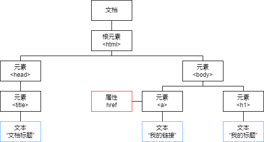

- [DOM是啥](#dom是啥)
- [获取元素](#获取元素)
- [操作元素](#操作元素)

# DOM是啥



- 文档：一个页面就是一个文档，DOM中用document表示。
- 元素：页面中的所有标签都是元素，DOM中用element表示。
- 节点：网页中的所有内容都是节点（标签，属性，文本，注释等），DOM中使用node表示。

DOM（Document Object Model）文档对象模型，把上面所有的内容都看成是对象。

# 获取元素

- 根据id获取：通过`getElementById()`方法获取。
- 根据标签名获取：通过`getElementsByTagName()`方法获取。
- H5新增的根据类名获取：通过`getElementsByClassName()`方法获取。
- H5新增的更强大的选择器选择：通过`querySelector(selector)`，这个`selector`的语法和css一样，根据id选择，根据标签选择，多层级选择。这个方法只返回第一个搜索到的结果，要所有结果需要用`querySelectorAll(selector)`。

# 操作元素

分成下面的步骤

1. 获取元素
2. 直接修改，或者注册事件
3. 事件触发进行修改

```html
<!DOCTYPE html>
<html lang="en">

<head>
    <meta charset="UTF-8">
    <meta http-equiv="X-UA-Compatible" content="IE=edge">
    <meta name="viewport" content="width=device-width, initial-scale=1.0">
    <title>Document</title>
</head>

<body>
    <button>更新时间</button>
    <div>当前时间</div>
    <script>
        // 1.获取元素
        var btnEle = document.querySelector("button")
        var divEle = document.querySelector("div")

        // 2.注册事件
        btnEle.onclick = function () {
            var date = new Date()
            divEle.innerText = date.toLocaleTimeString()
        }
    </script>
</body>

</html>
```
