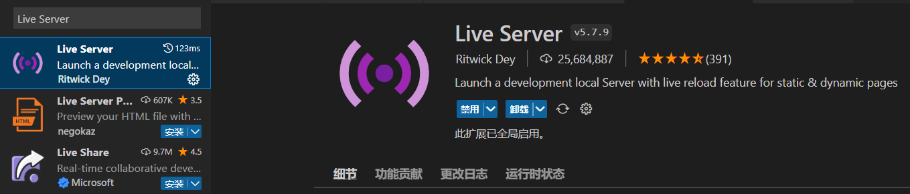
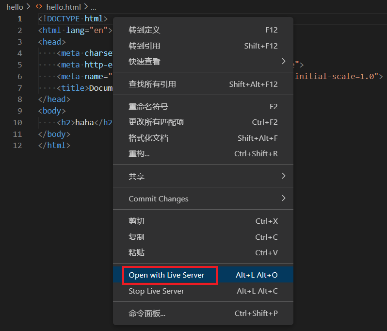

- [Live Server插件](#live-server插件)
- [自动重命名标签](#自动重命名标签)
- [参考资料](#参考资料)

# Live Server插件

Live Server插件可以在本地启动http服务器，这样就可以直接在vscode里面实时查看静态或者动态的页面。

安装之后在html的编辑界面直接鼠标右键，选择`Open with Live Server`就可以查看当前的网页了。

# 自动重命名标签

之前一般会下载Auto Rename Tag这个插件，来实现修改标签时，标签的另一半也自动进行修改。但现在vscode已经自带这个功能了，需要开启`editor.linkedEditing`设置。

# 参考资料
