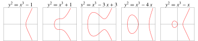
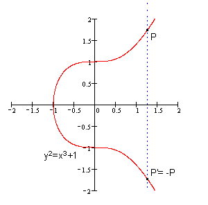
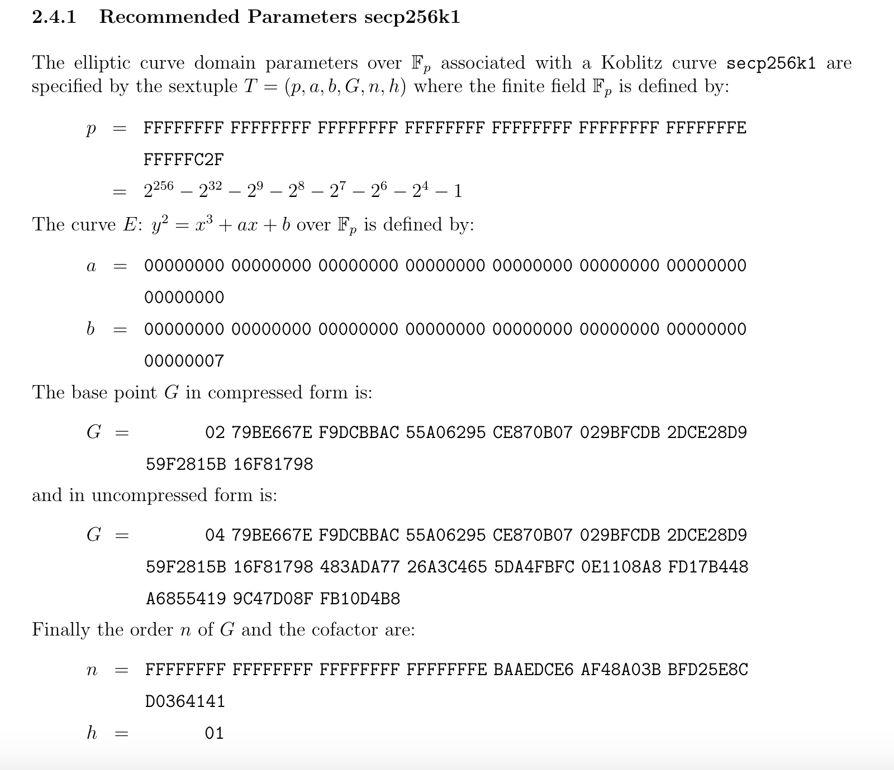

# ECC

椭圆曲线密码学（Elliptic curve cryptography，缩写为ECC），最初由Koblitz和Miller两人于1985年分别独立提出，是一种基于椭圆曲线数学的公开密钥加密算法，其数学基础是利用椭圆曲线上的有理点构成Abel加法群上椭圆离散对数的计算困难性。ECC的主要优势是在某些情况下它比其他的方法使用更小的密钥——比如RSA加密算法——提供相当的或更高等级的安全。

# 椭圆曲线

椭圆曲线的Weierstrass标准形式：
$$y^2=x^3+ax+b$$
当判别式不为0，那么椭圆曲线就是非奇异的，即处处可导：
$$4a^3+27b^2\neq 0$$
下图就是非奇异的椭圆曲线示例：

# 椭圆曲线上的阿贝尔群

$\mathbb{G}$是一个集合，在集合中定义一个对两个元素的操作，记为"加"，用$+$表示，集合中两个元素$a$和$b$，“加”操作表示为$a+b$，如果$a+b$满足以下5个特性，$\mathbb{G}$就是一个阿贝尔群：

- 闭合性（closure）： $a$, $b$是$\mathbb{G}$的元素，$a+b$也是。
- 结合性（associativity）： $(a+b)+c=a+(b+c)$.
- 存在单位元（identity element 0）：有$a+0=0+a=a$.
- 每个元素都有一个相反数，对每个元素$a$都存在$b$使$a+b=0$, $b$就是$a$的相反数，可以表示为$−a$.
- 交换律：$a+b=b+a$.

那么可以定义在椭圆曲线上的阿贝尔群：

- 一个椭圆曲线上的点是$\mathbb{G}$中的元素。
- 单位元0定义为无穷远处的点。
- 一个点$P$的相反数是关于$x$轴对称的点。
- “加”定义为：$P,Q,R$是一条直线跟椭圆曲线相交的3个点，那么有$P+Q+R=0$.

当点$P$加上它的相反数$-P$时，那么与椭圆曲线相交于无穷远点，也就是$P-P+0=0$：

# 有限域$\mathbb{F}_p$

前面的椭圆曲线是连续的，并不适合用于加密，所以我们必须把椭圆曲线变成离散的点。在ECC算法中用模$p$同余（p为素数），来实现离散的有限域$\mathbb{F}_p$.

# secp256k1的参数

椭圆曲线的参数可以有多种配置方式，也就存在多种不同的曲线，例如secp256k1、secp256r1、Curve25519等，不同曲线的安全性存在一些区别，在SafeCurves中有相关对比描述。
secp256k1是高效密码组标准(SECG)协会开发的一套高效的椭圆曲线签名算法标准。在比特币流行之前，secp256k1并未真正使用过。secp256k1命名由几部分组成：sec来自SECG标准，p表示曲线坐标是素数域，256表示素数是256位长，k表示它是Koblitz曲线的变体，1表示它是第一个标准中该类型的曲线。
那为什么比特币要选择secp256k1签名算法而不是其他已流行的算法呢？比特币开发者社区曾讨论过secp256k1是否安全。中本聪没有明确解释，只是说道”有根据的推测”。从社区的讨论中，有推测是其它的曲线，比如secp256r1中的参数是美国国安局精心挑选的，相当于安全性受到权威机构的干涉。总的来说选择secp256k1是安全和性能考量的结果。以太坊沿用了比特币中的数字签名算法。
secp256k1的参数如下：

- 有限域的大小是个素数$p$.
- 椭圆曲线中的系数$a,b$.$
- 群基准点$G$.
- 群的阶$n$.
- 群的协因子$h$.

# 群的阶$n$

如果椭圆曲线上一点$P$，存在最小的正整数$n$，使得数乘$nP=0$，则将$n$称为$P$的阶。

# 产生密钥genKey

- 选择一条椭圆曲线$E_P(a,b)$，选择基点$G$，$G$的阶数为$n$.
- 选择随机数$d\in [1,n)$为私钥，计算公钥$Q=d⋅G$.

这里计算$d⋅G$很简单，但是根据$Q$和$G$很难计算出$d$.

# 加解密

加密：

- 将要编码的一块数据编码为椭圆曲线上的一点$M$.
- 产生一个随机数$r$，计算密文：$C_1=M+rQ,C_2=rG$

解密：

- $C_1-dC_2=M+rQ-r(dG)=M+rQ-rQ=M$

# 签名算法sign

- 对消息$m$使用消息摘要算法，得到$z=hash(m)$.
- 生成随机数$k\in [1,n)$，计算点$(x, y)=k⋅G$.
- 取$r=x\,mod\,n$，若$r=0$则重新选择随机数$k$.
- 计算$s=k^{−1}(z+rd)\,mod\,n$，若$s=0$则重新选择随机数$k$.
- 上述$(r,s)$即为ECDSA签名。

# 验证算法verify

使用公钥$Q$和消息$m$，对签名$(r,s)$进行验证。

- 验证$r,s\in [1,n)$.
- 计算$z=hash(m)$.
- 计算$u_1=zs^{−1}\,mod\,n$和$u_2=rs^{−1}\,mod\,n$.
- 计算$(x, y)=u_1⋅G+u_2⋅Q\,mod\,n$.
- 判断$r==x$，若相等则签名验证成功。

# 恢复算法recover

已知消息$m$和签名$(r,s)$，恢复计算出公钥$Q$。

- 验证$r, s\in [1,n)$
- 计算$R=(x,y)$，其中$x=r,r+n,r+2n...$，代入椭圆曲线方程计算获得$R$.
- 计算$z=hash(m)$.
- 计算$u_1=−zr^{−1}\,mod\,n$和$u_2=sr^{−1}\,mod\,n$.
- 计算公钥$Q= (x’,y’)=u_1⋅G+u_2⋅R$

# recoveryId

在计算R的步骤可以看到，存在多个x的取值可能性，导致存在多个R的可能性，因此计算得到的Q也存在多个可能的结果，需要通过和已知的公钥对比，确定哪一个Q是正确的。如果遍历x的所有可能都未找到正确的Q，说明该消息和签名是不对应的，或者是一个未知的公钥。
为了确定正确的Q，需要遍历x的所有可能取值，跑多轮recover算法，这个时间开销是比较大的。为了提高recover的时间效率，采用空间换时间的思路，在签名中增加一个v值，用于快速确定x，避免遍历查找试探，这个v值就是recoveryId。
由于$r=x\,mod\,n$，因此$r,r+n,r+2n…$都可能是合法的原始x值，不同的椭圆曲线存在不同数量这样合法的x值，secp256k1曲线存在两个可能$r,r+n$。
每一个X轴坐标对应两个可能的Y坐标，因此secp256k1曲线具备四种可能的$R，(r,y) (r,-y) (r+n,y’) (r+n,-y’)$。但是，对于一个r值存在两个X轴坐标的概率极低，低到几乎可以忽略，以太坊中就忽略了这两种小概率事件。
由于$r=x\,mod\,n$，$x$是模$p$的结果，$r$是模$n$的结果，$x$值的范围是$[0, p)$，$r$值的范围是$[0, n)$。如果$r+n$也是曲线上的点，则$r$的值必须小于$p-n$，概率为$(p-n)/p$，大约为$3.73\times 10^{-39}$，这个概率是非常小的。

# 参考资料

- 博客：[ECC算法](http://suntus.github.io/2019/05/31/ECC%E7%AE%97%E6%B3%95/)
- 博客：[SM2算法第一篇：ECC加密算法](https://blog.csdn.net/qq_30866297/article/details/51175305)
- 博客：[一个数字引发的探索——ECDSA解析](https://my.oschina.net/fiscobcos/blog/4384028)
- secp256k1参数：[ECC SEC2](https://www.secg.org/sec2-v2.pdf)
