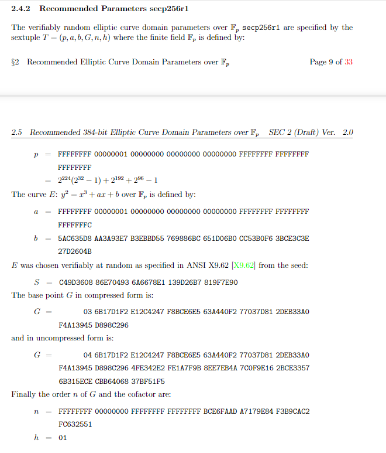

- [ECC](#ecc)
- [椭圆曲线](#椭圆曲线)
- [椭圆曲线上的阿贝尔群](#椭圆曲线上的阿贝尔群)
- [椭圆曲线的参数](#椭圆曲线的参数)
  - [有限域$\mathbb{F}_p$](#有限域mathbbf_p)
  - [子群的基准点$G$和子群的阶$n$](#子群的基准点g和子群的阶n)
  - [子群的协因子$h$](#子群的协因子h)
- [常用椭圆曲线参数](#常用椭圆曲线参数)
  - [secp256k1](#secp256k1)
  - [secp256r1](#secp256r1)
- [ECDSA算法](#ecdsa算法)
  - [生成密钥对（genKey）](#生成密钥对genkey)
  - [加密（encrypt）](#加密encrypt)
  - [解密（decrypt）](#解密decrypt)
  - [签名（sign）](#签名sign)
  - [验证（verify）](#验证verify)
  - [恢复（recover）](#恢复recover)
  - [recoveryID](#recoveryid)
- [参考资料](#参考资料)

# ECC

椭圆曲线密码学算法（Elliptic curve cryptography，缩写为ECC），最初由Koblitz和Miller两人于1985年分别独立提出，是一种基于椭圆曲线数学的公开密钥加密算法，其数学基础是利用椭圆曲线上的有理点构成的Abel加法群上**椭圆离散对数的计算困难性**。

ECC的主要优势是在某些情况下它比其他的方法使用更小的密钥——比如RSA算法——提供相当的或更高等级的安全。

# 椭圆曲线

椭圆曲线的Weierstrass标准形式：

$$y^2=x^3+ax+b$$

当判别式不为0，那么椭圆曲线就是非奇异的，即处处可导：

$$4a^3+27b^2\neq 0$$

下图是非奇异的椭圆曲线示例。

# 椭圆曲线上的阿贝尔群

$\mathbb{G}$是一个集合，在集合中定义一个对两个元素的操作，记为"加"，用$+$表示，集合中两个元素$a$和$b$，“加”操作表示为$a+b$，如果$a+b$满足以下5个特性，$\mathbb{G}$就是一个阿贝尔群。

- 闭合性（closure）： 若$a,b$是$\mathbb{G}$中的元素，那么$a+b$也是。
- 结合性（associativity）： $(a+b)+c=a+(b+c)$.
- 存在单位元（identity element 0）：有$a+0=0+a=a$.
- 每个元素都有一个相反数，对每个元素$a$都存在$b$使$a+b=0$, $b$就是$a$的相反数，可以表示为$−a$.
- 交换律：$a+b=b+a$.

那么可以得到定义在椭圆曲线上的阿贝尔群。

- 一个椭圆曲线上的点是$\mathbb{G}$中的元素。
- 单位元$0$定义为无穷远处的点。
- 一个点$P$的相反数是关于$x$轴对称的点。
- “加”定义为：$P,Q,R$是一条直线跟椭圆曲线相交的3个点，那么有$P+Q+R=0$，也就是$P+Q=-R$.

当点$P$加上它的相反数$-P$时，那么与椭圆曲线相交于无穷远点，也就是$P+(-P)=0$：

# 椭圆曲线的参数

上述内容简单说明了椭圆曲线算法的定义，但如果要将其转换为计算机能处理的离散算法，还需要做一些椭圆曲线参数上的限制。
椭圆曲线算法中的参数如下。

1. 椭圆曲线中的系数$a,b$.
2. 有限域的大小是个素数$p$.
3. 子群基准点$G$.
4. 子群的阶$n$.
5. 子群的协因子$h$.

## 有限域$\mathbb{F}_p$

之前的椭圆曲线是在实数域上的，并不适合计算机处理，所以我们必须把椭圆曲线变成离散的点。在ECC算法中选取模$p$同余（$p$为素数）的点来做“加”法。从而得到离散的有限域$\mathbb{F}_p$.

## 子群的基准点$G$和子群的阶$n$

首先需要定义一个椭圆曲线群的阶$N$，表示该群中点的总量。
子群的基准点$G$，其实就是椭圆曲线群中的任意一点，选取之后作为基准点。然后对其进行累加（可以转换为标量乘法）。

$$nG=G+G+\cdots +G$$

在有限域中，这样的加法会形成循环，也就是加到某一步$nG=0$，这时就得到一个基于基准点$G$的子群，这个子群中一共有$n$个点。此时$n$就是这个子群的阶。

1. 子群的阶就是子群中的元素个数，等价于$nG=0$，其$n$是正整数，且$n$是其中最小的1个，这个$n$就是这个子群的阶。
2. 根据拉格朗日定理，子群的阶，是父群阶的一个因子，比如一个椭圆曲线群有$N$个元素，它的一个子群有n个元素，n能整除N.

## 子群的协因子$h$

在实际使用中需要子群大一点，也就是$n$的值大一点。但是根据基准点来计算$n$，一个是范围太大，一个是没有直接公式可以计算子群的阶。所以实际中是先计算椭圆曲线群的阶$N$，这个可以利用`Schoof’s algorithm`算法计算，然后选取$N$的一个较大的素因子$n$作为子群的阶，令$h=\frac{N}{n}$，$h$就称做子群的协因子。在椭圆曲线中随机选择点$P$，那么有。

$$NP=0$$
$$n(hP)=0$$

因为$N$总是任何一个$n$的倍数。此时就可以选取$G=hP$作为这个子群的基准点了。方便快捷。

# 常用椭圆曲线参数

椭圆曲线的参数可以有多种配置方式，也就存在多种不同的曲线，例如`secp256k1`、`secp256r1`、`Curve25519`等，不同曲线的安全性存在一些区别，在SafeCurves中有相关对比描述。

## secp256k1

`secp256k1`是高效密码组标准(SECG)协会开发的一套高效的椭圆曲线签名算法标准。在比特币流行之前，`secp256k1`并未真正使用过。`secp256k1`命名由几部分组成。

- sec来自SECG标准。
- p表示曲线坐标是素数域。
- 256表示素数是256位长。
- k表示它是Koblitz曲线的变体。
- 1表示它是第一个标准中该类型的曲线。

那为什么比特币要选择`secp256k1`签名算法而不是其他已流行的算法呢？比特币开发者社区曾讨论过`secp256k1`是否安全。中本聪没有明确解释，只是说道”有根据的推测”。从社区的讨论中，有推测是其它的曲线，比如`secp256r1`中的参数是美国国安局精心挑选的，相当于安全性受到权威机构的干涉。总的来说选择`secp256k1`是安全和性能考量的结果。以太坊沿用了比特币中的数字签名算法。
`secp256k1`的参数如下。

## secp256r1

`secp256r1`是美国国家安全局建议使用的椭圆曲线，里面的`r`代表曲线的参数是经过随机选取的。它也被称为`NIST P-256`。

# ECDSA算法

## 生成密钥对（genKey）

1. 确定子群的阶数$n$，基点$G$.
2. 选择随机数$d\in [1,n)$作为私钥，并计算出公钥$Q=d⋅G$.

这里计算$d⋅G$很简单，但是根据公钥$Q$和基点$G$却很难计算出私钥$d$.

## 加密（encrypt）

1. 准备要加密的数据$M$，随机数$r$.
2. 计算密文：$C_1=M+r⋅Q,C_2=r⋅G$

## 解密（decrypt）

1. $C_1-d⋅C_2=M+r⋅Q-r(d⋅G)=M+r⋅Q-r⋅Q=M$

## 签名（sign）

1. 对消息$m$使用消息摘要算法，得到$z=hash(m)$.
2. 生成随机数$k\in [1,n)$，计算点$(x, y)=k⋅G$.
3. 取$r=x\,mod\,n$，若$r=0$则重新选择随机数$k$.
4. 计算$s=k^{−1}(z+rd)\,mod\,n$，若$s=0$则重新选择随机数$k$.
5. 上述$(r,s)$即为ECDSA签名。

## 验证（verify）

使用公钥$Q$和消息$m$，对签名$(r,s)$进行验证。

1. 验证$r,s\in [1,n)$.
2. 计算$z=hash(m)$.
3. 计算$u_1=zs^{−1}\,mod\,n$和$u_2=rs^{−1}\,mod\,n$.
4. 计算$(x, y)=u_1⋅G+u_2⋅Q\,mod\,n$.
5. 判断$r==x$，若相等则签名验证成功。

## 恢复（recover）

已知消息$m$和签名$(r,s)$，恢复计算出公钥$Q$。

1. 验证$r, s\in [1,n)$
2. 计算$R=(x,y)$，其中$x=r,r+n,r+2n...$，代入椭圆曲线方程计算获得$R$.
3. 计算$z=hash(m)$.
4. 计算$u_1=−zr^{−1}\,mod\,n$和$u_2=sr^{−1}\,mod\,n$.
5. 计算公钥$Q= (x’,y’)=u_1⋅G+u_2⋅R$

## recoveryID

在计算$R$的步骤可以看到，存在多个$x$的取值可能性，导致存在多个$R$的可能，因此计算得到的$Q$也存在多个可能的结果，需要通过和已知的公钥对比，确定哪一个$Q$是正确的。如果遍历$x$的所有可能都未找到正确的$Q$，说明该消息和签名是不对应的，或者是一个未知的公钥。
为了确定正确的$Q$，需要遍历$x$的所有可能取值，跑多轮`recover`算法，这个时间开销是比较大的。为了提高`recover`的时间效率，采用空间换时间的思路，在签名中增加一个$v$值，用于快速确定$x$，避免遍历查找试探，这个$v$值就是`recoveryId`。
由于$r=x\,mod\,n$，因此$r,r+n,r+2n…$都可能是合法的原始x值，不同的椭圆曲线存在不同数量这样合法的x值，`secp256k1`曲线存在两个可能$r,r+n$。
每一个X轴坐标对应两个可能的Y坐标，因此`secp256k1`曲线具备四种可能的$R，(r,y) (r,-y) (r+n,y’) (r+n,-y’)$。但是，对于一个$r$值存在两个$X$轴坐标的概率极低，低到几乎可以忽略，以太坊中就忽略了这两种小概率事件。
由于$r=x\,mod\,n$，$x$是模$p$的结果，$r$是模$n$的结果，$x$值的范围是$[0, p)$，$r$值的范围是$[0, n)$。如果$r+n$也是曲线上的点，则$r$的值必须小于$p-n$，概率为$(p-n)/p$，大约为$3.73\times 10^{-39}$，这个概率是非常小的。

# 参考资料

- 博客：[ECC算法](http://suntus.github.io/2019/05/31/ECC%E7%AE%97%E6%B3%95/)
- 博客：[SM2算法第一篇：ECC加密算法](https://blog.csdn.net/qq_30866297/article/details/51175305)
- 博客：[一个数字引发的探索——ECDSA解析](https://my.oschina.net/fiscobcos/blog/4384028)
- secp256k1参数：[ECC SEC2](https://www.secg.org/sec2-v2.pdf)
- [hyperledger/fabric的关键机制——secp256r1](https://www.jianshu.com/p/ce1bda92b28c)
