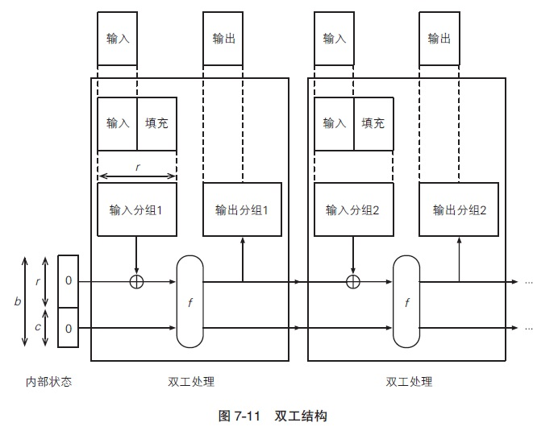
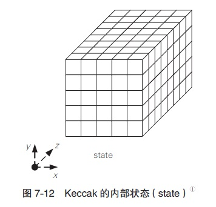
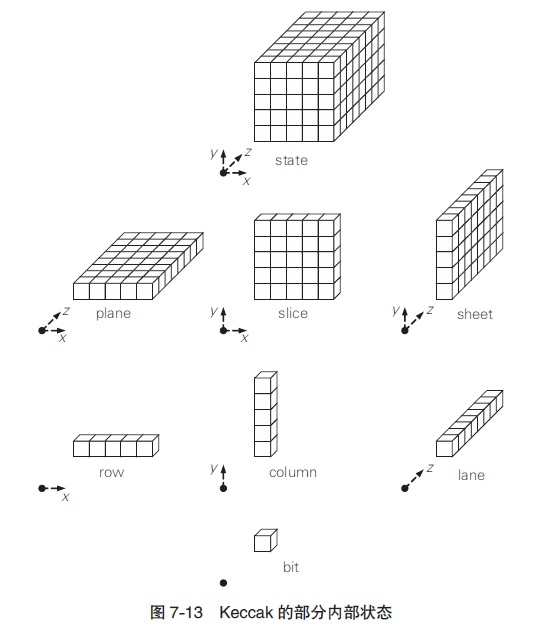
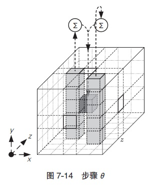
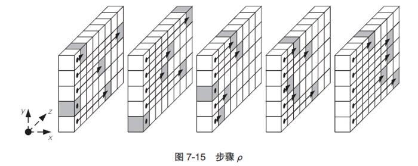
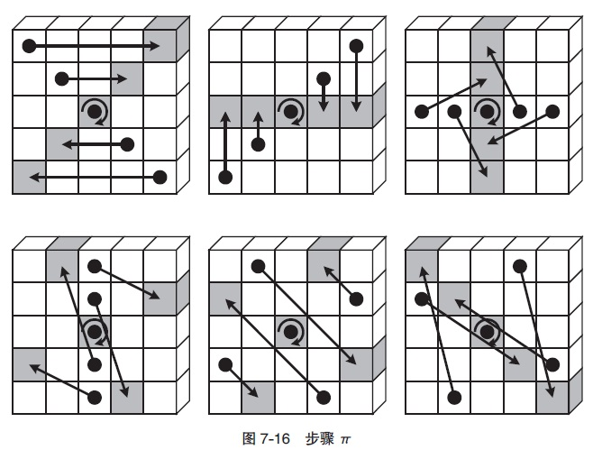
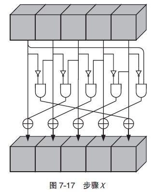

# SHA-3

SHA-3（Secure Hash Algorithm-3）是一种作为新标准发布的单向散列函数算法，用来替代在理论上已被找出攻击方法的SHA-1算法。全世界的企业和密码学家提交了很多SHA-3的候选方案，经过长达5年的选拔，最终于2012年正式确定将Keccak算法作为SHA-3标准。
和AES一样，举办SHA-3公开选拔活动的依然是美国国家标准与技术研究院NIST。本次选拔出的单向散列函数算法同时成为了联邦信息处理标准[FIPS 202](http://nvlpubs.nist.gov/nistpubs/FIPS/NIST.FIPS.202.pdf)。尽管这只是美国的国家标准，但实质上也将会作为国际标准被全世界所认可。

# SHA-3竞选过程

2007年，NIST开始了SHA-3的公开征集，截止到2008年共征集到64个算法。
2010年，SHA-3最终候选名单出炉，其中包括5个算法。SHA-3最终候选名单：

| 名称 | 提交者 |
| :---: | :---: |
| BLAKE | Jean-Philippe Aumasson、Luca Henzen、Willi Meier、Raphael C. -W. Phan |
| Grostl | Praveen Gauravaram、Lars R. Knudsen、Krystian Matusiewicz、Florian Mendel、Christian Rechberger、Martin Schlaffer、Soren S. Thomsen |
| JH | Hongjun Wu |
| keccak | Guido Bertoni、Joan Daemen、Gilles Van Assche、Michaël Peeters |
| Skein | Niels Ferguson、Stefan Lucks、Bruce Schneier、Doug Whiting、Mihir Bellare、Tadayoshi kohno、Jon Callas、Jesse Walker |

2012年，由Guido Bertoni、Joan Daemen、Gilles Van Assche、Michaël Peeters共同设计的Keccak算法被最终确定为SHA-3标准，其中Joan Daemen也是对称密码算法AES的设计者之一。
基于NIST所设定的条件，我们能够免费、自由地使用SHA-3算法，这与AES的情形完全相同。不过，SHA-3的出现并不意味着SHA-2就不安全了，在一段时间内，SHA-2和SHA-3还将会共存。
Keccak最终被选为SHA-3的理由如下：

- 采用了与SHA-2完全不同的结构。
- 结构清晰，易于分析。
- 能够适用于各种设备，也适用于嵌入式应用。
- 在硬件上的实现显示出了很高的性能。
- 比其他最终候选算法安全性边际更大。

# Keccak

如前所述，Keccak是一种被选定为SHA-3标准的单向散列函数算法。
Keccak可以生成任意长度的散列值，但为了配合SHA-2的散列值长度，SHA-3标准中共规定了SHA3-224、SHA-3-256、SHA3-384、SHA3-512这4种版本。在输入数据的长度上限方面，SHA-1为$2^{64}-1$比特，SHA-2 为$2^{128}-1$比特，而SHA-3则没有长度限制。

# Keccak和SHA-3的区别

SHA-3由Keccak标准化而来，在很多场合下Keccak和SHA-3是同义词，但在2015年8月SHA3最终完成标准化时，NIST调整了填充算法：`SHA3-256(M) = KECCAK [512] (M || 01, 256)`。所以标准的NIST SHA-3就和keccak计算的结果不一样。详见参考资料。

# 海绵结构

下面我们来看一看Keccak的结构。Keccak采用了与SHA-1、SHA-2完全不同的海绵结构（sponge construction）（图7-10）：


Keccak的海绵结构中，输入的数据在进行填充之后，要经过吸收阶段（absorbing phase）和挤出阶段（squeezing phase），最终生成输出的散列值。
“海绵结构”这个名字听上去有点怪，请大家想象一下将一块海绵泡在水里吸水，然后再将里面的水挤出来的情形。同样地，Keccak的海绵结构是先将输入的消息吸收到内部状态中，然后再根据内部状态挤出相应的散列值。
吸收阶段的流程如下：

- 将经过填充的输入消息按照每r个比特为一组分割成若干个输入分组。
- 首先，将“内部状态的r个比特”与“输入分组1”进行XOR，将其结果作为“函数f的输入值”。
- 然后，将“函数f的输出值r个比特”与“输入分组2”进行XOR，将其结果再次作为“函数f 的输入值”。
- 反复执行上述步骤，直到到达最后一个输入分组。
- 待所有输入分组处理完成后，结束吸收阶段，进入挤出阶段。

函数f的作用是将输入的数据进行复杂的搅拌操作并输出结果（输入和输出的长度均为$b = r + c$个比特），其操作对象是长度为$b = r + c$个比特的内部状态，内部状态的初始值为0。也就是说，通过反复将输入分组的内容搅拌进来，整个消息就会被一点一点地“吸收”到海绵结构的内部状态中，就好像水分被一点一点地吸进海绵内部一样。每次被吸收的输入分组长度为r个比特，因此r被称为比特率（bit rate）。
通过图7-10我们可以看出，函数f的输入长度不是r个比特，而是r + c个比特，请大家注意这一点，这意味着内部状态中有c个比特是不受输入分组内容的直接影响的（但会通过函数f受到间接影响）。这里的c被称为容量（capacity）。
吸收阶段结束后，便进入了挤出阶段，流程如下。

- 首先，将“函数f的输出值中的r个比特”保存为“输出分组1”，并将整个输出值（r + c个比特）再次输入到函数f中。
- 然后，将“函数f的输出值中的r个比特”保存为“输出分组2”，并将整个输出值（r + c个比特）再次输入到函数f中。
- 反复执行上述步骤，直到获得所需长度的输出数据。

无论是吸收阶段还是挤出阶段，函数f的逻辑本身是完全相同的，每执行一次函数f，海绵结构的内部状态都会被搅拌一次。
挤出阶段中实际上执行的是“对内部状态进行搅拌并产生输出分组（r个比特）”的操作，也就是以比特率（r个比特）为单位，将海绵结构的内部状态中的数据一点一点地“挤”出来，就像从海绵里面把水分挤出来一样。
在挤出阶段中，内部状态r + c个比特中的容量（c个比特）部分是不会直接进入输出分组的，这部分数据只会通过函数f间接影响输出的内容。因此，容量c的意义在于防止将输入消息中的一些特征泄漏出去。

# 双工结构

作为海绵结构的变形，Keccak中还提出了一种双工结构（图7-11）：



在海绵结构中，只有将输入的消息全部吸收完毕之后才能开始输出，但在双工结构中，输入和输出是以相同的速率进行的。在双向通信中，发送和接收同时进行的方式称为全双工（fullduplex），Keccak的双工结构也代表同样的含义。
通过采用双工结构，Keccak不仅可用于计算散列值，还可以覆盖密码学家的工具箱中的其他多种用途，如伪随机数生成器、流密码、认证加密、消息认证码等。

# Keccak的内部状态

刚才我们介绍了Keccak中$b = r + c$个比特的内部状态是如何通过函数f进行变化的，下面我们来深入地看一看内部状态。
Keccak的内部状态是一个三维的比特数组，如图7-12所示。图中的每个小方块代表1个比特，b个小方块按照$5\times 5\times z$的方式组合起来，就成为一个沿z轴延伸的立方体。



我们将具备x、y、z三个维度的内部状态整体称为state，state共有b个比特。
如果我们只关注内部状态中的两个维度，可以将xz平面称为plane，将xy平面称为slice，将yz平面称为sheet（图7-13）。



同样地，如果我们只关注其中一个维度，可以将x轴称为row，将y轴称为column，将z轴称为lane。
Keccak的本质就是实现一个能够将上述结构的state进行有效搅拌的函数f，这与分组密码设计中的搅拌过程非常相似。此外，由于内部状态可以代表整个处理过程中的全部中间状态，因此有利于节约内存。Keccak用到了很多比特单位的运算，因此被认为可以有效抵御针对字节单位的攻击。

# 函数Keccak-f [b]

下面我们来看一看负责对内部状态进行搅拌的函数f。Keccak的函数f实际上应该叫作Keccak-f [b]，从这个名称可以看出，这个函数带有一个参数b，即内部状态的比特长度。这里的参数b称为宽度（width）。
根据Keccak的设计规格，宽度b可以取25、50、100、200、400、800、1600 共7种值，SHA-3采用的是其中的最大宽度，即$b=1600$。
Keccak-f [b]中的每一轮包含5 个步骤：$\theta$（西塔）、$\rho$（柔）、$\pi$（派）、$\chi$（凯）、$\iota$（伊欧塔），总共循环$12 + 2l$轮（其中$b=25\times 2^l$）。具体到SHA-3 中所使用的Keccak-f [1600] 函数，其循环轮数为24轮。

- **步骤$\theta$**：

图7-14所示为对其中1个比特应用步骤$\theta$时的情形，这一步的操作是将位置不同的两个column中各自5个比特通过XOR运算加起来（图中的$\Sigma$标记），然后再与置换目标比特求XOR并覆盖掉目标比特。



- **步骤$\rho$**：

图7-15 所示为应用步骤$\rho$时的情形，这一步的操作是沿z轴（lane 方向）进行比特平移。



- **步骤$\pi$**：

图7-16所示为对其中1片slice应用步骤$\pi$时的情形，实际上整条lane上的所有slice都会被执行同样的比特移动操作。



- **步骤$\chi$**：

图7-17 所示为对其中1个row应用步骤$\chi$时的情形。这里我们使用了一些逻辑电路中的符号，其中代表对输入比特取反，即NOT；代表仅当两个输入比特均为1时则输出1，即AND。



- **步骤$\iota$**：

步骤$\iota$是用一个固定的轮常数对整个state的所有比特进行XOR运算，目的是让内部状态具备非对称性。

# keccak256代码实现

下面是[ethereum/aleth](https://github.com/ethereum/aleth)项目（以太坊C++版实现）中对于keccak256的算法实现：

```cpp
#include <cstdint>

#if _MSC_VER
#include <cstring>
#define __builtin_memcpy memcpy
#endif

#if _WIN32
/* On Windows assume little endian. */
#define __LITTLE_ENDIAN 1234
#define __BIG_ENDIAN 4321
#define __BYTE_ORDER __LITTLE_ENDIAN
#elif __APPLE__
#include <machine/endian.h>
#else
#include <endian.h>
#endif

#if __BYTE_ORDER == __LITTLE_ENDIAN
#define to_le64(X) X
#else
#define to_le64(X) __builtin_bswap64(X)
#endif

namespace dev {

static inline uint64_t rol(uint64_t x, unsigned s) {
    return (x << s) | (x >> (64 - s));
}

static const uint64_t s_roundConstants[24] = {
    0x0000000000000001,
    0x0000000000008082,
    0x800000000000808a,
    0x8000000080008000,
    0x000000000000808b,
    0x0000000080000001,
    0x8000000080008081,
    0x8000000000008009,
    0x000000000000008a,
    0x0000000000000088,
    0x0000000080008009,
    0x000000008000000a,
    0x000000008000808b,
    0x800000000000008b,
    0x8000000000008089,
    0x8000000000008003,
    0x8000000000008002,
    0x8000000000000080,
    0x000000000000800a,
    0x800000008000000a,
    0x8000000080008081,
    0x8000000000008080,
    0x0000000080000001,
    0x8000000080008008,
};

// 对内部状态进行搅拌的函数f，1600表示内部状态state包含的bit位数
static void keccakf1600(uint64_t state[25]) {
    /* The implementation based on the "simple" implementation by Ronny Van Keer. */

    int round;

    uint64_t Aba, Abe, Abi, Abo, Abu;
    uint64_t Aga, Age, Agi, Ago, Agu;
    uint64_t Aka, Ake, Aki, Ako, Aku;
    uint64_t Ama, Ame, Ami, Amo, Amu;
    uint64_t Asa, Ase, Asi, Aso, Asu;

    uint64_t Eba, Ebe, Ebi, Ebo, Ebu;
    uint64_t Ega, Ege, Egi, Ego, Egu;
    uint64_t Eka, Eke, Eki, Eko, Eku;
    uint64_t Ema, Eme, Emi, Emo, Emu;
    uint64_t Esa, Ese, Esi, Eso, Esu;

    uint64_t Ba, Be, Bi, Bo, Bu;

    uint64_t Da, De, Di, Do, Du;

    Aba = state[0];
    Abe = state[1];
    Abi = state[2];
    Abo = state[3];
    Abu = state[4];
    Aga = state[5];
    Age = state[6];
    Agi = state[7];
    Ago = state[8];
    Agu = state[9];
    Aka = state[10];
    Ake = state[11];
    Aki = state[12];
    Ako = state[13];
    Aku = state[14];
    Ama = state[15];
    Ame = state[16];
    Ami = state[17];
    Amo = state[18];
    Amu = state[19];
    Asa = state[20];
    Ase = state[21];
    Asi = state[22];
    Aso = state[23];
    Asu = state[24];

    // 循环次数为12+2l，其中b=1600=25*2^l
    // 对于keccak-f [1600]需要循环24次
    for (round = 0; round < 24; round += 2) {
        /* Round (round + 0): Axx -> Exx */

        // row：表示一行（x轴）
        // column：表示一列（y轴）
        // lane：表示一条（z轴）

        // theta变换：将每一列（column）异或压缩为一个bit
        Ba = Aba ^ Aga ^ Aka ^ Ama ^ Asa;
        Be = Abe ^ Age ^ Ake ^ Ame ^ Ase;
        Bi = Abi ^ Agi ^ Aki ^ Ami ^ Asi;
        Bo = Abo ^ Ago ^ Ako ^ Amo ^ Aso;
        Bu = Abu ^ Agu ^ Aku ^ Amu ^ Asu;

        // theta变换：将某B点旁边的两点抑或为D点
        Da = Bu ^ rol(Be, 1);
        De = Ba ^ rol(Bi, 1);
        Di = Be ^ rol(Bo, 1);
        Do = Bi ^ rol(Bu, 1);
        Du = Bo ^ rol(Ba, 1);

        // theta变换：计算ba，ge，ki，mo，su这样的lane中所有的theta变换的值
        // rho变换：计算ba，ge，ki，mo，su这样的lane中所有的rho变换的值
        // pi变换：旋转lane所处的行和列
        // 这也是为什么要这样选择ba，ge，ki，mo，su这样的lane，是因为这样经过旋转之后刚好处于同一行
        // chi变换：对一行进行求反，求并，异或的操作
        // iota变换：用固定的轮常数进行异或计算，目的是让内部状态具备非对称性
        Ba = Aba ^ Da;
        Be = rol(Age ^ De, 44);
        Bi = rol(Aki ^ Di, 43);
        Bo = rol(Amo ^ Do, 21);
        Bu = rol(Asu ^ Du, 14);
        Eba = Ba ^ (~Be & Bi) ^ s_roundConstants[round];
        Ebe = Be ^ (~Bi & Bo);
        Ebi = Bi ^ (~Bo & Bu);
        Ebo = Bo ^ (~Bu & Ba);
        Ebu = Bu ^ (~Ba & Be);

        Ba = rol(Abo ^ Do, 28);
        Be = rol(Agu ^ Du, 20);
        Bi = rol(Aka ^ Da, 3);
        Bo = rol(Ame ^ De, 45);
        Bu = rol(Asi ^ Di, 61);
        Ega = Ba ^ (~Be & Bi);
        Ege = Be ^ (~Bi & Bo);
        Egi = Bi ^ (~Bo & Bu);
        Ego = Bo ^ (~Bu & Ba);
        Egu = Bu ^ (~Ba & Be);

        Ba = rol(Abe ^ De, 1);
        Be = rol(Agi ^ Di, 6);
        Bi = rol(Ako ^ Do, 25);
        Bo = rol(Amu ^ Du, 8);
        Bu = rol(Asa ^ Da, 18);
        Eka = Ba ^ (~Be & Bi);
        Eke = Be ^ (~Bi & Bo);
        Eki = Bi ^ (~Bo & Bu);
        Eko = Bo ^ (~Bu & Ba);
        Eku = Bu ^ (~Ba & Be);

        Ba = rol(Abu ^ Du, 27);
        Be = rol(Aga ^ Da, 36);
        Bi = rol(Ake ^ De, 10);
        Bo = rol(Ami ^ Di, 15);
        Bu = rol(Aso ^ Do, 56);
        Ema = Ba ^ (~Be & Bi);
        Eme = Be ^ (~Bi & Bo);
        Emi = Bi ^ (~Bo & Bu);
        Emo = Bo ^ (~Bu & Ba);
        Emu = Bu ^ (~Ba & Be);

        Ba = rol(Abi ^ Di, 62);
        Be = rol(Ago ^ Do, 55);
        Bi = rol(Aku ^ Du, 39);
        Bo = rol(Ama ^ Da, 41);
        Bu = rol(Ase ^ De, 2);
        Esa = Ba ^ (~Be & Bi);
        Ese = Be ^ (~Bi & Bo);
        Esi = Bi ^ (~Bo & Bu);
        Eso = Bo ^ (~Bu & Ba);
        Esu = Bu ^ (~Ba & Be);


        /* Round (round + 1): Exx -> Axx */

        Ba = Eba ^ Ega ^ Eka ^ Ema ^ Esa;
        Be = Ebe ^ Ege ^ Eke ^ Eme ^ Ese;
        Bi = Ebi ^ Egi ^ Eki ^ Emi ^ Esi;
        Bo = Ebo ^ Ego ^ Eko ^ Emo ^ Eso;
        Bu = Ebu ^ Egu ^ Eku ^ Emu ^ Esu;

        Da = Bu ^ rol(Be, 1);
        De = Ba ^ rol(Bi, 1);
        Di = Be ^ rol(Bo, 1);
        Do = Bi ^ rol(Bu, 1);
        Du = Bo ^ rol(Ba, 1);

        Ba = Eba ^ Da;
        Be = rol(Ege ^ De, 44);
        Bi = rol(Eki ^ Di, 43);
        Bo = rol(Emo ^ Do, 21);
        Bu = rol(Esu ^ Du, 14);
        Aba = Ba ^ (~Be & Bi) ^ s_roundConstants[round + 1];
        Abe = Be ^ (~Bi & Bo);
        Abi = Bi ^ (~Bo & Bu);
        Abo = Bo ^ (~Bu & Ba);
        Abu = Bu ^ (~Ba & Be);

        Ba = rol(Ebo ^ Do, 28);
        Be = rol(Egu ^ Du, 20);
        Bi = rol(Eka ^ Da, 3);
        Bo = rol(Eme ^ De, 45);
        Bu = rol(Esi ^ Di, 61);
        Aga = Ba ^ (~Be & Bi);
        Age = Be ^ (~Bi & Bo);
        Agi = Bi ^ (~Bo & Bu);
        Ago = Bo ^ (~Bu & Ba);
        Agu = Bu ^ (~Ba & Be);

        Ba = rol(Ebe ^ De, 1);
        Be = rol(Egi ^ Di, 6);
        Bi = rol(Eko ^ Do, 25);
        Bo = rol(Emu ^ Du, 8);
        Bu = rol(Esa ^ Da, 18);
        Aka = Ba ^ (~Be & Bi);
        Ake = Be ^ (~Bi & Bo);
        Aki = Bi ^ (~Bo & Bu);
        Ako = Bo ^ (~Bu & Ba);
        Aku = Bu ^ (~Ba & Be);

        Ba = rol(Ebu ^ Du, 27);
        Be = rol(Ega ^ Da, 36);
        Bi = rol(Eke ^ De, 10);
        Bo = rol(Emi ^ Di, 15);
        Bu = rol(Eso ^ Do, 56);
        Ama = Ba ^ (~Be & Bi);
        Ame = Be ^ (~Bi & Bo);
        Ami = Bi ^ (~Bo & Bu);
        Amo = Bo ^ (~Bu & Ba);
        Amu = Bu ^ (~Ba & Be);

        Ba = rol(Ebi ^ Di, 62);
        Be = rol(Ego ^ Do, 55);
        Bi = rol(Eku ^ Du, 39);
        Bo = rol(Ema ^ Da, 41);
        Bu = rol(Ese ^ De, 2);
        Asa = Ba ^ (~Be & Bi);
        Ase = Be ^ (~Bi & Bo);
        Asi = Bi ^ (~Bo & Bu);
        Aso = Bo ^ (~Bu & Ba);
        Asu = Bu ^ (~Ba & Be);
    }

    state[0] = Aba;
    state[1] = Abe;
    state[2] = Abi;
    state[3] = Abo;
    state[4] = Abu;
    state[5] = Aga;
    state[6] = Age;
    state[7] = Agi;
    state[8] = Ago;
    state[9] = Agu;
    state[10] = Aka;
    state[11] = Ake;
    state[12] = Aki;
    state[13] = Ako;
    state[14] = Aku;
    state[15] = Ama;
    state[16] = Ame;
    state[17] = Ami;
    state[18] = Amo;
    state[19] = Amu;
    state[20] = Asa;
    state[21] = Ase;
    state[22] = Asi;
    state[23] = Aso;
    state[24] = Asu;
}

/** Loads 64-bit integer from given memory location as little-endian number. */
static inline uint64_t load_le(const uint8_t* data) {
    /* memcpy is the best way of expressing the intention. Every compiler will
       optimize is to single load instruction if the target architecture
       supports unaligned memory access (GCC and clang even in O0).
       This is great trick because we are violating C/C++ memory alignment
       restrictions with no performance penalty. */
    uint64_t word;
    __builtin_memcpy(&word, data, sizeof(word));
    return to_le64(word);
}

static void keccak(uint64_t* out, size_t outBits, const uint8_t* data, size_t size) {
    static const size_t wordSize = sizeof(uint64_t);
    const size_t hashSize = outBits / 8;
    // b = r + c
    // c = 2 * outBits
    // 这里blockSize就是分组r的大小
    const size_t blockSize = (1600 - outBits * 2) / 8;

    // 内部状态，初始为0
    uint64_t state[25] = {0};

    while (size >= blockSize) {
        // 将分组大小为r的输入与内部状态中分组r进行异或运算（海绵吸收阶段）
        for (size_t i = 0; i < (blockSize / wordSize); ++i) {
            state[i] ^= load_le(data);
            data += wordSize;
        }

        keccakf1600(state);

        size -= blockSize;
    }

    uint64_t* stateIter = state;

    while (size >= wordSize) {
        *stateIter ^= load_le(data);
        ++stateIter;
        data += wordSize;
        size -= wordSize;
    }

    uint64_t lastWord = 0;
    uint8_t* lastWordIter = (uint8_t*)&lastWord;

    while (size > 0) {
        *lastWordIter = *data;
        ++lastWordIter;
        ++data;
        --size;
    }
    *lastWordIter = 0x01;
    *stateIter ^= to_le64(lastWord);

    state[(blockSize / wordSize) - 1] ^= 0x8000000000000000;

    keccakf1600(state);

    // 海绵挤出阶段，由于输出的分组r比需要的哈希值长，所以一次就挤出了
    for (size_t i = 0; i < (hashSize / wordSize); ++i) {
        out[i] = to_le64(state[i]);
    }
}
```

# 参考资料

- 图灵社区：[图解密码技术（第3版）](https://www.ituring.com.cn/book/miniarticle/217276)
- stackoverflow提问：[Which cryptographic hash function does Ethereum use?](https://ethereum.stackexchange.com/questions/550/which-cryptographic-hash-function-does-ethereum-use)
- 在线hash计算工具：[online-tools](http://emn178.github.io/online-tools/keccak_256.html)
