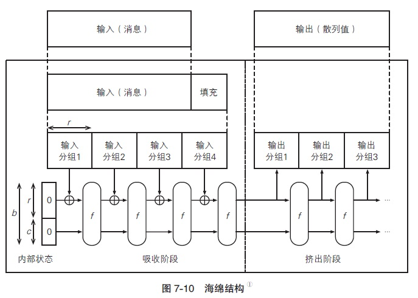

# SHA-3

SHA-3（Secure Hash Algorithm-3）是一种作为新标准发布的单向散列函数算法，用来替代在理论上已被找出攻击方法的SHA-1算法。全世界的企业和密码学家提交了很多SHA-3的候选方案，经过长达5年的选拔，最终于2012年正式确定将Keccak算法作为SHA-3标准。
和AES一样，举办SHA-3公开选拔活动的依然是美国国家标准与技术研究院NIST。本次选拔出的单向散列函数算法同时成为了联邦信息处理标准[FIPS 202](http://nvlpubs.nist.gov/nistpubs/FIPS/NIST.FIPS.202.pdf)。尽管这只是美国的国家标准，但实质上也将会作为国际标准被全世界所认可。

# SHA-3竞选过程

2007年，NIST开始了SHA-3的公开征集，截止到2008年共征集到64个算法。
2010年，SHA-3最终候选名单出炉，其中包括5个算法。SHA-3最终候选名单：

| 名称 | 提交者 |
| :---: | :---: |
| BLAKE | Jean-Philippe Aumasson、Luca Henzen、Willi Meier、Raphael C. -W. Phan |
| Grostl | Praveen Gauravaram、Lars R. Knudsen、Krystian Matusiewicz、Florian Mendel、Christian Rechberger、Martin Schlaffer、Soren S. Thomsen |
| JH | Hongjun Wu |
| keccak | Guido Bertoni、Joan Daemen、Gilles Van Assche、Michaël Peeters |
| Skein | Niels Ferguson、Stefan Lucks、Bruce Schneier、Doug Whiting、Mihir Bellare、Tadayoshi kohno、Jon Callas、Jesse Walker |

2012年，由Guido Bertoni、Joan Daemen、Gilles Van Assche、Michaël Peeters共同设计的Keccak算法被最终确定为SHA-3标准，其中Joan Daemen也是对称密码算法AES的设计者之一。
基于NIST所设定的条件，我们能够免费、自由地使用SHA-3算法，这与AES的情形完全相同。不过，SHA-3的出现并不意味着SHA-2就不安全了，在一段时间内，SHA-2和SHA-3还将会共存。
Keccak最终被选为SHA-3的理由如下：

- 采用了与SHA-2完全不同的结构。
- 结构清晰，易于分析。
- 能够适用于各种设备，也适用于嵌入式应用。
- 在硬件上的实现显示出了很高的性能。
- 比其他最终候选算法安全性边际更大。

# Keccak

如前所述，Keccak是一种被选定为SHA-3标准的单向散列函数算法。
Keccak可以生成任意长度的散列值，但为了配合SHA-2的散列值长度，SHA-3标准中共规定了SHA3-224、SHA-3-256、SHA3-384、SHA3-512这4种版本。在输入数据的长度上限方面，SHA-1为$2^{64}-1$比特，SHA-2 为$2^{128}-1$比特，而SHA-3则没有长度限制。

# Keccak和SHA-3的区别

SHA-3由Keccak标准化而来，在很多场合下Keccak和SHA-3是同义词，但在2015年8月SHA3最终完成标准化时，NIST调整了填充算法：`SHA3-256(M) = KECCAK [512] (M || 01, 256)`。所以标准的NIST SHA-3就和keccak计算的结果不一样。详见参考资料。

# 海绵结构

下面我们来看一看Keccak的结构。Keccak采用了与SHA-1、SHA-2完全不同的海绵结构（sponge construction）（图7-10）：

Keccak的海绵结构中，输入的数据在进行填充之后，要经过吸收阶段（absorbing phase）和挤出阶段（squeezing phase），最终生成输出的散列值。
“海绵结构”这个名字听上去有点怪，请大家想象一下将一块海绵泡在水里吸水，然后再将里面的水挤出来的情形。同样地，Keccak的海绵结构是先将输入的消息吸收到内部状态中，然后再根据内部状态挤出相应的散列值。
吸收阶段的流程如下：

- 将经过填充的输入消息按照每r个比特为一组分割成若干个输入分组。
- 首先，将“内部状态的r个比特”与“输入分组1”进行XOR，将其结果作为“函数f的输入值”。
- 然后，将“函数f的输出值r个比特”与“输入分组2”进行XOR，将其结果再次作为“函数f 的输入值”。
- 反复执行上述步骤，直到到达最后一个输入分组。
- 待所有输入分组处理完成后，结束吸收阶段，进入挤出阶段。

函数f的作用是将输入的数据进行复杂的搅拌操作并输出结果（输入和输出的长度均为$b = r + c$个比特），其操作对象是长度为$b = r + c$个比特的内部状态，内部状态的初始值为0。也就是说，通过反复将输入分组的内容搅拌进来，整个消息就会被一点一点地“吸收”到海绵结构的内部状态中，就好像水分被一点一点地吸进海绵内部一样。每次被吸收的输入分组长度为r个比特，因此r被称为比特率（bit rate）。
通过图7-10我们可以看出，函数f的输入长度不是r个比特，而是r + c个比特，请大家注意这一点，这意味着内部状态中有c个比特是不受输入分组内容的直接影响的（但会通过函数f受到间接影响）。这里的c被称为容量（capacity）。
吸收阶段结束后，便进入了挤出阶段，流程如下。

- 首先，将“函数f的输出值中的r个比特”保存为“输出分组1”，并将整个输出值（r + c个比特）再次输入到函数f中。
- 然后，将“函数f的输出值中的r个比特”保存为“输出分组2”，并将整个输出值（r + c个比特）再次输入到函数f中。
- 反复执行上述步骤，直到获得所需长度的输出数据。

无论是吸收阶段还是挤出阶段，函数f的逻辑本身是完全相同的，每执行一次函数f，海绵结构的内部状态都会被搅拌一次。
挤出阶段中实际上执行的是“对内部状态进行搅拌并产生输出分组（r个比特）”的操作，也就是以比特率（r个比特）为单位，将海绵结构的内部状态中的数据一点一点地“挤”出来，就像从海绵里面把水分挤出来一样。
在挤出阶段中，内部状态r + c个比特中的容量（c个比特）部分是不会直接进入输出分组的，这部分数据只会通过函数f间接影响输出的内容。因此，容量c的意义在于防止将输入消息中的一些特征泄漏出去。

# 双工结构

作为海绵结构的变形，Keccak中还提出了一种双工结构（图7-11）：

在海绵结构中，只有将输入的消息全部吸收完毕之后才能开始输出，但在双工结构中，输入和输出是以相同的速率进行的。在双向通信中，发送和接收同时进行的方式称为全双工（fullduplex），Keccak的双工结构也代表同样的含义。
通过采用双工结构，Keccak不仅可用于计算散列值，还可以覆盖密码学家的工具箱中的其他多种用途，如伪随机数生成器、流密码、认证加密、消息认证码等。

# Keccak的内部状态

刚才我们介绍了Keccak中$b = r + c$个比特的内部状态是如何通过函数f进行变化的，下面我们来深入地看一看内部状态。
Keccak的内部状态是一个三维的比特数组，如图7-12所示。图中的每个小方块代表1个比特，b个小方块按照$5\times 5\times z$的方式组合起来，就成为一个沿z轴延伸的立方体。

我们将具备x、y、z三个维度的内部状态整体称为state，state共有b个比特。
如果我们只关注内部状态中的两个维度，可以将xz平面称为plane，将xy平面称为slice，将yz平面称为sheet（图7-13）。

同样地，如果我们只关注其中一个维度，可以将x轴称为row，将y轴称为column，将z轴称为lane。
Keccak的本质就是实现一个能够将上述结构的state进行有效搅拌的函数f，这与分组密码设计中的搅拌过程非常相似。此外，由于内部状态可以代表整个处理过程中的全部中间状态，因此有利于节约内存。Keccak用到了很多比特单位的运算，因此被认为可以有效抵御针对字节单位的攻击。

# 函数Keccak-f [b]

下面我们来看一看负责对内部状态进行搅拌的函数f。Keccak的函数f实际上应该叫作Keccak-f [b]，从这个名称可以看出，这个函数带有一个参数b，即内部状态的比特长度。这里的参数b称为宽度（width）。
根据Keccak的设计规格，宽度b可以取25、50、100、200、400、800、1600 共7种值，SHA-3采用的是其中的最大宽度，即$b=1600$。
Keccak-f [b]中的每一轮包含5 个步骤：$\theta$（西塔）、$\rho$（柔）、$\pi$（派）、$\chi$（凯）、$\iota$（伊欧塔），总共循环$12 + 2l$轮（其中$b=25\times 2^l$）。具体到SHA-3 中所使用的Keccak-f [1600] 函数，其循环轮数为24轮。

- **步骤$\theta$**：

图7-14所示为对其中1个比特应用步骤$\theta$时的情形，这一步的操作是将位置不同的两个column中各自5个比特通过XOR运算加起来（图中的$\Sigma$标记），然后再与置换目标比特求XOR并覆盖掉目标比特。

- **步骤$\rho$**：

图7-15 所示为应用步骤$\rho$时的情形，这一步的操作是沿z轴（lane 方向）进行比特平移。

- **步骤$\pi$**：

图7-16所示为对其中1片slice应用步骤$\pi$时的情形，实际上整条lane上的所有slice都会被执行同样的比特移动操作。

- **步骤$\chi$**：

图7-17 所示为对其中1个row应用步骤$\chi$时的情形。这里我们使用了一些逻辑电路中的符号，其中代表对输入比特取反，即NOT；代表仅当两个输入比特均为1时则输出1，即AND。

- **步骤$\iota$**：

步骤$\iota$是用一个固定的轮常数对整个state的所有比特进行XOR运算，目的是让内部状态具备非对称性。

# 参考资料

- 图灵社区：[图解密码技术（第3版）](https://www.ituring.com.cn/book/miniarticle/217276)
- stackoverflow提问：[Which cryptographic hash function does Ethereum use?](https://ethereum.stackexchange.com/questions/550/which-cryptographic-hash-function-does-ethereum-use)
- 在线hash计算工具：[online-tools](http://emn178.github.io/online-tools/keccak_256.html)
