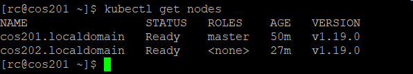

# 部署环境

| 主机名 | ip | 用途 |
| :---: | :---: | :---: |
| cos201.localdomain | 192.168.30.201 | master |
| cos202.localdomain | 192.168.30.202 | node |

# 检查机器配置

1. 至少2核CPU，2G内存。
2. 机器之间是互通的（公网，私网都行）。
3. 主机名，MAC，product_uuid都是唯一的。
4. k8s各个组件需要占用端口是可用的。
5. 关闭swap分区。

关闭swap分区：

```sh
# 临时关闭
sudo swapoff -a

# 永久关闭，打开下面文件注释掉swap那一行
sudo vi /etc/fstab
```

# 环境配置

两台主机添加host信息：

```sh
sudo vi /etc/hosts

192.168.30.201 master
192.168.30.202 node
```

关闭防火墙：

```sh
# 停止防火墙
sudo systemctl stop firewalld

# 禁止防火墙开机自启动
sudo systemctl disable firewalld
```

禁用selinux：

```sh
# 临时关闭
sudo setenforce 0

# 永久关闭
sudo sed -i 's/SELINUX=enforcing/SELINUX=disabled/' /etc/selinux/config
```

内核调整,将桥接的IPv4流量传递到iptables的链：

```sh
# 确认内核是否加载了该模块，没有的话可以先加载
lsmod | grep br_netfilter
sudo modprobe br_netfilter

cat <<EOF | sudo tee /etc/sysctl.d/k8s.conf
net.bridge.bridge-nf-call-ip6tables = 1
net.bridge.bridge-nf-call-iptables = 1
EOF
sudo sysctl --system
```

# 安装软件

安装docker（最好用定制的版本，后面kubeadm等也是，这样保证阿里的源有相应的包和镜像下载，不然下载最新的后面有一两个依赖不存在那就比较不爽了）：

```sh
sudo yum install -y yum-utils device-mapper-persistent-data lvm2
sudo yum-config-manager --add-repo   https://download.docker.com/linux/centos/docker-ce.repo
sudo yum install -y docker-ce-19.03.11 docker-ce-cli-19.03.11 containerd.io-1.2.13
sudo mkdir /etc/docker
cat <<EOF | sudo tee /etc/docker/daemon.json
{
  "exec-opts": ["native.cgroupdriver=systemd"],
  "storage-driver": "overlay2"
}
EOF
sudo systemctl restart docker
sudo systemctl enable docker
```

添加k8s 阿里yum源：

```sh
cat <<EOF | sudo tee /etc/yum.repos.d/kubernetes.repo
[kubernetes]
name=Kubernetes
baseurl=https://mirrors.aliyun.com/kubernetes/yum/repos/kubernetes-el7-x86_64
enabled=1
gpgcheck=1
repo_gpgcheck=1
gpgkey=https://mirrors.aliyun.com/kubernetes/yum/doc/yum-key.gpg https://mirrors.aliyun.com/kubernetes/yum/doc/rpm-package-key.gpg
EOF
```

安装kubeadm，kubelet，kubectl：

```sh
sudo yum install -y kubelet-1.19.0 kubeadm-1.19.0 kubectl-1.19.0
sudo systemctl enable kubelet
sudo systemctl restart kubelet
```

# 创建k8s集群

初始化k8s集群（在master执行）：

```sh
sudo kubeadm init \
--apiserver-advertise-address=192.168.30.201 \
--image-repository registry.aliyuncs.com/google_containers \
--service-cidr=10.1.0.0/16 \
--pod-network-cidr=172.16.0.0/16
```

初始化成功会输出以下内容：

```sh
Your Kubernetes control-plane has initialized successfully!

To start using your cluster, you need to run the following as a regular user:

  mkdir -p $HOME/.kube
  sudo cp -i /etc/kubernetes/admin.conf $HOME/.kube/config
  sudo chown $(id -u):$(id -g) $HOME/.kube/config

You should now deploy a pod network to the cluster.
Run "kubectl apply -f [podnetwork].yaml" with one of the options listed at:
  https://kubernetes.io/docs/concepts/cluster-administration/addons/

Then you can join any number of worker nodes by running the following on each as root:

kubeadm join 192.168.30.201:6443 --token pqi3zb.fjgkg0kbh4ixnvel \
    --discovery-token-ca-cert-hash sha256:8b8d113ed0b1672d29f5ad0e1c771af624da1343c6c56374bd70d31d734ed219
```

使用kubectl：

```sh
# root用户
export KUBECONFIG=/etc/kubernetes/admin.conf

# 非root用户
mkdir -p $HOME/.kube
sudo cp -i /etc/kubernetes/admin.conf $HOME/.kube/config
sudo chown $(id -u):$(id -g) $HOME/.kube/config
```

创建容器网络接口（CNI），在master上执行就可以：

```sh
wget https://docs.projectcalico.org/v3.3/getting-started/kubernetes/installation/hosted/rbac-kdd.yaml
wget https://docs.projectcalico.org/v3.10/manifests/calico.yaml

kubectl apply -f rbac-kdd.yaml
kubectl apply -f calico.yaml
```

在node执行，加入集群：

```sh
sudo kubeadm join 192.168.30.201:6443 --token pqi3zb.fjgkg0kbh4ixnvel \
    --discovery-token-ca-cert-hash sha256:8b8d113ed0b1672d29f5ad0e1c771af624da1343c6c56374bd70d31d734ed219
```

等待一会，在master上查看节点信息，显示正常就算完事儿了：



# 参考资料

- [kubeadm部署安装k8s集群](https://blog.csdn.net/linxi7/article/details/111318769)
- [使用kubeadm快速部署一套K8S集群](https://www.cnblogs.com/double-dong/p/11483670.html)
