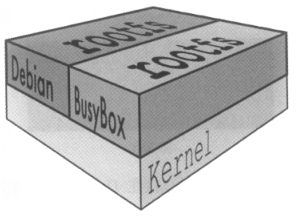
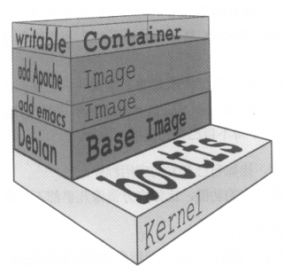

# docker简介


docker是一种轻量级的虚拟化技术，可以将你的应用的运行环境，可执行程序，配置等一并打包为一个镜像，然后发布到目标主机上直接运行。
如果多个进程运行在同一个操作系统上，那容器到底是怎样隔离它们的？有两个机制可用：第一个是Linux命名空间，它使每个进程只看到它自己的系统视图（文件、进程、网络接口、主机名等）；第二个是Linux控制组（cgroups），它限制了进程能使用的资源量（CPU、内存、网络带宽等）。
docker主要包含了下面几个概念：

| 名词 | 含义 |
| :---: | :---: |
| 镜像 | docker镜像里包含了你打包的应用程序及其所依赖的环境。它包含应用程序可用的文件系统和其他元数据，如镜像运行时的可执行文件路径。 |
| 镜像仓库 | docker镜像仓库用于存放docker镜像，以及促进不同人和不同电脑之间共享这些镜像。当你编译你的镜像时，要么可以在编译它的电脑上运行，要么可以先上传镜像到一个镜像仓库，然后下载到另外一台电脑上并运行它。某些仓库是公开的，允许所有人从中拉取镜像，同时也有一些是私有的，仅部分人和机器可接入。 |
| 容器 | docker容器通常是一个Linux容器，它基于Docker镜像被创建。一个运行中的容器是一个运行在Docker主机上的进程，但它和主机，以及所有运行在主机上的其他进程都是隔离的。这个进程也是资源受限的，意味着它只能访问和使用分配给它的资源(CPU、内存等) |

# docker架构

docker使用客户端-服务器(C/S) 架构模式，docker客户端会与docker守护进程（daemon）进行通信。docker daemon会处理复杂繁重的任务，例如建立、运行、发布你的 docker容器。当本地找不到指定的镜像的时候便会去docker仓库（registry）中拉取：


# docker和VM的区别

VM在宿主机器操作系统的基础上创建虚拟层、虚拟化的操作系统、虚拟化的库，然后再安装应用；docker在宿主机操作系统上创建docker引擎，并且与其它容器共享宿主机内核，在docker引擎的基础上再安装应用。


| docker | VM |
| :---: | :---: |
| 秒级启动 | 分钟级启动 |
| MB级别镜像大小 | GB级别镜像大小 |
| OS级别虚拟化 | 硬件级别虚拟化，更安全 |
| 单机可运行上千容器 | 单机可运行数十个VM |

# 共享宿主机内核原理

linux操作系统由内核空间和用户空间组成，内核空间是kernel，linux刚启动的时候回加载bootfs文件系统，之后bootfs会被卸载掉，用户空间是rootfs，包含熟悉的/dev、/bin目录等，对于base镜像来说，底层直接用Host的kernel，自己只需要提供rootfs就行。



# 只读镜像层和可写容器层

当容器启动时，一个新的可写层被加载到镜像的顶部，这一层通常被称作“容器层”，“容器层”之下的都叫“镜像层”，所有对容器的改动——无论添加、删除、还是修改文件都只会发生在容器层中，只有容器层是可写的，容器层下面的所有镜像层都是只读的。 
容器层记录对镜像的修改，所有镜像层都是只读的，不会被容器修改，所以镜像可以被多个容器共享。



# 容器镜像可移植性的限制

理论上，一个容器镜像能运行在任何一个运行Docker的机器上。但有一个小警告：如果一个容器化的应用需要一个特定的内核版本，那它可能不能在每台机器上都工作。如果一台机器上运行了一个不匹配的Linux内核版本，或者没有相同内核模块可用，那么此应用就不能在其上运行。
虽然容器相比虚拟机轻量许多，但也给运行于其中的应用带来了一些局限性。虚拟机没有这些局限性，因为每个虚拟机都运行自己的内核。
还不仅是内核的问题。一个在特定硬件架构之上编译的容器化应用，只能在有相同硬件架构的机器上运行。不能将一个x86架构编译的应用容器化后，又期望它能运行在ARM架构的机器上。你仍然需要一台虚拟机来做这件事情。

# docker run

`docker run`其实相当于`docker create`+`docker start`，可以直接从镜像启动一个新的容器。

```sh
docker run [OPTIONS] IMAGE[:TAG|@DIGEST] [COMMAND] [ARG...]
```

选项说明：

- **-i：**交互模式，开启STDIN
- **-t：**分配一个伪终端，一般连用`-it`，如果用`bash`命令启动的容器，可以用`Ctrl+P+Q`来退出，这样可以保证容器不停止运行。
- **-d：**后台运行，如果用`bash`命令启动的容器，可以加上`-it`来保证容器不停止运行。

# 参考

- docker官网引用：[docker reference](https://docs.docker.com/reference/)
