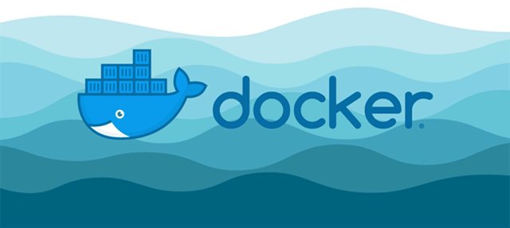
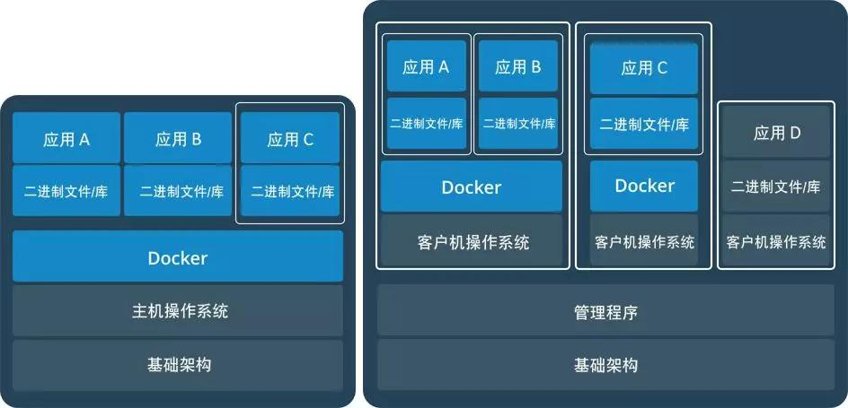

# docker简介

docker是一种轻量级的虚拟化技术，可以将你的应用的运行环境，可执行程序，配置等一并打包为一个镜像，然后发布到目标主机上直接运行。
如果多个进程运行在同一个操作系统上，那容器到底是怎样隔离它们的？有两个机制可用：第一个是Linux命名空间，它使每个进程只看到它自己的系统视图（文件、进程、网络接口、主机名等）；第二个是Linux控制组（cgroups），它限制了进程能使用的资源量（CPU、内存、网络带宽等）。
docker主要包含了下面几个概念：

| 名词 | 含义 |
| :---: | :---: |
| 镜像 | docker镜像里包含了你打包的应用程序及其所依赖的环境。它包含应用程序可用的文件系统和其他元数据，如镜像运行时的可执行文件路径。 |
| 镜像仓库 | docker镜像仓库用于存放docker镜像，以及促进不同人和不同电脑之间共享这些镜像。当你编译你的镜像时，要么可以在编译它的电脑上运行，要么可以先上传镜像到一个镜像仓库，然后下载到另外一台电脑上并运行它。某些仓库是公开的，允许所有人从中拉取镜像，同时也有一些是私有的，仅部分人和机器可接入。 |
| 容器 | docker容器通常是一个Linux容器，它基于Docker镜像被创建。一个运行中的容器是一个运行在Docker主机上的进程，但它和主机，以及所有运行在主机上的其他进程都是隔离的。这个进程也是资源受限的，意味着它只能访问和使用分配给它的资源(CPU、内存等) |

# docker架构

docker使用客户端-服务器(C/S) 架构模式，docker客户端会与docker守护进程（daemon）进行通信。docker daemon会处理复杂繁重的任务，例如建立、运行、发布你的 docker容器。当本地找不到指定的镜像的时候便会去docker仓库（registry）中拉取：

# docker和VM的区别

VM在宿主机器操作系统的基础上创建虚拟层、虚拟化的操作系统、虚拟化的库，然后再安装应用；docker在宿主机操作系统上创建docker引擎，并且与其它容器共享宿主机内核，在docker引擎的基础上再安装应用。

| docker | VM |
| :---: | :---: |
| 秒级启动 | 分钟级启动 |
| MB级别镜像大小 | GB级别镜像大小 |
| OS级别虚拟化 | 硬件级别虚拟化，更安全 |
| 单机可运行上千容器 | 单机可运行数十个VM |
