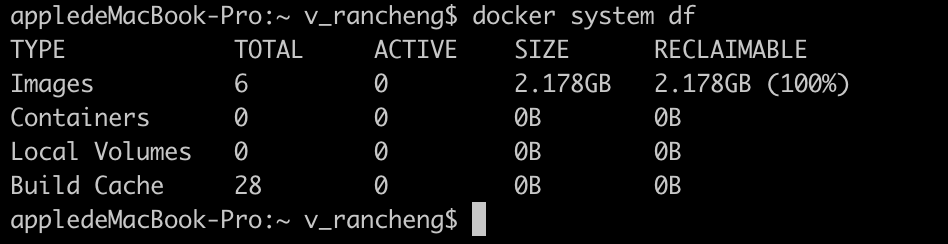

# docker system df

`docker system df`查看docker数据占据的磁盘空间信息，其中RECLAIMABLE一列表示可以回收的数据：



docker用久了，build cache那一项可能占据很大的空间，这时候可以用

```sh
docker builder prune
```

来清理无用的build cache。
其它的数据可以用下面的命令来清理：

```sh
# 清理所有没有被容器用到的网络
docker network prune
# 清理所有没有被容器用到的卷
docker volume prune
# 清理所有stopped的容器
docker container prune
# 清理所有dangling的镜像
docker image prune
```
