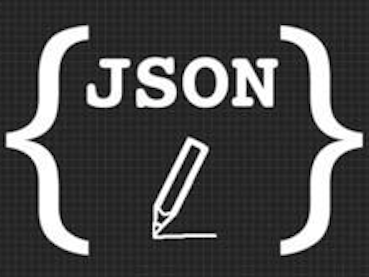

# json



JSON(JavaScript Object Notation)是一种轻量级的数据交换格式。易于人阅读和编写，同时也易于机器解析和生成。它基于JavaScript Programming Language, Standard ECMA-262 3rd Edition - December 1999的一个子集。JSON采用完全独立于语言的文本格式，但是也使用了类似于C语言家族的习惯（包括C, C++, C#, Java, JavaScript, Perl, Python等）。这些特性使JSON成为理想的数据交换语言。

# json文法

```text
value = string
      | number
      | object
      | array
      | true
      | false
      | null

object = {}
       | { members }

members = pair
        | pair , members

pair = string : value

array = []
      | [ elements ]

elements = value 
         | value , elements

string = ""
       | " chars "

chars = char
      | char chars

char = any-Unicode-character-except-"-or-\-or- control-character
     | \"
     | \\
     | \/
     | \b
     | \f
     | \n
     | \r
     | \t
     | \u four-hex-digits

number = int
       | int frac
       | int exp
       | int frac exp

int = digit
    | digit1-9 digits 
    | - digit
    | - digit1-9 digits

frac = . digits

exp = e digits

digits = digit
       | digit digits

e = e
  | e+
  | e-
  | E
  | E+
  | E-
```

# 转义字符

注意在上面的json文法中，对于字符串中出现的特殊字符，比如双引号`“`，那么在json编码中也是需要进行转义的，一般在各个语言的json库中会自动进行转义和反转义的操作。

# json注释

json并不支持注释，所以json来当配置文件的时候有点麻烦，但一般的json库都支持注释的语法。详见参考资料。

# 参考资料

- json官方说明：[json.org](https://www.json.org/json-zh.html)
- 知乎提问：[写一个 JSON、XML 或 YAML 的 Parser 的思路是什么？](https://www.zhihu.com/question/24640264/answer/80500016)
- 知乎提问：[如何看待json语法中不能加注释的设计?](https://www.zhihu.com/question/23004511/answer/23444684)
