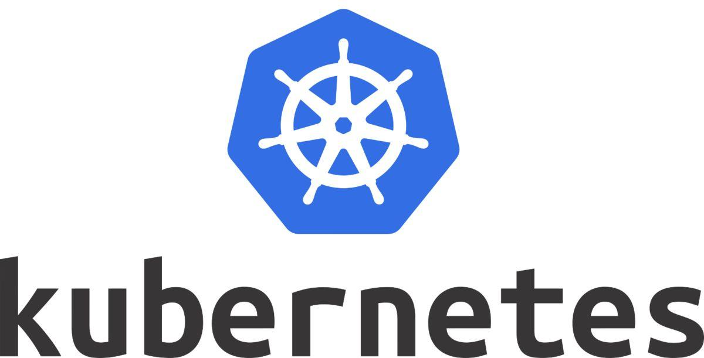
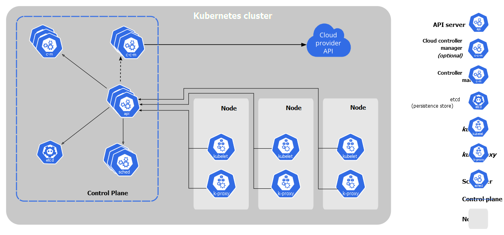

# k8s简介



k8s全称kubernetes，kubernetes源于希腊语，意为“舵手”或“领航员”。是容器编排与管理的平台。

# k8s架构



一般将控制组件部署在master节点上，其余的node是工作节点，用来运行pod。
各个控制面板组件功能如下：

- **kube-apiserver**：提供了资源操作的唯一入口，并提供认证、授权、访问控制、API注册和发现等机制；
- **kube-controller-manager**：负责维护集群的状态，比如故障检测、自动扩展、滚动更新等；
- **kube-scheduler**：负责资源的调度，按照预定的调度策略将Pod调度到相应的机器上；
- **etcd**：分布式键值存储系统，用于保存集群状态数据。

各个Node组件如下：

- **kubelet**：负责维护容器的生命周期，同时也负责Volume（CVI）和网络（CNI）的管理；
- **kube-proxy**：负责为Service提供cluster内部的服务发现和负载均衡；

# 在Docker与Kubernetes中指定可执行程序及其参数

| docker | k8s | 含义 |
| :---: | :---: | :---: |
| ENTRYPOINT | command | 容器中运行的可执行文件 |
| CMD | args | 传给可执行文件的参数 |

# k8s挂载——emptyDir

emptyDir类型的volume在pod分配到node上时被创建，这个目录的初始内容为空，当Pod从node上移除时，emptyDir中的数据会被永久删除。

```yml
apiVersion: v1
kind: Pod
metadata:
  name: redis
spec:
  containers:
  - name: redis
    image: redis
    volumeMounts:
    - name: redis-storage
      mountPath: /data/redis
  volumes:
  - name: redis-storage
    emptyDir: {}
```

# 参考资料

- [Kubernetes 文档](https://kubernetes.io/zh/docs/home/)
- [k8s](https://www.cnblogs.com/xy51/p/12744956.html)
- [配置 Pod 以使用卷进行存储](https://kubernetes.io/zh/docs/tasks/configure-pod-container/configure-volume-storage/)
