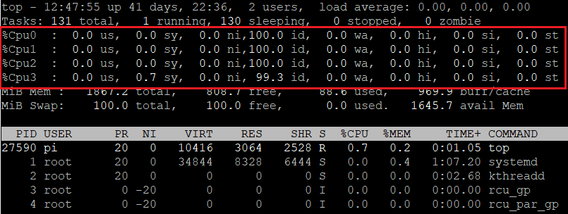
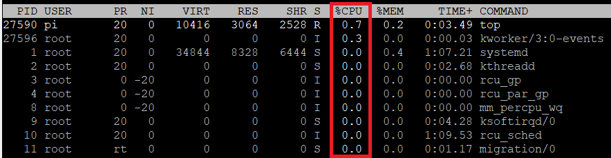

# date

date命令可以用来显示或设定系统的日期与时间，在显示方面，使用者可以设定欲显示的格式。

- **使用场景1**：备份文件的时候代替手动输入时间

```sh
cp file.txt file.txt.`date +%Y%m%d%H%M`
```

# screen

screen可以为你在远端主机保留你当前的会话session，这样就不用怕连接中断了：

```sh
screen -S yourname           # 新建一个叫yourname的session
screen -ls                   # 列出当前所有的session
screen -r yourname           # 回到yourname这个session
screen -d yourname           # 远程detach某个session    # detach快捷键 ctrl a + d
screen -S yourname -X quit   # 删除叫yourname的session
```

# top

1.进入top界面之后可以按数字键`1`，这样可以展开每个CPU的运行情况：



2.进入top界面，可以按键`x`，这样会高亮作为排序基准的列，然后可以使用`shift + >`或者`shift + <`键来重新选择排序基准列：



# 查询出口ip

```sh
curl cip.cc
```

# dd

dd命令可以用来快速测试磁盘的读写速度：

```sh
dd if=/dev/zero of=tmp.txt bs=1024 count=1000000
dd if=tmp.txt of=/dev/null bs=1024 count=1000000
```

# xargs

xargs可以将标准输入转换为命令的参数去执行：

```sh
# 为所有文件添加后缀
ls | xargs -n1 -i mv {} {}.j2
```

# uuidgen

uuidgen用来生成uuid，形式为`xxxxxxxx-xxxx-Mxxx-Nxxx-xxxxxxxxxxxx`，其中`M`表示uuid的版本，这里默认生成`uuid v4`：

```sh
$ uuidgen
a8413894-dc2c-4acd-b98a-9fcde3f962ad
```

# 参考资料

- [Linux--screen远程必备](https://blog.csdn.net/qq_34243930/article/details/106771285)
