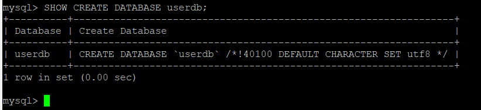
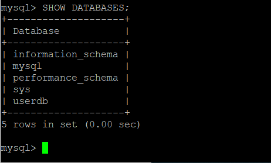
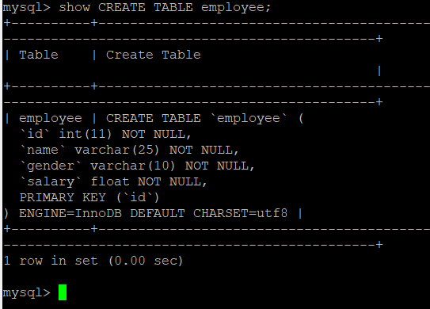
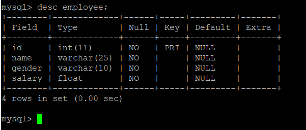

# 创建数据库

```sh
CREATE DATABASE [IF NOT EXISTS] <数据库名>
[[DEFAULT] CHARACTER SET <字符集名>] 
[[DEFAULT] COLLATE <校对规则名>];
```

比如通过下面的语句创建数据库：

```sh
CREATE DATABASE userdb CHARACTER SET utf8 COLLATE utf8_general_ci;
```

可以通过下面的语句查看建库的语句：

```sh
SHOW CREATE DATABASE userdb;
```



删除数据库的语句如下，需要注意删除之后无法恢复：

```sh
DROP DATABASE userdb;
```

查看有哪些数据库：

```sh
SHOW DATABASES;
```



选择数据库：

```sh
use userdb;
```

# 创建表

```sh
CREATE TABLE <表名> ([表定义选项])[表选项][分区选项];
```

比如通过下面的语句创建表：

```sh
CREATE TABLE employee(
    id INT NOT NULL PRIMARY KEY,
    name VARCHAR(25) NOT NULL,
    gender VARCHAR(10) NOT NULL,
    salary FLOAT NOT NULL
) ENGINE=InnoDB DEFAULT CHARSET=utf8;
```

可以通过下面的命令来查看建表的语句：

```sh
show CREATE TABLE employee;
```



也可以查看表结构：

```sh
DESC employee;
```



删除表，注意删除之后无法恢复：

```sh
DROP TABLE employee;
```

# 清空表数据

```sh
# 方式1
TRUNCATE employee;
# 方式2
DELETE FROM employee;
```

区别：

- truncate是整体删除（速度较快），delete是逐条删除（速度较慢）
- truncate表相当于新建了表，所以索引资源清空，自增序列重新从1开始

# 新增数据，修改数据

```sh
# 新增数据（当插入全量数据的时候可以不写字段名）
INSERT INTO 表名称 (字段名1，字段名2...字段名n) VALUES (值1，值2...值n)
```

比如新增一条数据：

```sh
INSERT INTO employee VALUES (1, 'rc', 'male', 0);
```

```sh
# 修改数据
UPDATE 表名 set 字段名1=值1，字段名2=值2...字段名n=值n WHERE 条件
```

比如修改一条数据：

```sh
UPDATE employee set salary=1 WHERE id=1;
```

# group by

在mysql5.7以前，group by语法检查还不严格，因为按照sql的标准，group by只能查询出group by后面有的字段，没法查下面的语句：

```sh
SELECT * FROM 表名 group by 字段名
```

但是在mysql中这一句表示按group by的字段分组，并且查询出没组中的第一条数据。不过Mysql5.7默认的sql配置`sql_mode='ONLY_FULL_GROUP_BY'`，这个配置严格执行了"SQL92标准"。
一般大家都会修改配置，以便继续用以前的语法：

```sh
set global sql_mode='STRICT_TRANS_TABLES,NO_ZERO_IN_DATE,NO_ZERO_DATE,ERROR_FOR_DIVISION_BY_ZERO,NO_AUTO_CREATE_USER,NO_ENGINE_SUBSTITUTION';
```

也可以自己写新的sql语句来替代：

```sh
SELECT * FROM 表名 WHERE 主键 IN (SELECT MAX(主键) FROM 表名 GROUP BY 字段名)
```

# 参考资料

- [数据库入门](http://c.biancheng.net/mysql/10/)
- [Mysql清空表(truncate)与删除表中数据(delete)的区别](http://blog.is36.com/mysql_difference_of_truncate_and_delete/)
