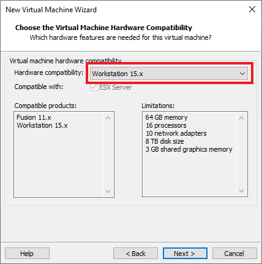

# CentOS

CentOS（Community Enterprise Operating System）是企业Linux发行版领头羊Red Hat Enterprise Linux（RHEL）的再编译版本，而且在RHEL的基础上修正了不少已知的Bug，相对于其他Linux发行版，其稳定性值得信赖。CentOS是免费的，你可以使用它像使用RHEL一样去构筑企业级的Linux系统环境，但不需要向RedHat付任何的费用。
CentOS社区在官方博客于2020年12月08日发布“CentOS Project shifts focus to CentOS Stream”和关于该问题的Wiki百科说明。该博文的发布标志着CentOS Linux版本的终结，同时大幅缩短了CentOS Linux 8的支持维护时间。根据官方网站的下载页显示，CentOS Linux 8的支持维护时间已经变更为2021年12月31日截止（以前为2029年截止），同时官方已经在下载页提供CentOS Stream版下载地址（暂时没有结束维护时间计划）。
CentOS Linux从2020年12月以后不会再有CentOS Linux 9等之后的操作系统。

# CentOS镜像下载

点击这里进入下载页面：[阿里云站点](http://mirrors.aliyun.com/centos/7/isos/x86_64/)

这里显示的时当前最新版本的镜像（2009代表20年9月更新），下载这DVD版就行，这是标准版镜像。

# 新建虚拟机

选择新建一个虚拟机：

选择自定义安装（默认）：

选择虚拟机兼容特性（默认）：

选择稍后再安装操作系统：

选择要安装的操作系统：

给新建的虚拟机命名并指定存储路径：

分配处理器资源（以后可以随时调整）：

分配内存资源（以后可以随时调整）：

网络类型选择，NAT表示虚拟机自己形成局域网，配置私有ip地址，访问外部通过NAT功能实现，用起来最方便（默认）：

以下选项使用推荐的即可（默认）：

分配磁盘大小，我选择30GB：

跳过：

最后完成新虚拟机创建：

# 安装CentOS

编辑刚刚创建的虚拟机`centos101`：

设置`centos`镜像所在路径：

启动`centos101`虚拟机，开始安装：

设置安装语言，这里就用英语（默认）：

选择时区（上海）：

添加中文语言包：

选择手动进行分区：

分区详情（其实对于初学者，这里不区分出`/`和`/home`更好，不然可能出现`/home`满了但是`/`还存在空间的情况，不方便使用；如果全部都分配到`/`下面方便共用存储）：

查看NAT网关地址（可知当前的NAT网络的网关为`192.168.30.2`）：

设置主机名：

默认开启以太网口：

手动配置ip地址（不用DHCP）：

然后点击开始安装，在安装的时候设置root密码，创建新用户并成为管理员，这样可以使用sudo：

