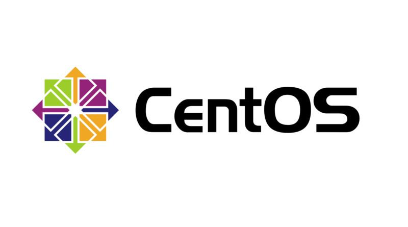

# CentOS

CentOS（Community Enterprise Operating System）是企业Linux发行版领头羊Red Hat Enterprise Linux（RHEL）的再编译版本，而且在RHEL的基础上修正了不少已知的Bug，相对于其他Linux发行版，其稳定性值得信赖。CentOS是免费的，你可以使用它像使用RHEL一样去构筑企业级的Linux系统环境，但不需要向RedHat付任何的费用。
CentOS社区在官方博客于2020年12月08日发布“CentOS Project shifts focus to CentOS Stream”和关于该问题的Wiki百科说明。