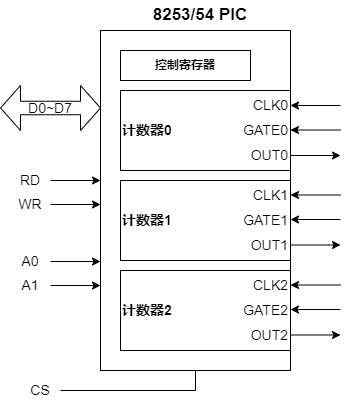

- [可编程定时器8253/54](#可编程定时器825354)
  - [8253/54编程步骤](#825354编程步骤)
  - [操作模式](#操作模式)
  - [控制字格式](#控制字格式)
- [参考资料](#参考资料)

# 可编程定时器8253/54

8253/54是一个可编程的内部定时器，它能根据程序提供的计数值和工作模式，产生各种形状和各种频率的计数/定时脉冲。

在8253/54定时器内部有3个独立工作的计数器。结构如下。

## 8253/54编程步骤

1. 设定控制字：选择计数器，确定工作模式和计数值格式。
2. 初始化计数器：设定计数器初值，每个计数器内部包含一个16位的计数寄存器，计数开始就是每次减1，直到0为止。

## 操作模式

- **模式0，计数器结束时中断**：写入控制字后，OUT输出低电平，计数到0，OUT输出高电平，并一直维持不变，OUT可作为中断信号。
- **模式1，可编程脉冲触发**：初始化后，由GATE触发开始计数，OUT输出低电平，计数到0，OUT输出高电平。可由GATE再次触发，重新计数，不需重新送计数常数。
- **模式2，N分频计数器**：输入时间常数后开始计数，减到0时，OUT输出一个负脉冲，宽度为一个CLK。并且自动装入时间常数，重新计数。
- **模式3，方波发生器**：与模式2类似，OUT输出也是一个脉冲序列，但占空比为50%。
- **模式4，软件触发选通信号**：写入控制字后，OUT输出高电平，计数到0时，OUT输出一个负脉冲，宽度为一个CLK。
- **模式5，硬件触发选通信号**：与模式4类似，只是由GATE信号触发计数。

## 控制字格式

- Select Counter：计数器选择。
- RL：读写模式，00计数器锁存；01只读写高8位；10只读写低8位；11先读写高8位，再读写低8位。
- Mode：操作模式。
- BCD：0为二进制，1为BCD码。

# 参考资料
