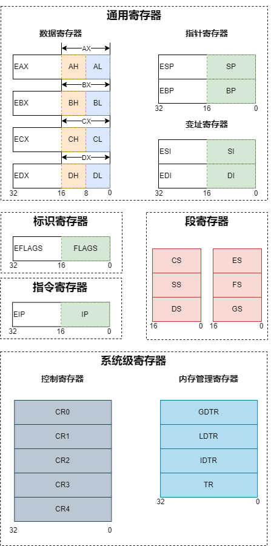
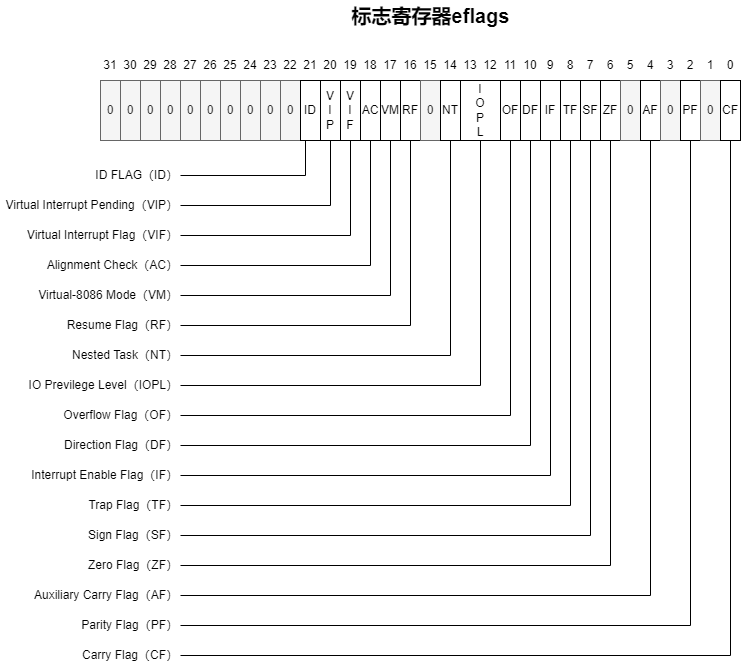
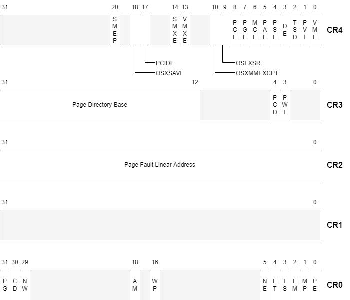
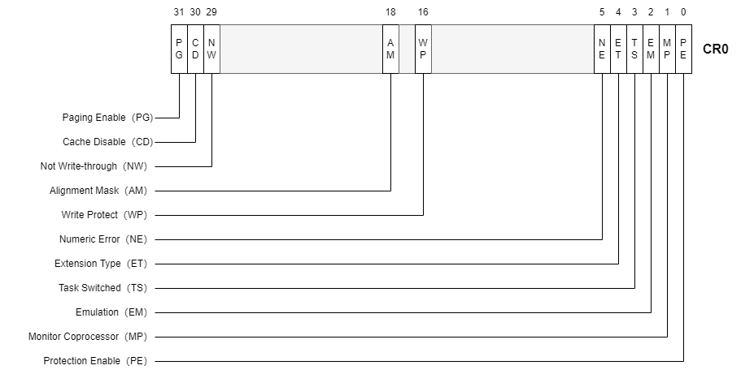
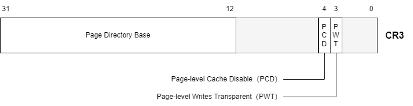
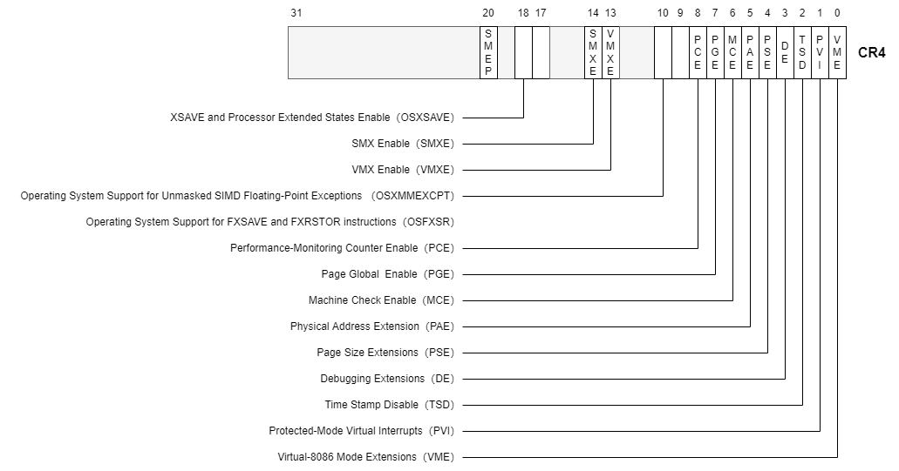

- [x86寄存器](#x86寄存器)
  - [标志寄存器](#标志寄存器)
  - [控制寄存器](#控制寄存器)
    - [cr0](#cr0)
  - [cr3](#cr3)
  - [cr4](#cr4)
- [参考资料](#参考资料)

# x86寄存器

## 标志寄存器

标志寄存器eflags，记录了CPU执行指令过程中的一系列状态，这些标志大都由CPU自动设置和修改。

- CF：进位标志位。无符号数运算时，运算结果的最高有效位向前有借位或进位。
- PF：奇偶标志位。运算结果所有的bit中1的个数为偶数则为1，为奇数则为0。
- AF：辅助进位标志位。运算过程中看最后四位，不论长度为多少，最后四位向前有借位或者进位。
- ZF：零标志位。执行结果是否为0。
- SF：符号标志位。执行结果的符号位（最高位）。
- TF：调试标志位。当TF=1时，处理器每次只执行一条指令，即单步执行。
- IF：中断允许标志位。是否响应外部中断。可以通过`sti`和`cli`指令来开启和关闭。
- DF：方向标志位。在串处理指令中，每次操作后，如果DF=0，si、di递增；如果DF=1，si、di递减。可以通过`std`和`cld`指令来设置。
- OF：溢出标志位。记录了有符号运算的结果是否发生了溢出。
- IOPL：是从80286开始出现的，占2个bit表示I/O特权级，如果当前特权级小于或等于IOPL，则可以执行I/O操作，否则将出现一个保护性异常。IOPL只能由特权级为0的程序或任务来修改。
- NT：也是从80286开始出现的，表示嵌套任务，用于控制中断返回指令IRET，当NT=0时，用堆栈中保存的值恢复EFLAGS、CS和EIP，从而实现返回；若NT=1，则通过任务切换实现中断返回。
- VM：表示虚拟8086模式，如果VM被置位且80386已出于保护模式下，则CPU切换到虚拟8086模式，此时，对段的任何操作又回到了实模式，如同在8086下运行一样。   
- RF：表示恢复标志(也叫重启标志)，与调试寄存器一起用于断点和单步操作，当RF＝1 时，下一条指令的任何调试故障将被忽略，不产生异常中断。当RF=0时，调试故障被接受，并产生异常中断。用于调试失败后，强迫程序恢复执行，在成功执行每条指令后，RF自动复位。   
- AC：表示对齐检查。这个标志是80486以后的CPU才有的。当AC=1且CR0中的AM=1时，允许存储器进行地址对齐检查，若发现地址未对齐，将产生异常中断。所谓地址对齐，是指当访问一个字（2字节长）时，其地址必须是偶数（2的倍数），当访问双字（4字节长）时，其地址必须是4的倍数。但是只有运行在特权级3的程序才执行地址对齐检查，特权级0、1、2忽略该标志。   
- VIF：表示虚拟中断标志。以下的三个标志是Pentium以后的CPU才有的。当VIF=1时，可以使用虚拟中断，当VIF=0时不能使用虚拟中断。该标志要和下面的VIP和CR4中的VME配合使用。   
- VIP：表示虚拟中断挂起标志。当VIP=1时，VIF有效，VIP=0时VIF无效。   
- ID：表示鉴别标志。该标志用来只是Pentium CPU是否支持CPUID的指令。

## 控制寄存器

- cr0: 存储了CPU控制标记和工作状态。
- cr1: 保留未使用。
- cr2: 导致出现页错误的线性地址。
- cr3: 存储了当前进程的页目录地址。
- cr4: 存储了CPU工作相关以及当前任务的一些信息。

### cr0

- PE：开启保护模式。PE=0表示CPU工作在实模式，PE=1表示CPU工作在保护模式。
- MP：监控协处理器。MP=1表示协处理器在工作，MP=0表示协处理器未工作。
- EM：协处理器仿真，当MP=0，EM=1时，表示正在使用软件仿真协处理器工作。
- TS：任务转换，每当进行任务转换时，TS=1，任务转换完毕，TS=0。TS=1时不允许协处理器工作。
- ET：处理器扩展类型，反映了所扩展的协处理器的类型，ET=0为80287，ET=1为80387。
- NE：数值异常中断控制，NE=1时，如果运行协处理器指令发生故障，则用异常中断处理，NE=0时，则用外部中断处理。
- WP：写保护，当WP=1时，对只读页面进行写操作会产生页故障。
- AM：对齐标志，AM=1时，允许对齐检查，AM=0时不允许，关于对齐，在EFLAGS的AC标志时介绍过，在80486以后的CPU中，CPU进行对齐检查需要满足三个条件，AC=1、AM=1并且当前特权级为3。
- NW（Not Write-through）和CD（Cache Disable），这两个标志都是用来控制CPU内部的CACHE的，当NW=0且CD=0时，CACHE使能，其它的组合说起来比较复杂。
- PG：页式管理机制使能，PG=1时页式管理机制工作，否则不工作。

## cr3

- PCD：页CACHE禁止，当PCD=0时，页目录表进行高速缓存，PCD=1时，不进行高速缓存；该位控制PCD引脚控制外部CACHE工作还是不工作。
- PWT：CACHE的写入分为透写（Write-Through）和回写（Write-Back）,80486以上的CPU内部的CACHE都是透写的，但对外部CACHE而言，允许某些页是回写的，而另一些页是透写的，当PWT=1时，外部CACHE对页目录进行透写，否则进行回写；此位驱动PWT引脚以控制外部CACHE是透写还是回写。CR4是从Pentium CPU开始出现的。

## cr4

- VME：虚拟8086方式扩展，VME=1允许使用虚拟8086扩展模式，否则只能使用80386/80486的虚拟8086模式。
- PVI：保护模式虚拟中断，PVI=1时，在保护模式下支持虚拟中断标志VIF(EFLAGS中)，PVI=0则不支持虚拟中断标志。
- TSD：时间戳禁止，TSD=1时，允许在特权级为0的程序中执行RDTSC指令（读时间戳计数指令），TSD=0时，允许任何特权级执行RDTSC指令。
- DE：调试扩展。
- PSE：页大小扩展，PSE=1时，页大小可以扩展到2M或4M，PSE=0时，页大小只能是4K.
- PAE：物理地址扩展，PAE=1时，页物理地址可以扩展到36bits以上，PAE=0时只能用32bits的物理地址。
- MCE：硬件检查使能，Pentium以后的CPU有一种硬件检测功能，MCE=1时允许使用该功能。
- PGE：全局页使能，PGE=1时，允许使用全局页，PGE=0时禁止使用全局页。
- PCE：性能监视计数器使能，当PCE=1时，允许在任何保护级下执行RDPMC指令，PCE=0时，只有特权级0的程序可以执行RDPMC指令。
- VMXE：VMX使能位，VMXE=1时，允许VMX操作。
- SMXE：SMX使能位，SMXE=1时，允许SMX操作。

# 参考资料

- [汇编学习：寄存器](https://www.bilibili.com/read/cv18035431)
