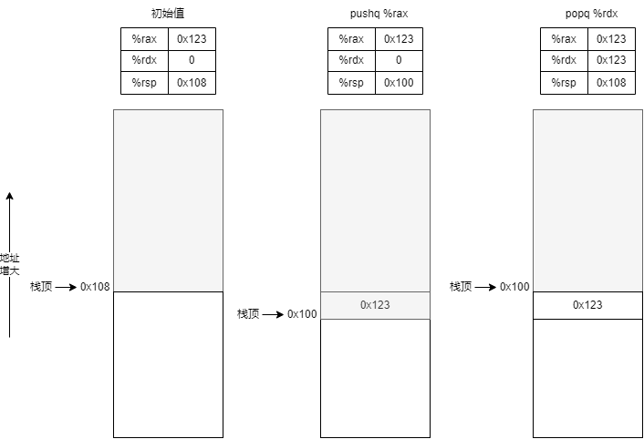
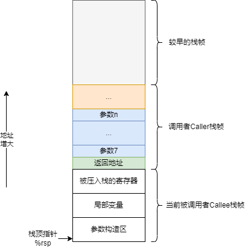

- [x86汇编](#x86汇编)
  - [数据格式](#数据格式)
  - [寻址模式](#寻址模式)
  - [数据传送指令](#数据传送指令)
    - [MOV类](#mov类)
    - [MOVZ和MOVS类](#movz和movs类)
  - [压入和弹出栈指令](#压入和弹出栈指令)
  - [算术和逻辑操作指令](#算术和逻辑操作指令)
    - [加载有效地址指令](#加载有效地址指令)
    - [位移指令](#位移指令)
    - [特殊算术操作指令](#特殊算术操作指令)
  - [控制相关指令](#控制相关指令)
    - [条件码](#条件码)
    - [设置指令](#设置指令)
    - [跳转指令](#跳转指令)
    - [用条件控制实现分支语句（if）](#用条件控制实现分支语句if)
    - [条件传送指令实现三元运算符](#条件传送指令实现三元运算符)
    - [用条件控制实现循环语句](#用条件控制实现循环语句)
    - [用条件控制实现switch](#用条件控制实现switch)
  - [汇编实现函数](#汇编实现函数)
- [参考资料](#参考资料)

# x86汇编

本文使用AT&T风格的汇编代码展示。

## 数据格式

由于x86是从16位机发展过来的，Intel就用术语“字（word）”表示16位数据类型。由此衍生出“双字（double word）”，“四字（quad word）”。具体如下表。

| Intel数据类型 | 汇编代码后缀 | 大小（字节） |    备注    |
| :-----------: | :----------: | :----------: | :--------: |
|     字节      |      b       |      1       |            |
|      字       |      w       |      2       |            |
|     双字      |      l       |      4       |            |
|     四字      |      q       |      8       | x86-64语法 |
|    单精度     |      s       |      4       |            |
|    双精度     |      l       |      8       |            |

## 寻址模式

寻址模式可以总结为$Imm(r_b,r_i,s)$这种形式，由四部分组成：一个立即数偏移地址$Imm$，一个基址寄存器$r_b$，一个变址寄存器$r_i$，一个比例因子$s$，这里$s$必须为1，2，4或者8。

下表就是上述形式的各种用法。

|       格式       |         操作数值         | 操作对象 |      名称       |
| :--------------: | :----------------------: | :------: | :-------------: |
|     $\$Imm$      |          $Imm$           |  立即数  |   立即数寻址    |
|      $r_a$       |         $R[r_a]$         |  寄存器  |   寄存器寻址    |
|      $Imm$       |         $M[Imm]$         |   内存   |    绝对寻址     |
|     $(r_a)$      |       $M[R[r_a]]$        |   内存   |    间接寻址     |
|    $Imm(r_b)$    |     $M[Imm+R[r_b]]$      |   内存   | 基址+偏移量寻址 |
|   $(r_b,r_i)$    |    $M[R[r_b]+R[r_i]]$    |   内存   |    变址寻址     |
|  $Imm(r_b,r_i)$  |  $M[Imm+R[r_b]+R[r_i]]$  |   内存   |    变址寻址     |
|    $(,r_i,s)$    |      $M[R[r_i]*s]$       |   内存   |  比例变址寻址   |
|  $Imm(,r_i,s)$   |    $M[Imm+R[r_i]*s]$     |   内存   |  比例变址寻址   |
|  $(r_b,r_i,s)$   |   $M[R[r_b]+R[r_i]*s]$   |   内存   |  比例变址寻址   |
| $Imm(r_b,r_i,s)$ | $M[Imm+R[r_b]+R[r_i]*s]$ |   内存   |  比例变址寻址   |

## 数据传送指令

### MOV类

`mov`指令的源操作数要么是一个立即数，要么是寄存器值或者内存值。目的操作数只能是寄存器或者内存地址。并且`mov`指令不支持内存到内存的移动，必须先从内存移动到寄存器，再从寄存器移动到内存。

|     指令      | 效果  |     描述     |
| :-----------: | :---: | :----------: |
|   `MOV S,D`   | D<-S  |     传送     |
|    `movb`     |       |   传送字节   |
|    `movw`     |       |    传送字    |
|    `movl`     |       |   传送双字   |
|    `movq`     |       |   传送四字   |
| `movabsq I,R` | R<-I  | 传送绝对四字 |

`movq`只允许最大32的立即数作为源数据，然后高位用符号扩展传送到64位目的，当需要64位立即数时，得使用专门的`movabsq`指令。

```asm
movabsq 0x0011223344556677, %rax
movq %rax, %rbx
```

当目的是寄存器时，`movb`，`movw`都不影响目的高位字节，`movl`对高位字节做0扩展，`movq`对高位字节做符号位扩展。

```asm
movabsq $0x0011223344556677, %rax  // %rax = 0x0011223344556677
movb $-1, %al                      // %rax = 0x00112233445566ff
movw $-1, %ax                      // %rax = 0x001122334455ffff
movl $-1, %eax                     // %rax = 0x00000000ffffffff
movq $-1, %rax                     // %rax = 0xffffffffffffffff
```

### MOVZ和MOVS类

在将较小的源值复制到较大的目的时，使用`MOVZ`指令对高位字节做0扩展，使用`MOVS`指令对高位字节做符号位扩展。目的地址必须是寄存器。

零扩展。

|    指令    |      效果      |            描述             |
| :--------: | :------------: | :-------------------------: |
| `MOVZ S,R` | R<-零扩展（S） |       以0扩展进行传送       |
|  `movzbw`  |                |  将做了0扩展的字节传送到字  |
|  `movzbl`  |                | 将做了0扩展的字节传送到双字 |
|  `movzwl`  |                |  将做了0扩展的字传送到双字  |
|  `movzbq`  |                | 将做了0扩展的字节传送到四字 |
|  `movzwq`  |                |  将做了0扩展的字传送到四字  |

符号位扩展。

|    指令    |            效果            |             描述             |
| :--------: | :------------------------: | :--------------------------: |
| `MOVS S,R` |      R<-符号扩展（S）      |      以符号扩展进行传送      |
|  `movsbw`  |                            |  做了符号扩展的字节传送到字  |
|  `movsbl`  |                            | 做了符号扩展的字节传送到双字 |
|  `movswl`  |                            | 将做了符号扩展的字传送到双字 |
|  `movsbq`  |                            | 做了符号扩展的字节传送到四字 |
|  `movswq`  |                            | 将做了符号扩展的字传送到四字 |
|  `movslq`  |                            | 做了符号扩展的双字传送到四字 |
|   `cltq`   | `%rax`<-符号扩展（`%eax`） |   将`%eax`符号扩展到`%rax`   |

## 压入和弹出栈指令

|   指令    |                效果                 |     描述     |
| :-------: | :---------------------------------: | :----------: |
| `pushq S` | R[%rsp]<-R[%rsp]-8<br>M[R[%rsp]]<-S | 将四字压入栈 |
| `popq D`  | D<-M[R[%rsp]]<br>R[%rsp]<-R[%rsp]+8 | 将四字弹出栈 |

`%rsp`寄存器记录的就是栈顶指针，这里栈顶指针是往低地址增长的。



## 算术和逻辑操作指令

|    指令    |   效果   |          描述          |
| :--------: | :------: | :--------------------: |
| `leaq S,D` |  D<-&S   |      加载有效地址      |
|  `INC D`   |  D<-D+1  |         自增1          |
|  `DEC D`   |  D<-D-1  |         自减1          |
|  `NEG D`   |  D<--D   |          取负          |
|  `NOT D`   |  D<-~D   |          取反          |
| `ADD S,D`  |  D<-D+S  |        加上S到D        |
| `SUB S,D`  |  D<-D-S  |        从D减去S        |
| `IMUL S,D` |  D<-D*S  |           乘           |
| `XOR S,D`  |  D<-D^S  |          异或          |
|  `OR S,D`  | D<-D\|S  |           或           |
| `AND S,D`  |  D<-D&S  |           与           |
| `SAL k,D`  | D<-D<< k |          左移          |
| `SHL k,D`  | D<-D<< k |   左移（等同于SAL）    |
| `SAR k,D`  | D<-D>>k  | 算术右移（符号位扩展） |
| `SHR k,D`  | D<-D>>k  |  逻辑右移（零位扩展）  |

### 加载有效地址指令

加载有效地址（load effective address）指令`leaq`实际上是`movq`指令的变形。`leaq`指令直接计算源操作数对应的地址，然后不对地址做解引用，直接复制给目的。

```asm
movq $1, %rax                // %rax = 1
leaq 7(%rax, %rax, 4), %rdx  // %rdx = 5%rax+7 = 12
```

### 位移指令

位移指令中先给出位移量，再给出要唯一的值。位移量可以是一个立即数，也可以是`%cl`寄存器。

### 特殊算术操作指令

|   指令    |                              效果                              |     描述     |
| :-------: | :------------------------------------------------------------: | :----------: |
| `imulq S` |                   R[%rdx]:R[%rax]<-S*R[%rax]                   | 有符号全乘法 |
| `mulq S`  |                   R[%rdx]:R[%rax]<-S*R[%rax]                   | 无符号全乘法 |
|  `clto`   |              R[%rdx]:R[%rax]<-符号扩展（R[%rax]）              |  转换位8字   |
| `idivq S` | R[%rdx]<-R[%rdx]:R[%rax] mod S<br>R[%rax]<-R[%rdx]:R[%rax] / S |  有符号除法  |
| `divq S`  | R[%rdx]<-R[%rdx]:R[%rax] mod S<br>R[%rax]<-R[%rdx]:R[%rax] / S |  无符号除法  |

## 控制相关指令

### 条件码

CPU维护着一组单个位的条件码寄存器。它们描述了最近的算术或者逻辑运算属性。可以通过检测这些条件码寄存器来执行条件分支指令。常见的条件码有。

- CF：进位标志，最近的操作使最高位产生了进位，可以用来判断无符号操作的溢出。
- ZF：零标志，最近的操作得出的结果为0。
- SF：符号标志，最近的操作得出的结果为负数。
- OF：溢出标志，最近的操作导致一个补码溢出——正溢出或者负溢出。

### 设置指令

有两类指令，比较指令和测试指令，它们都只设置条件码，不改变任何其它寄存器。

|        指令         |    基于    |   描述   |
| :-----------------: | :--------: | :------: |
| $CMP\quad S_1,S_2$  | $S_2-S_1$  |   比较   |
|       `cmpb`        |            | 比较字节 |
|       `cmpw`        |            |  比较字  |
|       `cmpl`        |            | 比较双字 |
|       `cmpq`        |            | 比较四字 |
| $TEST\quad S_1,S_2$ | $S_1\&S_2$ |   测试   |
|       `testb`       |            | 测试字节 |
|       `testw`       |            |  测试字  |
|       `testl`       |            | 测试双字 |
|       `testq`       |            | 测试四字 |

`TEST`的典型用法是两个操作数一样，比如`testq %rax, %rax`来判断`%rax`是正数还是0还是负数。或者其中的一个操作数是掩码，用来指示哪些位应该被测试。

一条`SET`指令的目的操作数是低位单字节寄存器。或是一个字节的内存位置。

|   指令    |  同义词  |      效果       |         描述         |
| :-------: | :------: | :-------------: | :------------------: |
| `sete D`  |  `setz`  |      D<-ZF      |       相等/零        |
| `setne D` | `setnz`  |     D<-~ZF      |    不相等/不为零     |
| `sets D`  |          |      D<-SF      |         负数         |
| `setns D` |          |     D<-~SF      |        非负数        |
| `setg D`  | `setnle` | D<-~(SF^OF)&~ZF |    大于（有符号）    |
| `setge D` | `setnl`  |   D<-~(SF^OF)   |  大于等于（有符号）  |
| `setl D`  | `setnge` |    D<-SF^OF     |    小于（有符号）    |
| `setle D` | `setng`  | D<-(SF^OF)\|ZF  |  小于等于（有符号）  |
| `seta D`  | `setnbe` |   D<-~CF&~ZF    |    超过（无符号）    |
| `setae D` | `setnb`  |     D<-~CF      | 超过或相等（无符号） |
| `setb D`  | `setnae` |      D<-CF      |    低于（无符号）    |
| `setbe D` | `setna`  |    D<-CF\|ZF    | 低于或相等（无符号） |

`SET`指令可以和`CMP`指令搭配使用。

```asm
// int comp(data_t a, data_t b)
// a in %rdi, b in %rsi
comp:
    cmpq %rsi, %rdi     // 比较a和b
    setg %al            // 判断a>b
    movzbl %al, %eax
    ret
```

### 跳转指令

正常情况下，指令按照出现的顺序一条一条地执行。`jmp`指令可以将执行切换到程序的另一个位置（相当于高级语言中的`goto`）。

`jmp`指令通常有两种跳转格式，一个是目的地址用一个标号（LABEL）指明叫做直接跳转，一个是目的地址用寄存器或内存中保存的值指明叫做间接跳转。

```asm
// 直接跳转
    jmp .L1
    movq %rax, %rbx
.L1:
    popq %rdx

// 间接跳转，前面需要加一个星号*
jmp *%rax
```

|      指令      | 同义词 |   跳转条件   |           描述           |
| :------------: | :----: | :----------: | :----------------------: |
|  `jmp LABEL`   |        |      1       |         直接跳转         |
| `jmp *Operand` |        |      1       |         间接跳转         |
|   `je LABEL`   |  `jz`  |      ZF      |      相等/零时跳转       |
|  `jne LABEL`   | `jnz`  |     ~ZF      |    不相等/非零时跳转     |
|   `js LABEL`   |        |      SF      |        负数时跳转        |
|  `jns LABEL`   |        |     ~SF      |        非负时跳转        |
|   `jg LABEL`   | `jnle` | ~(SF^OF)&~ZF |   大于时（有符号）跳转   |
|  `jge LABEL`   | `jnl`  |   ~(SF^OF)   | 大于等于时（有符号）跳转 |
|   `jl LABEL`   | `jnge` |    SF^OF     |   小于时（有符号）跳转   |
|  `jle LABEL`   | `jng`  | (SF^OF)\|ZF  | 小于等于时（有符号）跳转 |
|   `ja LABEL`   | `jnbe` |   ~CF&~ZF    |   超过时（无符号）跳转   |
|  `jae LABEL`   | `jnb`  |     ~CF      | 超过相等时（无符号）跳转 |
|   `jb LABEL`   | `jnae` |      CF      |   低于时（无符号）跳转   |
|  `jbe LABEL`   | `jna`  |    CF\|ZF    | 低于相等时（无符号）跳转 |

在汇编代码中，跳转目标用标号（LABEL）书写，后续的汇编器和链接器会产生适当的编码。通常是程序指针相对的（PC-relative）的，它们会将目标指令的地址和紧跟在跳转指令后面的那条指令的地址之间的差值作为编码。这种相对值编码可以编码为1，2或4个字节。

第二种编码方式就是直接写出“绝对”地址，用四个字节直接指定目标。

### 用条件控制实现分支语句（if）

C语言中`if-else`的通用形式如下。

```c
if (test-expr)
    then-statement
else 
    else-statement
```

汇编通常会用下面的格式进行翻译，下面的`if`对应`cmp`指令，`goto`对应`je`指令。

```c
    t = test-expr;
    if (!t)
        goto false;
    then-statement
    goto done;
false:
    else-statement
done:
```

### 条件传送指令实现三元运算符

|      指令      |  同义词   |   传送条件   |           描述           |
| :------------: | :-------: | :----------: | :----------------------: |
|  `cmove S,R`   |   cmovz   |      ZF      |      相等或零时传送      |
|  `cmovne S,R`  |  cmovnz   |     ~ZF      |    不相等或非零时传送    |
|  `cmovs S,R`   |           |      SF      |        负数时传送        |
|  `cmovns S,R`  |           |     ~SF      |       非负数时传送       |
|  `cmovg S,R`   | `cmovnle` | ~(SF^OF)&~ZF |   大于时（有符号）传送   |
| `cmovge LABEL` | `cmovnl`  |   ~(SF^OF)   | 大于等于时（有符号）传送 |
| `cmovl LABEL`  | `cmovnge` |    SF^OF     |   小于时（有符号）传送   |
| `cmovle LABEL` | `cmovng`  | (SF^OF)\|ZF  | 小于等于时（有符号）传送 |
| `cmova LABEL`  | `cmovnbe` |   ~CF&~ZF    |   超过时（无符号）传送   |
| `cmovae LABEL` | `cmovnb`  |     ~CF      | 超过相等时（无符号）传送 |
| `cmovb LABEL`  | `cmovnae` |      CF      |   低于时（无符号）传送   |
| `cmovbe LABEL` | `cmovna`  |    CF\|ZF    | 低于相等时（无符号）传送 |

同条件跳转不同，条件传送不需要分支预测，所以性能更高。

三元运算符可以通过条件跳转和条件传送实现。

```c
// 三元运算符
v = test-expr ? then-expr : else-expr;

// 条件跳转实现
    t = test-expr;
    if (!t)
        goto false;
    v = then-expr;
    goto done;
false:
    v = else-expr;
done:

// 条件传送实现
v = then-expr;
ve = else-expr;
t = test-expr;
if (!t) v = ve;
```

但是要用条件传送那肯定是有限制的。当计算表示比较复杂，或者计算表达式有副作用（比如自增，取地址等），那么用条件传送反而不好。对GCC的实验表明，只有两个表达式都很好计算的时候，比如简单的加减法，那么会翻译为条件传送的形式。

### 用条件控制实现循环语句

C语言中`do-while`循环形式如下。

```c
do
    body-statement
while (test-expr);
```

翻译为汇编格式如下。

```c
loop:
    body-statement
    t = test-expr;
    if (t)
        goto loop;
```

`while`循环形式如下。

```c
while (test-expr)
    body-statement
```

翻译为汇编格式如下。

```c
goto test;
loop:
    body-statement
test:
    t = test-expr;
    if (t)
        goto loop;
```

`for`循环形式如下，其实和`while`的形式是一样的。

```c
for (init-expr; test-expr; update-expr)
    body-statement

// 等于while
init-expr;
while (test-expr)
{
    body-statement
    update-expr;
}
```

### 用条件控制实现switch

C语言中的`switch`语句支持整型常量作为跳转分支的值，当分支数量比较多，并且分支的值范围比较小时，可以用跳转表来优化程序的性能。

跳转表是一个数组，里面存放了各个分支的入口代码地址，这样直接就可以根据传入的值跳转到对应的分支入口。

```c
// 原版C语言switch代码
int ans = 0;

switch (n) {
case 100 :
    ans = 0;
    break;

case 102 :
    ans = 2;
    //fall through

case 103 :
    ans = 3;
    break;

case 104 :
    break;

default :
    ans = 0;
}

//翻译为跳转表的C代码
//跳转表
static void *jt[6] = {
    &&loc_A, &&loc_def, &&loc_B,
    &&loc_C, &&loc_D, &&loc_def
};

//对分支对应的值做简单的坐标变换
unsigned index = n - 100;

int ans = 0;

//default分支
if (index > 5) {
    goto loc_def;
}

//进行分支跳转
goto &jt[index];

//case 100
loc_A :
    ans = 0;
    goto done;

//case 102
loc_B :
    ans = 2;
    //fall through

loc_C :
    ans = 3;
    goto done;

//case 104
loc_D :
    ans = 6;
    goto done;

loc_def :
    ans = 0;

done :
```

对于其他情况，翻译为`if-elseif-else`那种形式就可以了。

## 汇编实现函数

实现函数主要有三点。

- 转移控制：将执行流程从函数Caller跳转到函数Callee，执行完后又跳转回函数Caller。这个主要依靠`call`和`ret`指令实现。
- 参数传递：通过寄存器最多可以传递6个参数（x86-64），多余的参数可以放在函数Caller的栈帧上，也就是在执行`call`之前，先把参数`push`到内存里面。
- 数据返回：一般是通过`%rax`寄存器返回数据。

|      指令       |       描述       |
| :-------------: | :--------------: |
|  `call LABEL`   |     过程调用     |
| `call *Operand` |     过程调用     |
|      `ret`      | 从过程调用中返回 |

当执行`call`指令后，会将紧跟在`call`指令后面的那条指令的地址压入栈。然后跳转到被调用函数Callee。

而对于`ret`指令，则是相反的顺序，先从当前栈顶弹出之前保存的调用者函数Caller中下一条指令的地址，然后再跳转到该地址继续执行（所以得出在退出一个函数之前要先把函数栈都退完，让栈顶指针`%rsp`指向回去的地址）。

x86-64中，可以通过寄存器传递最多6个整型数据。寄存器的使用顺序是有规范的。

| 参数大小 |            参数顺序             |
| :------: | :-----------------------------: |
|    64    |  `%rdi %rsi %rdx %rcx %r8 %r9`  |
|    32    | `%edi %esi %edx %ecx %r8d %r9d` |
|    16    |   `%di %si %dx %cx %r8w %r9w`   |
|    8     |  `%dil %sli %dl %cl %r8b %r9b`  |

如果要传递的参数超过6个，那就需要通过栈来传递了，通过栈传递时，所有数据的大小都要向8字节对齐，顺序小的参数越靠近栈顶（第7个参数在栈顶）。

依照惯例，寄存器`%rbx`和`%rbp`以及`%r12~%r15`这些寄存器都为被调用者Callee保存的寄存器，被调用这Callee得保证自己返回的时候这些寄存器还得和原来一样。

这里`%rbp`还比较常见，叫做基址寄存器，通常用来保存一个栈帧的基址，比如一个栈帧是变长的话（函数里面有变长数组，变长参数等），那么要对栈内的局部变量寻址那么还是用`%rbp`比较方便，只需要在函数开头设置`movq %rsp, %rbp`即可。



# 参考资料

