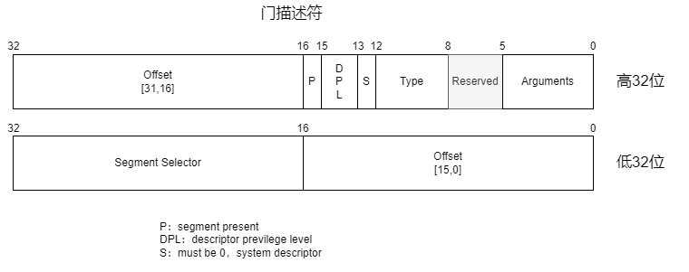

- [中断和异常](#中断和异常)
- [中断描述符表](#中断描述符表)
  - [中断门和陷阱门的区别](#中断门和陷阱门的区别)
- [中断流程](#中断流程)
- [参考资料](#参考资料)

# 中断和异常

中断，也叫做异步中断，由外部设备产生可以随时打断当前CPU的执行流程。通常分为。

- 可屏蔽中断：由IO设备产生的IRQ中断。这类中断可以通过将`%eflags`寄存器中的IF标志置为0来屏蔽。
- 不可屏蔽中断：比如内存不对齐，断电等无法忽略的外部信号。

异常，也叫做同步中断，中断信号在CPU执行完某个指令后产生并接收到。通常分为。

- 故障（fault）：通常可以恢复，恢复之后返回到引起异常的语句重新执行，比如缺页故障。
- 陷阱（trap）：可以恢复，恢复之后引起异常的指令应该已经完成，所以返回到下一条语句执行，比如用来实现系统调用的软中断INT指令。
- 终止（abort）：不可恢复，不返回引起异常的地方，都是直接终止进程。

# 中断描述符表

中断发生后，会根据当前的中断向量号去查询中断描述符表，里面的中断描述符记录了当前中断的处理程序的地址信息，这样就可以正确跳转到中断处理程序了。

在中断描述符表中，可以存放中断门，陷阱门，调用门，任务门这几种描述符。结构如下。

- Offset：中断函数在段中的偏移地址。
- Selector：段选择子。
- Arguments：调用门的参数。
- Type：门的类型。
- S：为0表示为系统段，这里必须为0。
- DPL：门特权级。
- P：存在位，如果这一位为0，则此描述符为非法的。

门的类型如下。

|   系统段类型   | type值 |           说明           |
| :------------: | :----: | :----------------------: |
|     未定义     |  0000  |           保留           |
| 可用的80286TSS |  0001  |  仅限80286，任务状态段   |
|      LDT       |  0010  |       局部描述符表       |
| 忙碌的80286TSS |  0011  |        仅限80286         |
|  80286调用门   |  0100  |        仅限80286         |
|     任务门     |  0101  |                          |
|  80286中断门   |  0110  |        仅限80286         |
|  80286陷阱门   |  0111  |        仅限80286         |
|     未定义     |  1000  |           保留           |
| 可用的80386TSS |  1001  | 386以上的CPU的任务状态段 |
|     未定义     |  1010  |           保留           |
| 忙碌的80386TSS |  1011  |                          |
|  80386调用门   |  1100  |    386以上CPU的调用门    |
|     未定义     |  1101  |           保留           |
|     中断门     |  1110  |    386以上CPU的中断门    |
|     陷阱门     |  1111  |    386以上CPU的陷阱门    |

## 中断门和陷阱门的区别

它们之间的唯一区别就是中断门在中断触发的时候会自动将`%eflags`中的IF值0，频闭外部中断，以免被打断。陷阱门则不会。
中断处理完毕后，执行`iret`指令会自动恢复之前压入栈的`%eflags`的值。

# 中断流程

1. 发生异常后，先查询中断描述符表，找到对应的描述符。
2. 检查段权限：将目标代码段描述符中的DPL与CPL比较，目标段的DPL必须小于或等于CPL。也就是说，通过中断门时只允许保持或提升CPU的运行级别。这两个环节中的任何一个失败都会产生一次一般保护错误（General protection fault，GPF）。
3. 保存现场：如果当前的程序优先级CPL和目标代码段DPL的一致，那么直接将中断现场压入当前的栈。如果发生了优先级提升，那么切换到对应优先级的栈空间，在那里去保存现场。可以通过TSS中保存的各个优先级的栈地址来知道具体切换到哪个栈空间去。

4. 执行中断程序并从中断处理程序中返回：从栈中依次弹出Error Code和EIP和CS以及EFLAGS寄存器的值。然后进行栈恢复，判断当前的特权级别和弹出的CS选择子的特权级别，如果不同，说明之前有过栈切换，从栈中再弹出ESP和SS寄存器的值。

# 参考资料

