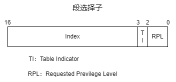
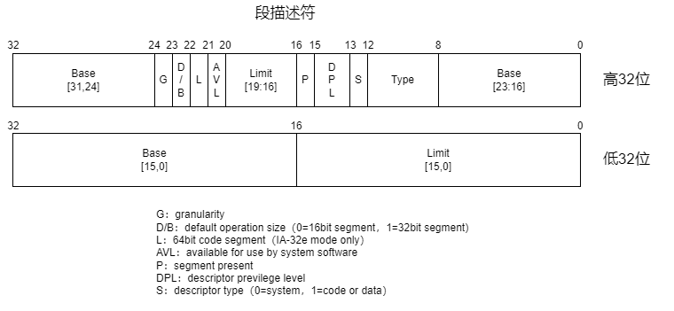

- [实模式下的分段机制](#实模式下的分段机制)
- [保护模式下的分段机制](#保护模式下的分段机制)
- [参考资料](#参考资料)

# 实模式下的分段机制

也就是8086的16位模式，16位的段寄存器左移4位（变为20位大小）作为段基址，再加上相应的段偏移值就得到了最终的地址。

比如对于代码段（code segment），计算`%CS<<4+%EIP`就是当前实际要寻址的代码地址。

# 保护模式下的分段机制

这时，段寄存器的值并不是直接作为段偏移，而是分为了三部分：

- 索引（INDEX）：在描述符表中的下标值，最多$2^{13}=8192$个描述符。
- 表指示位（Table Indicator）：表示该访问哪一个描述符表，0表示全局描述符表（GDT），1表示局部描述符表（LDT）。
- 需要的特权级（Requested Previlege Level）：0表示内核态，3表示用户态，数字越小权力越大。

段描述符一共64bit，其中包括32位的段基地址，20位的段大小，段的类型等。

- 颗粒度（G granularity）：段的大小单位，0表示单位为1Byte，那么段最大为1MB，1表示单位为4KB，那么段最大为4GB。
- D/B字段：对于代码段来说，为0则为16位模式，使用寄存器%IP，为1则为32位模式，使用寄存器%EIP。对于栈段来说，为0使用寄存器%SP，为1使用寄存器%ESP。
- L字段：用来设置是否为64位代码段。
- 段存在位（P segment present）：如果这一位为0，则此描述符为非法的，不能被用来实现地址转换。如果一个非法描述符被加载进一个段寄存器，处理器会立即产生异常。
- 描述符特权级（DPL Descriptor previlege level）：用来实现特权级，这两位能表示4种特权级，分别是0、1、2、3、4级特权。数字越小权力越大。
- S字段：为0表示为系统段，为1表示为普通段。

当S为0时，记录的是系统段，具体类型由type的值确定。

|   系统段类型   | type值 |           说明           |
| :------------: | :----: | :----------------------: |
|     未定义     |  0000  |           保留           |
| 可用的80286TSS |  0001  |  仅限80286，任务状态段   |
|      LDT       |  0010  |       局部描述符表       |
| 忙碌的80286TSS |  0011  |        仅限80286         |
|  80286调用门   |  0100  |        仅限80286         |
|     任务门     |  0101  |                          |
|  80286中断门   |  0110  |        仅限80286         |
|  80286陷阱门   |  0111  |        仅限80286         |
|     未定义     |  1000  |           保留           |
| 可用的80386TSS |  1001  | 386以上的CPU的任务状态段 |
|     未定义     |  1010  |           保留           |
| 忙碌的80386TSS |  1011  |                          |
|  80386调用门   |  1100  |    386以上CPU的调用门    |
|     未定义     |  1101  |           保留           |
|     中断门     |  1110  |    386以上CPU的中断门    |
|     陷阱门     |  1111  |    386以上CPU的陷阱门    |

当S为1时，记录的是数据段或者代码段，对于数据段和代码段type的值每一位有不同的含意。

代码段如下，type的值由高到低每一位分别为`XCRA`。

|   X   |   C   |   R   |   A   |           说明           |
| :---: | :---: | :---: | :---: | :----------------------: |
|   1   |   0   |   0   |   *   |       可执行代码段       |
|   1   |   1   |   0   |   *   |    可执行，一致代码段    |
|   1   |   0   |   1   |   *   |    可执行，可读代码段    |
|   1   |   1   |   1   |   *   | 可执行，可读，一致代码段 |

数据段如下，type的值由高到低每一位分别为`XEWA`。

|   X   |   E   |   W   |   A   |             说明             |
| :---: | :---: | :---: | :---: | :--------------------------: |
|   0   |   0   |   0   |   *   |          只读数据段          |
|   0   |   1   |   0   |   *   |  只读，向低地址扩展的数据段  |
|   0   |   0   |   1   |   *   |         可读写数据段         |
|   0   |   1   |   1   |   *   | 可读写，向低地址扩展的数据段 |

# 参考资料

- [IA-32保护模式下的内存管理-分段](https://zhuanlan.zhihu.com/p/57143407)
