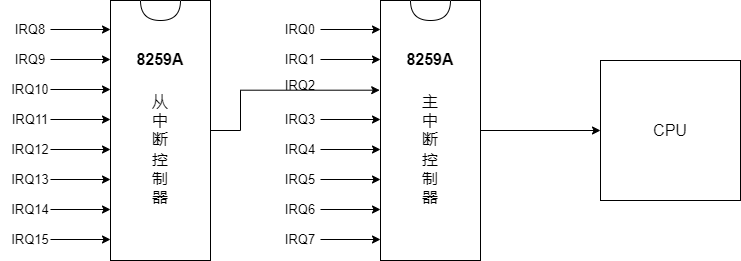
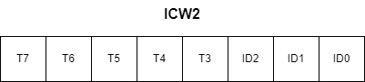
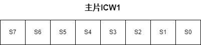
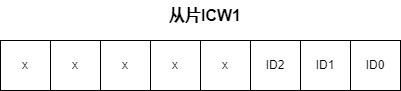
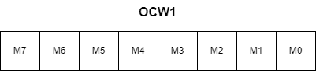
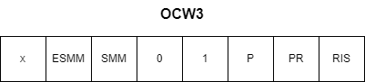

- [可编程中断控制器](#可编程中断控制器)
- [8259A](#8259a)
- [8259A内部寄存器](#8259a内部寄存器)
  - [ICW1寄存器](#icw1寄存器)
  - [ICW2寄存器](#icw2寄存器)
  - [ICW3寄存器](#icw3寄存器)
  - [ICW4寄存器](#icw4寄存器)
  - [OCW1寄存器](#ocw1寄存器)
  - [OCW2寄存器](#ocw2寄存器)
  - [OCW3寄存器](#ocw3寄存器)
- [参考资料](#参考资料)

# 可编程中断控制器

在x86中，外部设备产生的中断信号并不会直接通过INTR发给CPU，而是先发送给可编程中断控制器（PIC Programmable Interrupt Controller），再由中断控制器发送给CPU。

# 8259A

可编程中断控制器（PIC）一般由2个8259A芯片级联组成，靠近CPU的叫主中断控制器（master），第2个叫从中断控制器（slave）。通过这种级联的方式可以分辨出15种不同的中断请求（IRQ Interrupt Request）。

8259A芯片的IRQ序号越小，中断优先级越高。级联的从中断控制器的IRQ继承了IRQ2的优先级。所以最后的优先级顺序就是IRQ0>IRQ1>IRQ8>...>IRQ15>IRQ3>...>IRQ7。

IRQ有默认的配置，这些默认的配置都是些常用设备，一般的默认配置如下。

| IRQ序号 |               说明               |
| :-----: | :------------------------------: |
|  IRQ0   |           Timer计时器            |
|  IRQ1   |               键盘               |
|  IRQ2   |    与8259A芯片级联，不做他用     |
|  IRQ3   | COM2或COM4，第2个或第4个串行端口 |
|  IRQ4   | COM1或COM3，第1个或第3个串行端口 |
|  IRQ5   |           LPT2，并口2            |
|  IRQ6   |               软盘               |
|  IRQ7   |           LPT1，并口1            |
|  IRQ8   |     Real-time clock实时时钟      |
|  IRQ9   |            重定向IRQ2            |
|  IRQ10  |         保留，建议给网卡         |
|  IRQ11  |         保留，建议给显卡         |
|  IRQ12  |            PS/2 鼠标             |
|  IRQ13  |       FPU 浮点协处理器中断       |
|  IRQ14  |               硬盘               |
|  IRQ15  |               保留               |

# 8259A内部寄存器

主要分为初始化命令和操作命令寄存器。

- 初始化命令寄存器组ICW1~ICW4，用来保存初始化命令字。
- 操作命令寄存器组OCW1~OCW3，保存操作命令字。

CPU通过0x20（偶）和0x21（奇）端口来操作主8259A，通过0xA0（偶）和0xA1（奇）端口来操作从8259A。

ICW1和OCW2，OCW3需要操作偶数端口，ICW2，ICW3，ICW4和OCW1需要操作奇数端口。

为了区分传的到底是什么数据，对于操作偶数端口的ICW1和OCW2，OCW3通过指定特定位为特定值作为标志码区别。然后再规定ICW1后面必须按顺序执行ICW2，ICW3，ICW4命令，这样就可以正确识别了。

## ICW1寄存器

ICW1用来初始化8259A的连接方式（单片工作还是多片级联）以及中断信号的触发方式（电平触发还是边沿触发）。

ICW1的结构如下。

- IC4：表示是否写入ICW4，1为要写入，0为不需要。
- SNGL：1表示单片，0表示级联。
- ADI：用来设置8085的调用时间间隔，x86不需要。
- LTIM：用来设置中断检测方式，0表示边沿触发，1表示电平触发。
- 第4位：固定为1，ICW1的标识码。
- 第5~7位：8085专用，x86不用，直接置为0。

## ICW2寄存器

ICW2是用来设置中断起始偏移量的，IR0~IR7是逻辑上的向量号（0~7），实际的向量号=设置的中断起始偏移量+逻辑上的向量号。

x86中，0-31的中断号Intel保留，不分配给IRQ，为异常。所以一般需要设置起始偏移量为32。

- 低3位：由8259A自动导入，IRQ0为000，IRQ1为001，依次类推。
- 高5位：中断起始向量号。

## ICW3寄存器

ICW3只有在8259A级联工作的时候才有效，从片连在主片哪个IRQ端口上。

对于主片来说ICW3的结构如下。

- 对于主片来说，S0~S7的bit为1则表示作为连接从片的IRQ端口。

对于从片来说ICW3的结构如下。

- 对于从片来说，高5位无效，低3位的值表示自己连接的主片的哪个IRQ端口。

## ICW4寄存器

ICW4用来设置其工作模式。结构如下。

- uPM：0表示处理器为8080或8085，1表示x86处理器。
- AEOI：0表示中断需要手动结束，需要中断处理程序结束时向芯片的主从片发送EOI信号，1表示自动结束中断。
- M/S：当多个芯片级联工作时，如果工作在缓冲模式下，M/S为1表示是主片，0表示为从片，如果工作在非缓冲模式下，M/S无效。
- BUF：0表示采用非缓冲模式工作，1表示采用缓冲工作模式。
- SNFM：0表示全嵌套模式，1表示特殊嵌套模式。
- 第5~7位：无意义，置0就可以。

## OCW1寄存器

OCW1用来设置屏蔽中断信号，结构如下。

- 哪一位置1就表示屏蔽该IRQ端口。

## OCW2寄存器

OCW2结构如下。

- L0~L2：用来确定优先级的编码，用于EOI时，表示被中断的优先级别；用于优先级循环时，指定起始最低的优先级别。
- 第3~4位：固定为00，作为OCW2的标识码。
- EOI：中断结束命令位，该bit位为1时，会自动将ISR寄存器中对应的位清0。
- SL：表示是否指定优先级，等级是用低3位来指定的，SL为1时低3位有效，SL为0低3位无效。
- R：表示是否按照循环方式设置中断优先级，1表示优先级自动循环，0表示优先级固定。

OCW2设置的模式如下表。

|   R   |  SL   |  EOI  |                                                                            描述                                                                             |
| :---: | :---: | :---: | :---------------------------------------------------------------------------------------------------------------------------------------------------------: |
|   0   |   0   |   1   |                                 普通EOI结束方式：当中断处理完成后，向8259A发送EOI命令，8259A会将ISR中当前优先级最高的位置0                                  |
|   0   |   1   |   1   |                                   特殊EOI结束方式：当中断处理完成后，向8259A发送EOI命令，8259A会将ISR中由L0~L2指定的位置0                                   |
|   1   |   0   |   1   | 普通EOI循环命令：当中断处理完成后，向8259A发送EOI命令，8259A会将ISR中当前优先级最高的位置0，并将此位的优先级变为最低，使之前第2高的变为最高优先级，以此类推 |
|   1   |   1   |   1   |  特殊EOI循环方式：当中断处理完成后，向8259A发送EOI命令，8259A会将ISR中由L0~L2指定的位置0，并将此位的优先级变为最低，使之前第2高的变为最高优先级，以此类推   |
|   0   |   0   |   0   |                                                                       自动EOI结束方式                                                                       |
|   1   |   0   |   0   |                      自动EOI循环命令：8259A自动将当前处理的中断位清0，并将此位的优先级变为最低，使之前第2高的变为最高优先级，以此类推                       |
|   1   |   1   |   0   |                                       设置优先级命令：将L0~L2指定的IRQ(i)为最低优先级，IRQ(i+1)为最高优先级，以此类推                                       |
|   0   |   1   |   0   |                                                                           无操作                                                                            |

## OCW3寄存器

OCW3结构如下。

- RIS：读取中断寄存器选择位，如果为1，表示读取ISR寄存器，如果为0，表示读取IRR寄存器。
- RR：读取寄存器指令，和RIS配合使用，只有RR为1时，才可以读取寄存器。
- P：当P为1时，设置8259A为中断查询方式，这样便可以读取寄存器，查看中断的处理情况。
- 第3~4位：固定为01，作为OCW3的标识码。
- ESMM和SMM：组合使用用来启用或禁用特殊屏蔽模式。ESSM为0，SMM无效，ESMM为1，SMM为1表示工作在特殊屏蔽模式。
- 第7位：无效位。

# 参考资料

- [中断控制器](https://zhuanlan.zhihu.com/p/402050706)
