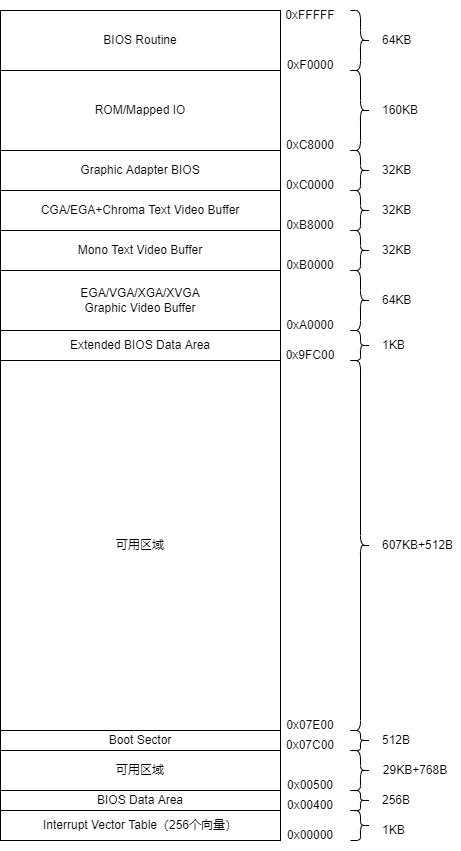

- [字符模式显卡驱动](#字符模式显卡驱动)
  - [显存数据结构](#显存数据结构)
  - [游标位置](#游标位置)
  - [写字符](#写字符)
- [参考资料](#参考资料)

# 字符模式显卡驱动

在物理内存低1MB地区，有显示适配器缓存的内存空间，可以直接通过改写缓存来改变显示内容。



所有在PC上工作的显卡，在加电初始化之后都会自动初始化到80*25的文本模式。上图中的`CGA/EGA+ Chroma Text Video Buffer`区域映射的就是工作在文本模式的显存。一些低版本显卡不支持彩色字符，只支持单色字符，其显存映射的区域就是`Mono Text Video Buffer`。

## 显存数据结构

在彩色文字显存区域，每2个字节表示屏幕上显示的一个字符。格式如下。


|   R   |   G   |   B   | 背景色，K=0闪烁 | 前景色I=0 | 前景色I=1 |
| :---: | :---: | :---: | :-------------: | :-------: | :-------: |
|   0   |   0   |   0   |       黑        |    黑     |    灰     |
|   0   |   0   |   1   |       蓝        |    蓝     |   浅蓝    |
|   0   |   1   |   0   |       绿        |    绿     |   浅绿    |
|   0   |   1   |   1   |       青        |    青     |   前青    |
|   1   |   0   |   0   |       红        |    红     |   浅红    |
|   1   |   0   |   1   |      品红       |   品红    |  浅品红   |
|   1   |   1   |   0   |       棕        |    棕     |    黄     |
|   1   |   1   |   1   |       白        |    白     |   亮白    |

## 游标位置

显示适配器会自动记录当前的游标位置，并将闪烁的游标展示在显示器上。下面展示了更新游标位置的代码。

```c
#define CGA_BASE 0x3D4

static uint16_t g_cursor_pos; // 当前游标的位置，等于行数*80+列数

void move_cursor()
{
    // 移动游标到新的位置
    outb(CGA_BASE, 14);
    outb(CGA_BASE + 1, g_cursor_pos >> 8);
    outb(CGA_BASE, 15);
    outb(CGA_BASE + 1, g_cursor_pos);
}
```

## 写字符

写字符直接修改显存就可以。重要的是怎么处理游标位置和滚动效果。

```c
#define CRT_ROWS 25
#define CRT_COLS 80
#define CRT_SIZE (CRT_ROWS * CRT_COLS)

static uint16_t g_cursor_pos; // 当前游标的位置，等于行数*80+列数
static uint16_t *g_crt_buf;   // 显存数组

static void cga_putc(int c)
{
    // 没有设置颜色的默认白字黑底
    if (!(c & ~0xFF))
    {
        c |= 0x0700;
    }

    switch (c & 0xff)
    {
    case '\b':
        if (g_cursor_pos > 0)
        {
            g_cursor_pos--;
            g_crt_buf[g_cursor_pos] = (c & ~0xff) | ' ';
        }
        break;
    case '\n':
        g_cursor_pos += CRT_COLS;
    case '\r':
        g_cursor_pos -= (g_cursor_pos % CRT_COLS);
        break;
    default:
        g_crt_buf[g_cursor_pos++] = c;
        break;
    }

    // 当超过一页，向后滚动一行
    if (g_cursor_pos >= CRT_SIZE)
    {
        memmove(g_crt_buf, g_crt_buf + CRT_COLS, (CRT_SIZE - CRT_COLS) * sizeof(uint16_t));
        for (int i = CRT_SIZE - CRT_COLS; i < CRT_SIZE; i++)
        {
            // 最后一行内容初始化为空格
            g_crt_buf[i] = 0x0700 | ' ';
        }
        g_cursor_pos -= CRT_COLS;
    }

    // 移动游标到新的位置
    move_cursor();
}
```


# 参考资料

- [hurlex <四> 字符模式下的显卡驱动](https://www.bilibili.com/read/cv4526043/)
