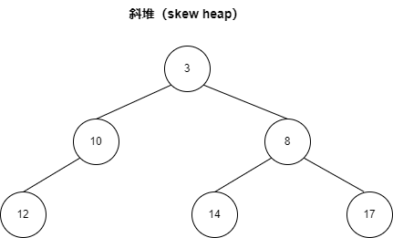

- [结构定义](#结构定义)
- [操作定义](#操作定义)
  - [合并](#合并)
  - [插入](#插入)
  - [删除](#删除)
- [复杂度分析](#复杂度分析)
- [代码示例](#代码示例)
- [参考资料](#参考资料)

# 结构定义

斜堆(skew heap)也叫自适应堆(self-adjusting heap)，它是左倾堆的一个变种。通常用来实现优先队列，支持插入，删除，合并操作，并且均摊复杂度都为$O(lgn)$。

斜堆在结构上没什么特殊要求，只需要是一颗二叉树，并且结点满足堆序即可。所谓堆序就是父结点的值小于等于儿子结点的值（最小堆），兄弟结点之间的大小没有约束。



# 操作定义

## 合并

斜堆的合并操作步骤如下：

1. 如果一个空斜堆与一个非空斜堆合并，返回非空斜堆。
2. 如果两个斜堆都非空，那么比较两个根结点，将较小的根结点的右孩子对应的子堆和另一个堆去合并，合并得到的新子堆的根结点作为新的右孩子。
3. **将当前根结点的左右孩子互换位置**。

最后一步很关键，简单地想一下，对于一个结点来说，合并的数据总是交替地插入自己的左边和右边，那么高度是不是就可以控制住了呢。

## 插入

插入一个结点就相当于合并只有一个结点的斜堆。

## 删除

移除一个结点，然后合并其左右子堆，用新堆的根结点替代自己即可。

# 复杂度分析

这里分析合并操作即可。下面将说明合并操作的均摊复杂度就是$O(lgn)$。

这里采用均摊分析来计算n次操作中，平均一次操作的均摊代价，首先需要定义一些概念：

- 假设一共要进行n次合并，但最终合并得到的斜堆最多包含n个结点，也就是最多有n个元素。
- 定义重结点（heavy）为右子堆结点数大于左子堆结点数的结点，否则为轻结点。
- 定义右路径为一直往右走的路径。
- 定义势能 $\Phi（i）$ 为第i次合并后，重结点的个数之和。显然初始势能$\Phi(0)<n$，最终势能$\Phi(n)<n$。最终势能减初始势能范围也在$(-n,n)$，最后计算的时候让它加上一个n保持大于0就行了。

考虑第i次合并过程，比如堆a，和堆b。它们右路径上轻、重点个数分别为$l_a$，$h_a$和$l_b$和$l_b$。那么这次合并的实际开销为

$$c_i=l_a+h_a+l_b+h_b$$

本次合并之后，在右路径上，一个重结点右儿子本来就比左儿子重，合并又发生在右儿子，交换后左儿子大于右儿子，所以合并后重结点一定会变轻结点。考虑最坏情况，所有轻结点都变成重结点。并且由于轻结点的性质，一条右路径上的轻结点的数量小于$lgn$。

所以本次合并过程的势能变化为

$$\Delta\Phi<l_a+l_b-h_a-h_b$$

均摊开销等于势能变化加上实际开销

$$\begin{align}
\hat c_i&=\Delta\Phi + c_i\notag \\
&<2(l_a+l_b)\notag \\
&<2lgn\notag \\
\end{align}$$

而n次的均摊开销为

$$\begin{align}
\sum_{i=1}^n c_i + \Phi(n)-\Phi(0) &= \sum_{i=1}^n \hat c_i \notag\\
\sum_{i=1}^n c_i + \Phi(n)-\Phi(0) &<2nlgn\notag \\
\sum_{i=1}^n c_i &<n+2nlgn\notag \\
\end{align}$$

最终平均下来也就是$O(lgn)$了。

# 代码示例

C语言代码示例。

```c
struct skew_heap_node
{
    int item;
    struct skew_heap_node *left;
    struct skew_heap_node *right;
};

struct skew_heap_node *skew_heap_merge(struct skew_heap_node *x, struct skew_heap_node *y)
{
    if (NULL == y)
    {
        return x;
    }
    else if (NULL == x)
    {
        return y;
    }

    if (x->item > y->item)
    {
        struct skew_heap_node *tmp = x;
        x = y;
        y = tmp;
    }

    struct skew_heap_node *r = x->right;
    x->right = x->left;
    x->left = skew_heap_merge(r, y);

    return x;
}

struct skew_heap_node *skew_heap_insert(struct skew_heap_node *x, struct skew_heap_node *y)
{
    return skew_heap_merge(x, y);
}

struct skew_heap_node *skew_heap_delete_min(struct skew_heap_node *x)
{
    return skew_heap_merge(x->left, x->right);
}

```

# 参考资料

- [斜堆学习笔记+复杂度证明](https://blog.csdn.net/luositing/article/details/108895514)
