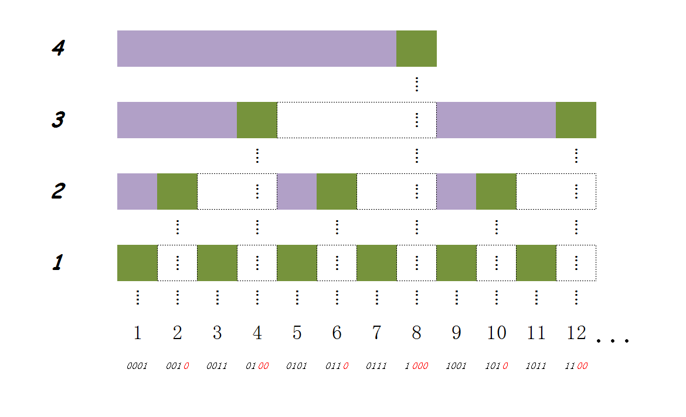

- [求区间和的问题](#求区间和的问题)
- [树状数组](#树状数组)
- [代码示例（go）](#代码示例go)
- [参考资料](#参考资料)

# 求区间和的问题

当前有一个包含n个元素的数组`arr[n]`，需要不断地修改其中某一元素的值，以及查询某一区间的和。

最为原始的做法就是直接修改值，然后遍历求和，那么修改的时间复杂度就是$O(1)$，查询的时间复杂度就是$O(n)$。

或者采用前缀和的形式，`arr[i]`记录的是0到i元素的和，这样查询区间和的复杂度就降为$O(1)$了，但是修改区间和的复杂度变为了$O(n)$。这样只适合查询很多，修改很少的场景。


# 树状数组

树状数组就是为了解决上面同时存在修改和查询的问题。树状数组用二进制的方式来划分区间，从而达到修改和查询的时间复杂度均为$O(lgn)$。

树状数组也是利用求前缀和的形式来算区间和，但是不是遍历求前缀和，而是将二进制划分的区间相加得到前缀和。

这里二进制的思想就是，对于任意一个数，其二进制表达都是0，1的序列，可以通过每一位上的1相加得到，比如

$$\begin{align}
6&=0110\notag \\
&=0100+0010\notag \\
\end{align}$$

要实现区间也能像二进制一样加起来，树状数组引入了`lowbit`函数，`lowbit(i)`取`i`中最低的为1的二进制位。然后规定`arr[i]`表示从第i个元素往前数`lowbit(i)`个元素得到一个区间。



这样一来，要求任意的前缀和，只要不断地计算`i = i - lowbit(i)`，直到`i == 0`就行了。这里执行的次数，就是i的二进制表示中1的数量，所以复杂度为$O(lgn)$。

对于修改某一元素，例如对于元素`arr[i]`，其直接父层可以通过计算`i = i + lowbit(i)`计算得到，不断找影响到的父层，直到`i > n`就行了。所以复杂度也为$O(lgn)$。

# 代码示例（go）

```go
package main

import "fmt"

func lowbit(x int) int {
	return x & -x
}

// 将arr[idx]的值加上val
func add(arr []int, idx, val int) {
	idx++
	for idx <= len(arr) {
		arr[idx-1] += val
		idx += lowbit(idx)
	}
}

// 求[0,idx]的前缀和
func prefixSum(arr []int, idx int) int {
	var ans int
	idx++
	for idx != 0 {
		ans += arr[idx-1]
		idx -= lowbit(idx)
	}
	return ans
}

// 求[i,j]的区间和
func intervalSum(arr []int, i, j int) int {
	return prefixSum(arr, j) - prefixSum(arr, i-1)
}

// 在原数组上初始化树状数组
func initBIT(arr []int) {
	for i := len(arr) - 2; i >= 0; i-- {
		val := arr[i]
		arr[i] = 0
		add(arr, i, val)
	}
}

func main() {
	arr := []int{4, 2, 7, 5, 9, 1, 0, 3}
	initBIT(arr)
	for i := 0; i < len(arr); i++ {
		fmt.Println(prefixSum(arr, i))
	}
	for i := 0; i < len(arr); i++ {
		for j := i + 1; j < len(arr); j++ {
			fmt.Println(i, j, intervalSum(arr, i, j))
		}
	}
}
```

# 参考资料

- [树状数组简单易懂的详解](https://blog.csdn.net/FlushHip/article/details/79165701)
