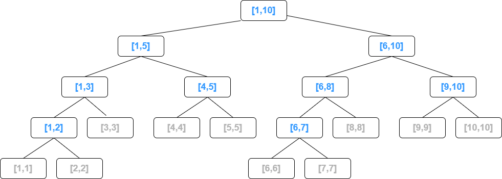

- [还是区间求和问题](#还是区间求和问题)
- [线段树](#线段树)
  - [时间复杂度](#时间复杂度)
  - [建树](#建树)
  - [查询区间](#查询区间)
  - [更新区间](#更新区间)
- [参开资料](#参开资料)

# 还是区间求和问题

对于单点修改，区间求和问题，我们可以用树状数组很好地解决。但是如果需要对区间进行修改（统一加上一个值），然后区间求和这种问题，那么就需要线段树了。

# 线段树

线段树是一颗二叉树（近似于完全二叉树），线段树的每一个节点都对应一个区间`[L,R]`，然后将该区间平分，分别作为左儿子和右耳子节点，直到区间变为一个点`L == R`，这时就变为一个叶子节点。



## 时间复杂度

显然线段树的高度为$O(lgn)$。对于区间查询操作，只需要从根节点开始查，不断划分下去，直到当前节点的范围满足当前的查询划分，最后总结起来就可以了。对于这一操作，可以粗略地证明时间复杂度是$O(lgn)$。

因为对于每一层的节点，如果连续的区间被选中，并且他们的父节点相同那么会合并为对父节点的查询，最终每一层最多有两个节点被选中。

然后就是对于区间的修改，这里需要用到懒操作，也是像查询区间一样，并不会细分到叶节点，然后只更新选中的区间对应的节点的值，并将修改值累计到该节点的懒操作缓存值中，只有从一个节点向其子节点继续操作的时候才将该懒操作的缓存值更新到选中的子节点。这样一来复杂度就和区间查询一样了，也为$O(lgn)$。

## 建树

可以用一个数组来保存线段树，在这个数组中左儿子下标为父节点下标的2倍，右儿子再加1，就和二叉堆一样。

并且数组的大小需要设置为区间范围的4倍。这个可以自己大概算一下，比如整个区间大小为$2^n+1$，那么一共需要$2^{n+2}+3$个空间存储节点，非常接近4倍。

```go
type SegTreeNode struct {
	left     int
	right    int
	sum      int
	delayVal int
}

type SegTree struct {
	nodeTree []SegTreeNode
	nums     []int
}

func leftChild(node int) int {
	return node << 1
}

func rightChild(node int) int {
	return (node << 1) + 1
}

func (st *SegTree) createST(nums []int) {
	st.nodeTree = make([]SegTreeNode, len(nums)*4)
	st.nums = nums
}

func (st *SegTree) buildST(left, right, node int) int {
	st.nodeTree[node].left = left
	st.nodeTree[node].right = right

	if left == right {
		// 叶子节点
		st.nodeTree[node].sum = st.nums[left]
		return st.nodeTree[node].sum
	}

	mid := (right-left+1)/2 + left

	st.nodeTree[node].sum = st.buildST(left, mid-1, leftChild(node)) + st.buildST(mid, right, rightChild(node))

	return st.nodeTree[node].sum
}

func main() {
	nums := []int{2, 4, 1, 5, 8}
	st := &SegTree{}
	st.createST(nums)
	st.buildST(0, len(nums)-1, 1)

}
```

## 查询区间

```go
// 懒更新到下一层子节点
func (st *SegTree) pushDown(node int) {
	if st.nodeTree[node].delayVal != 0 {
		leftIntervalLen := st.nodeTree[leftChild(node)].right - st.nodeTree[leftChild(node)].left + 1
		st.nodeTree[leftChild(node)].sum += st.nodeTree[node].delayVal * leftIntervalLen
		st.nodeTree[leftChild(node)].delayVal += st.nodeTree[node].delayVal
		rightIntervalLen := st.nodeTree[rightChild(node)].right - st.nodeTree[rightChild(node)].left + 1
		st.nodeTree[rightChild(node)].sum += st.nodeTree[node].delayVal * rightIntervalLen
		st.nodeTree[rightChild(node)].delayVal += st.nodeTree[node].delayVal

		st.nodeTree[node].delayVal = 0
	}
}

func (st *SegTree) intervalSum(l, r, node int) int {
	if st.nodeTree[node].left == l && st.nodeTree[node].right == r {
		return st.nodeTree[node].sum
	}

	st.pushDown(node)

	mid := (st.nodeTree[node].right-st.nodeTree[node].left+1)/2 + st.nodeTree[node].left

	if mid <= l {
		return st.intervalSum(l, r, rightChild(node))
	} else if mid > r {
		return st.intervalSum(l, r, leftChild(node))
	} else {
		return st.intervalSum(l, mid-1, leftChild(node)) + st.intervalSum(mid, r, rightChild(node))
	}
}
```

## 更新区间

```go

func (st *SegTree) intervalAdd(l, r, val, node int) int {
	if st.nodeTree[node].left == l && st.nodeTree[node].right == r {
		st.nodeTree[node].sum += val * (r - l + 1)
		st.nodeTree[node].delayVal = val
		return val * (r - l + 1)
	}

	st.pushDown(node)

	mid := (st.nodeTree[node].right-st.nodeTree[node].left+1)/2 + st.nodeTree[node].left

	var total int
	if mid <= l {
		total = st.intervalAdd(l, r, val, rightChild(node))
	} else if mid > r {
		total = st.intervalAdd(l, r, val, leftChild(node))
	} else {
		total = st.intervalAdd(l, mid-1, val, leftChild(node)) + st.intervalAdd(mid, r, val, rightChild(node))
	}
	st.nodeTree[node].sum += total
	return total
}
```


# 参开资料

- [线段树详解 （原理，实现与应用）](https://blog.csdn.net/zearot/article/details/48299459)
