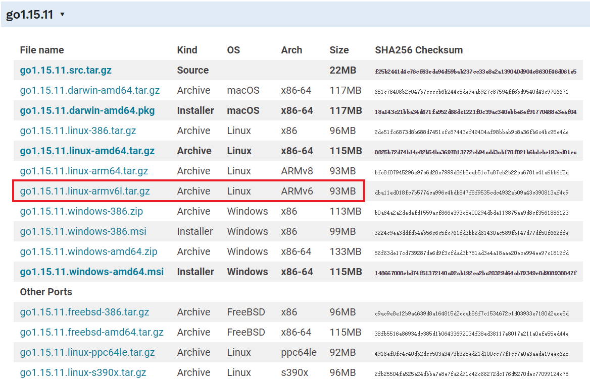

# 树莓派安装golang

到[官网](https://golang.google.cn)下载安装包：



解压压缩包：

```sh
rm -rf /usr/local/go && tar -C /usr/local -xzf go1.15.11.linux-armv6l.tar.gz
```

设置环境变量：

```go
export PATH=$PATH:/usr/local/go/bin
export GOROOT=/usr/local/go
export GOPATH=/home/pi/go
```

查看是否安装成功：

```go
pi@raspberrypi:~ $ go version
go version go1.15.11 linux/arm
```
