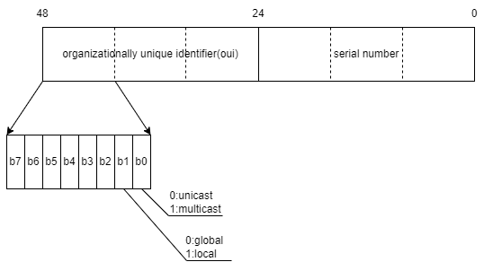

- [MAC地址](#mac地址)
  - [MAC地址格式](#mac地址格式)
  - [查看MAC地址](#查看mac地址)
  - [修改MAC地址](#修改mac地址)
- [参考资料](#参考资料)

# MAC地址

MAC地址（Media Access Control），即媒介访问控制地址，在不同的使用场景下有不同的别名，比如局域网地址（LAN Address）,以太网地址（Ethernet Address），物理地址（Physical Address），硬件地址（Hardware Address）等。

MAC地址作用于数据链路层，用来在局域网中唯一标识一个网络设备接口。网络设备制造商在生产时会根据规则将全球唯一的MAC地址烧录到硬件中。

## MAC地址格式

MAC地址的长度为6字节，48比特。除去组播的，本地的MAC地址，差不多还有70万亿个地址可以使用，随便用。

MAC地址一般用冒分十六进制表示，比如`58:A0:23:27:B6:31`。6字节长的MAC地址可以划分为两部分，前3字节为oui（organizationally unique identifier），为IEEE的注册管理机构统一分配（出售）给各个网络设备生产商的编码。后3字节就由拥有该oui的厂家自己分配了。每一个oui可以对应1400w+的MAC地址，大公司往往拥有成百上千个oui，比如去[oui与厂商对应表](https://standards-oui.ieee.org/oui/oui.txt)搜索一下huawei就可以得到上千条结果。



MAC地址的第1个字节中还有两个标志位，`b0`位表示单播地址还是组播地址（unicast/multicast），`b1`位表示全局地址还是本地地址（global/local）。

广播MAC地址`ff:ff:ff:ff:ff:ff`算是特殊的组播地址。本地MAC地址一般用于系统随机生成MAC地址。

## 查看MAC地址

环境为centos7，可以使用`ip link`查看网络设备的信息，其中包括了MAC地址。

```bash
[rc@localhost work]$ ip link
1: lo: <LOOPBACK,UP,LOWER_UP> mtu 65536 qdisc noqueue state UNKNOWN mode DEFAULT group default qlen 1000
    link/loopback 00:00:00:00:00:00 brd 00:00:00:00:00:00
2: ens33: <BROADCAST,MULTICAST,UP,LOWER_UP> mtu 1500 qdisc pfifo_fast state UP mode DEFAULT group default qlen 1000
    link/ether 00:0c:29:26:36:6b brd ff:ff:ff:ff:ff:ff
```

里面的`link/ether`后面跟的就是MAC地址。

## 修改MAC地址

在一些场景，比如不希望暴露自己的真实MAC地址，或者MAC地址被网络管理员限制了。那么可以手动去修改MAC地址。只需要保证你的MAC地址在局域网内唯一就行。

可以用`ip link set DEVICE address LLADDR`命令临时修改网卡的MAC地址，这里我们将`ens33`网卡的MAC地址最后一位由`6b`改为`6c`。

```bash
[rc@localhost ~]$ ip link show ens33
2: ens33: <BROADCAST,MULTICAST,UP,LOWER_UP> mtu 1500 qdisc pfifo_fast state UP mode DEFAULT group default qlen 1000
    link/ether 00:0c:29:26:36:6b brd ff:ff:ff:ff:ff:ff
[rc@localhost ~]$ sudo ip link set ens33 address "00:0c:29:26:36:6c"
[sudo] rc 的密码：
[rc@localhost ~]$ ip link show ens33
2: ens33: <BROADCAST,MULTICAST,UP,LOWER_UP> mtu 1500 qdisc pfifo_fast state UP mode DEFAULT group default qlen 1000
    link/ether 00:0c:29:26:36:6c brd ff:ff:ff:ff:ff:ff
```

这一修改是临时的，只要系统重启，或者网卡重启就恢复原来的MAC地址了（重启网卡要注意啊，关闭网卡远程连接就断了~）。可以用重启网络服务的形式，内核还会保留网络栈，这里重启网络服务后MAC地址又复原了。

```bash
[rc@localhost ~]$ ip link show ens33
2: ens33: <BROADCAST,MULTICAST,UP,LOWER_UP> mtu 1500 qdisc pfifo_fast state UP mode DEFAULT group default qlen 1000
    link/ether 00:0c:29:26:36:6c brd ff:ff:ff:ff:ff:ff
[rc@localhost ~]$ sudo systemctl restart network
[rc@localhost ~]$ ip link show ens33
2: ens33: <BROADCAST,MULTICAST,UP,LOWER_UP> mtu 1500 qdisc pfifo_fast state UP mode DEFAULT group default qlen 1000
    link/ether 00:0c:29:26:36:6b brd ff:ff:ff:ff:ff:ff
```

# 参考资料

- [MAC地址-百度百科](https://baike.baidu.com/item/MAC%E5%9C%B0%E5%9D%80/1254181?fr=aladdin)
- [MAC地址介绍](https://www.bilibili.com/read/cv14378174/)
