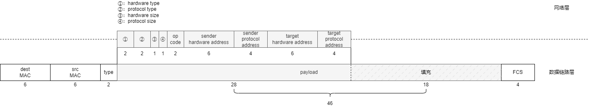
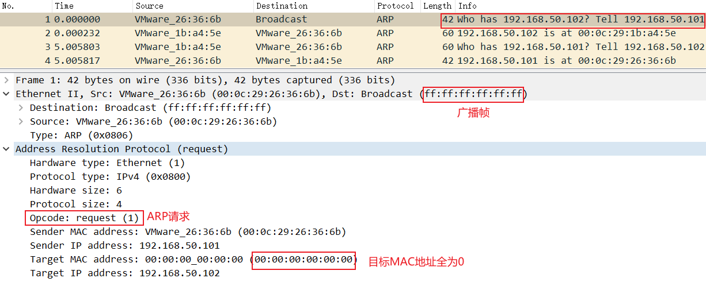

- [ARP协议](#arp协议)
- [ARP报文格式](#arp报文格式)
- [ARP协议流程](#arp协议流程)
  - [查询arp缓存](#查询arp缓存)
  - [广播ARP请求报文](#广播arp请求报文)
  - [单播ARP响应报文](#单播arp响应报文)
  - [完成IP报文的发送](#完成ip报文的发送)
  - [为什么有的arp请求报文不是广播](#为什么有的arp请求报文不是广播)
- [参考链接](#参考链接)

# ARP协议

ARP（Address Resolution Protocol）地址解析协议，用于实现从IP地址到MAC地址的映射，可以根据对方的IP地址查询到对方的MAC地址。
整个ARP协议交互过程仅需要两个包，一问一答即可搞定。

# ARP报文格式



- **硬件类型**：arp底层使用的物理网络协议，1代表以太网协议。
- **协议类型**：arp上层使用的网络协议，0x0800代表IPv4。
- **硬件长度**：物理地址（MAC）的长度，以字节为单位，对于以太网地址为6。
- **协议长度**：逻辑地址（IP）的长度，以字节为单位，对于IPv4为4。
- **操作码**：用来定义报文的类型，ARP请求（1），ARP响应（2）。
- **源硬件地址**：发送方的物理地址。
- **源逻辑地址**：发送方的逻辑地址。
- **目的硬件地址**：目标的物理地址。
- **目的逻辑地址**：目标的逻辑地址。

# ARP协议流程

## 查询arp缓存

当主机A向本局域网中的主机B发送IP报文的时候，会先根据主机B的IP去自己的arp缓存表中查询B对应的MAX地址。这里假设主机A的IP为`192.168.136.128`，主机B的IP为`192.168.136.129`。下面是主机A的arp缓存表。

```bash
rc@rc-virtual-machine:~$ ip neigh 
192.168.136.129 dev ens33 lladdr 00:0c:29:1b:38:de STALE
192.168.136.2 dev ens33 lladdr 00:50:56:e1:08:33 REACHABLE
```

这里如果查询到有主机B的IP对应的arp缓存，那么就直接把对应的MAC地址填写到以太帧的目的地址中。如果arp缓存中没有那就进入后续的步骤。

## 广播ARP请求报文

为了模拟arp缓存表找不到主机B，可以手动删除一下arp缓存。

```bash
rc@rc-virtual-machine:~$ ip neigh 
192.168.136.129 dev ens33 lladdr 00:0c:29:1b:38:de STALE
192.168.136.2 dev ens33 lladdr 00:50:56:e1:08:33 REACHABLE
rc@rc-virtual-machine:~$ sudo ip neigh del 192.168.136.129 dev ens33
rc@rc-virtual-machine:~$ ip neigh 
192.168.136.2 dev ens33 lladdr 00:50:56:e1:08:33 REACHABLE
```

当arp缓存表中找不到主机B对应的MAC地址的时候，那么主机A就主动发出ARP请求报文，广播的主要内容是：“我的IP地址是IP_A，我的硬件地址是MAC_A，我要知道IP地址为IP_B的主机的硬件地址”。
可以用tcpdump命令抓包，然后通过wireshark可视化查看arp请求包。

```bash
sudo tcpdump -i ens33 arp -vv -U -w - | tee arp.pcap | tcpdump -r -
```

这里MAC地址为`Vmware_xx:xx:xx`，是因为MAC地址的前三个字节代表`organization unique identifier(oui)`，表示生产该物理设备的厂商标志符。由于我是在Vmware中的虚拟机做的实验，所以Vmware生成的MAC地址被识别出来了。oui表单可以查看这里[http://standards-oui.ieee.org/oui/oui.txt](http://standards-oui.ieee.org/oui/oui.txt)。



## 单播ARP响应报文

主机B在接受到ARP请求报文之后，发现对方找的是自己，就回复主机A自己的IP和MAC地址信息：“我的IP是IP_B，我的硬件地址是MAC_B”。


## 完成IP报文的发送

主机A接收到ARP响应报文，得知了主机B的MAC地址，用主机B的MAC地址填充号以太帧之后就可以正常发送IP报文了，并更新本地ARP缓存表。

## 为什么有的arp请求报文不是广播

这其实是arp缓存条目刷新机制，定时向arp缓存条目中的主机发送单播的arp请求。这其实是为了减轻网络负担。


# 参考链接

- [oui unknown中的oui是什么？](https://blog.csdn.net/lineuman/article/details/119010896)
- [为什么我抓到的ARP请求包是个单播包呢？](https://www.zhihu.com/question/55518131/answer/906406302)
