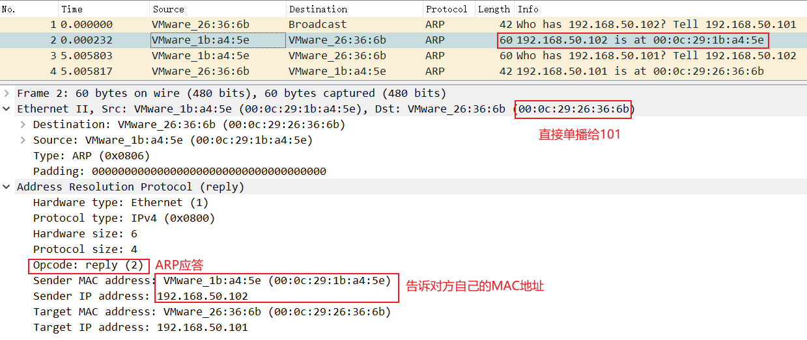
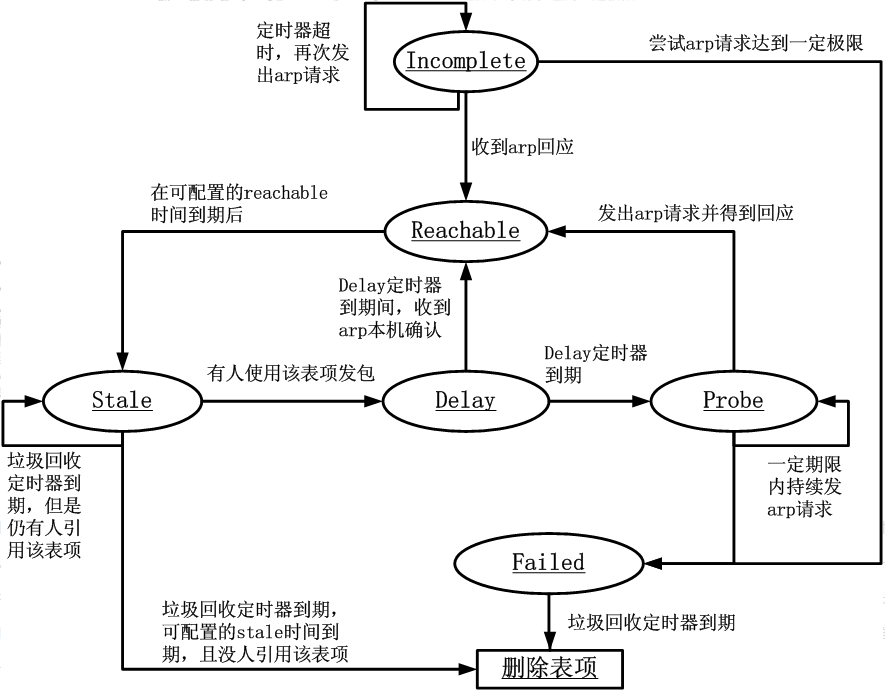

- [ARP协议](#arp协议)
  - [ARP分组格式](#arp分组格式)
  - [ARP请求和ARP应答](#arp请求和arp应答)
  - [ARP缓存表](#arp缓存表)
  - [为什么有很多ARP请求不是广播帧](#为什么有很多arp请求不是广播帧)
  - [免费ARP](#免费arp)
- [参考资料](#参考资料)

# ARP协议

ARP（Address Resolution Protocol）地址解析协议，用来在局域网中查询拥有某一IP地址的设备的MAC地址。因为只有知晓了MAC地址，才能将数据通过二层网络在局域网中传递给指定设备。

ARP协议的使用场景。

- **两通信主机在同一网段**：源主机知道目的主机的IP地址，但不知道目的主机的MAC地址。那么直接在局域网广播ARP请求，询问谁拥有目的主机的IP。目的主机在收到ARP请求后，就给源主机发送ARP应答，ARP应答里就写好了目的主机的MAC地址。接下来就是源主机直接把目的主机的MAC地址填上就可以顺利发送数据了。
- **通信主机不在同一网段**：源主机要将IP分组转发给网关，让网关去路由到其它网络。所以这里的流程就是源主机在局域网广播ARP请求，询问谁拥有网关的IP。接下来的流程就和上面一样了。

## ARP分组格式


在承载ARP协议分组的时候，以太帧中的`type`值为`0x0806`。并且由于以太帧最小长度为64字节，一个ARP分组填不满以太帧的载荷数据字段，所以需要填充数据。

ARP分组中的字段为。

- `hardware type`：硬件类型，也就是数据链路层协议，这里为Ethernet，值为1。
- `protocol type`：协议类型，也就是网络层协议，这里为IP，值为`0x0800`。
- `hardware size`：硬件长度，也就是MAC地址的长度，为6。
- `protocol size`：协议长度，也就是IP地址的长度，为4。
- `opcode`：操作码，可以为ARP请求（1），ARP应答（2），RARP请求（3），RARP应答（4）。
- `sender hardware address`：发送方硬件地址（MAC地址）。
- `sender protocol address`：发送方协议地址（IP地址）。
- `target hardware address`：目标硬件地址（MAC地址）。
- `target protocol address`：目标协议地址（IP地址）。

## ARP请求和ARP应答

ARP请求是广播的形式发出的，所以在以太帧中，目的MAC地址为`ff:ff:ff:ff:ff:ff`。

在ARP请求分组中，会填好发送方的MAC地址和IP地址，以及目标IP地址，但是此时目标的MAC地址还是未知的，所以全部填0。

这里我们来抓取一下ARP的包，假设有两台同网段的机器，IP分别是`192.168.50.101`和`192.168.50.102`。

首先到101机器上清空一下ARP缓存表。

```bash
[root@localhost ~]# ip neigh
192.168.50.102 dev ens33 lladdr 00:0c:29:1b:a4:5e STALE
192.168.50.1 dev ens33 lladdr 00:50:56:c0:00:08 DELAY
192.168.50.2 dev ens33 lladdr 00:50:56:e4:66:e2 STALE
[root@localhost ~]# ip neigh flush dev ens33
[root@localhost ~]# ip neigh
192.168.50.1 dev ens33 lladdr 00:50:56:c0:00:08 REACHABLE
[root@localhost ~]#
```

然后在101机器`ping`一下102机器。这样就会触发101给102发ARP请求。这时候再用`tcpdump`抓一下包，并保存到文件中，以便后续用wireshark分析。

```bash
# 一定要加-U参数，不然抓的包全在缓存里，显示不出来
[root@localhost ~]# tcpdump -i ens33 arp host 192.168.50.102 -U -w - | tee arp.cap | tcpdump -n -e -r -
tcpdump: listening on ens33, link-type EN10MB (Ethernet), capture size 262144 bytes
reading from file -, link-type EN10MB (Ethernet)
23:37:12.017160 00:0c:29:26:36:6b > Broadcast, ethertype ARP (0x0806), length 42: Request who-has 192.168.50.102 tell 192.168.50.101, length 28
23:37:12.017392 00:0c:29:1b:a4:5e > 00:0c:29:26:36:6b, ethertype ARP (0x0806), length 60: Reply 192.168.50.102 is-at 00:0c:29:1b:a4:5e, length 46
23:37:17.022963 00:0c:29:1b:a4:5e > 00:0c:29:26:36:6b, ethertype ARP (0x0806), length 60: Request who-has 192.168.50.101 tell 192.168.50.102, length 46
23:37:17.022977 00:0c:29:26:36:6b > 00:0c:29:1b:a4:5e, ethertype ARP (0x0806), length 42: Reply 192.168.50.101 is-at 00:0c:29:26:36:6b, length 28
```

把文件拿出来，用wireshark打开看更直观。


再来看ARP应答，102用单播的方式直接告诉101自己的MAC地址。



## ARP缓存表

ARP高效运行的关键是维护一个本地的ARP缓存表，里面可以保存动态学习到的IP与MAC映射关系，也可以保存静态手动配置的映射关系。

可以通过`ip neigh`命令查看ARP缓存表，常见的状态为`REACHABLE`可达的，`STALE`老化的，`PERMANENT`手动配置永久的，`DELAY`延迟删除的，`INCOMPLETE`发送了ARP请求还没收到回复的。

```bash
[root@localhost ~]# ip neigh
192.168.50.102 dev ens33 lladdr 00:0c:29:1b:a4:5e REACHABLE
192.168.50.1 dev ens33 lladdr 00:50:56:c0:00:08 REACHABLE
192.168.50.2 dev ens33 lladdr 00:50:56:e4:66:e2 STALE
```

## 为什么有很多ARP请求不是广播帧


ARP缓存表在删除过期的条目的时候，会尝试发送一个单播ARP请求到表中记录的MAC地址处，如果短时间内没有回复再删除，如果回复了就更新状态。

还有就是当ARP缓存处于`STALE`状态时，如果某一条目被使用，那么状态会更新为`DELAY`，同时发送单播ARP请求到该条目指定的MAC地址处，如果对方回复了，那么直接更新为`REACHABLE`，从而很大程度降低了广播的次数。

下图就展示了linux内核代码中对ARP缓存状态转移的优化设计。



## 免费ARP

其实翻译为无偿ARP（Gratuitous ARP）比较好。它和普通的ARP请求一样是广播帧，但是字段里面发送方和目的的IP和MAC地址都是自己。作用就是通知全局域网，自己的IP和MAC地址映射关系。当有人应答免费ARP就说明有IP冲突了。

当设备接口的协议状态变为`up`时可能发送免费ARP。路由器也可能定期发送免费ARP。

# 参考资料

- [Linux实现的ARP缓存老化时间原理解析](https://blog.csdn.net/younger_china/article/details/79216211)
- [有些arp请求报文中为什么会有目的mac地址](https://blog.csdn.net/digong5325/article/details/101968546)
- [免费ARP](https://www.cnblogs.com/lipx9527/p/9438024.html)
