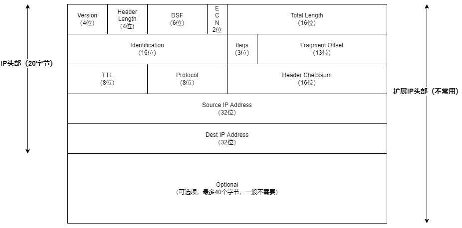

- [ip协议](#ip协议)
  - [ipv4](#ipv4)
    - [头部结构](#头部结构)
- [参考资料](#参考资料)

# ip协议

ip是tcp/ip协议族中的核心协议。工作在网络层，给上面的icmp，igmp，tcp，udp协议提供服务。ip提供了一种尽力而为，无连接的数据报交付服务。

ipv4使用32位bit来表示一个地址，最多只有40多亿个地址，现在越来越不够用了。所以提出ipv6，使用128位地址来表示地址，给每一粒沙子单独编址都够了。

## ipv4

### 头部结构

- Version：ip协议的版本，ipv4的值为4。
- Header Length：ip头部的长度，单位为4字节，所以最大表示60字节（基本ip头部20字节+扩展选项40字节）。
- DSF（Differentiated Services Field）：区分服务字段，用于为不同的IP数据包定义不同的服务质量，一般应用在QoS技术中。
- ECN（Explicit Congestion Notification）：显式拥塞通知。
- Total Length：ip报文整体长度，包括ip头部和数据，最大65535字节。
- Identification：标识字段，发送主机通常在每次发送数据报时都将一个内部计数器加1，该值就赋值给标识字段，用来实现ip分片功能。
- flags：用来确认是否还有IP分片或是否能执行分片。第1位没有使用。第2位表示不分片（DF），设置该位后，如果路由器发现ip报文超过MTU只能丢弃该ip报文并发送控制信息。第3位表示更多分片，为0表示自己就是最后一个分片了。
- Fragment Offset：分片的偏移量，该分片的数据在原本的ip报文中的偏移值。
- TTL（Time To Live）：用于表示一个ip报文可经过的路由器数量的上限。当这个数减到0时，路由器就丢弃该报文，并使用ICMP消息通知发送方。
- Protocol：上层协议，ICMP协议号为1，TCP协议号为6，UDP的协议号为17。
- Header Checksum：头部数据校验和，ip协议只校验头部数据，对载荷数据不校验，交给上层自己去做。

# 参考资料

- [IP数据包结构](https://www.cnblogs.com/sbkill1r/p/13723422.html)
