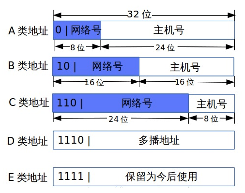

- [IPv4地址](#ipv4地址)
  - [IPv4地址结构](#ipv4地址结构)
  - [特殊IPv4地址](#特殊ipv4地址)
  - [私有IPv4地址](#私有ipv4地址)
  - [无类域间路由（Classless Inter-Domain Routing CIDR）](#无类域间路由classless-inter-domain-routing-cidr)
- [网络端口](#网络端口)
  - [常见知名端口](#常见知名端口)

# IPv4地址

IPv4地址大小为4个字节，用点分十进制表示法可以表达范围`0.0.0.0`到`255.255.255.255`的地址，大约为42.95亿个地址。互联网编号分配机构（IANA，Internet Assigned Numbers Authority）负责分配和规划IP地址，以及对TCP/UDP公共服务的端口进行定义。

## IPv4地址结构

IP地址由网络号+主机号组成，分别表示设备所处的网络和设备在该网络中的主机编号。最初，IPv4地址空间分为5大类。

| 类别 | 范围 | 说明 |
| :--: | :--: | :--: |
| A类地址 | 0.x.x.x-127.x.x.x | 用于少量的大型网络，第一个字节的最高位固定为0 |
| B类地址 | 128.0.x.x-191.255.x.x | 用于中等规模的网络，第一个字节的最高2比特固定为10 |
| C类地址 | 192.0.0.x-223.255.255.x | 用于小规模的网络，第一个字节的最高3比特固定为110 |
| D类地址 | 224.0.0.0-239.255.255.255 | D类地址又称为组播地址，每个地址对应一个组，发往某一组播地址的数据将被该组中的所有成员接收，D类地址不能分配给主机 |
| E类地址 | 240.0.0.0-255.255.255.254 | 为保留地址，可以用于实验目的|

## 特殊IPv4地址

在每个网络中都存在两个特殊的地址不能给主机使用。

- **网络地址**：主机号全0，表示该网络的网络地址。
- **广播地址**：主机号全1，表示该网络的直接广播地址。

与DHCP协议相关的特殊地址。

- **`0.0.0.0`**：主机刚启动的时候发送DHCP报文想找服务器分配IP之前，不知道自己的IP地址，就可以用`0.0.0.0`来表示不知道自己是谁。
- **受限广播地址（`255.255.255.255`）**：在本地局域网广播，并且广播时受限的，路由器不会转发目的地址为`255.255.255.255`的报文。
- **`169.254.x.x`**：如果你的IP地址是自动获取IP地址，而你在网络上又没有找到可用的DHCP服务器。就会得到其中一个IP。

环回地址。

- **环回地址**：A类网络地址`127.x.x.x`被用作环回地址。习惯上采用`127.0.0.1`作为环回地址，命名为localhost。

## 私有IPv4地址

在一般的私有网络中，可以直接分配私有ip地址，私有ip地址在互联网上不是全局唯一的，只能在私网内寻址。

- **A类地址**：10.x.x.x
- **B类地址**：172.16.x.x-172.31.x.x
- **C类地址**：192.168.0.x-192.168.255.x

## 无类域间路由（Classless Inter-Domain Routing CIDR）

最初的IPv4地址是分为A,B,C类的，但是在实际使用中有很大的问题。分配一个A类网络可容纳1677万台主机，显得太多，C类网络只容纳254台主机，又显得特少。很多时候C类网络就够用了，但是C类网络多了，由于地域太分散不好聚合路由又导致路由信息大量增加。
无类域间路由不再对IP地址进行分类，而是采用可变长子网掩码（VLSM)来进行任意长度的前缀的网络分配。比如`192.168.0.2/16`就是表明网络号占前16位。

# 网络端口

- **知名端口（Well-Known Ports）**：0~1023，在Linux、UNIX平台均需要root权限才能监听这些端口。
- **注册端口（Registered Ports）**：BSD使用的监听端口范围是1024到4999。IANA建议49152至65535作为“监听端口”。许多Linux内核使用32768至61000范围。 配置文件`/proc/sys/net/ipv4/ip_local_port_range`有当前系统设定。
- **动态端口（Dynamic Ports）**：也就是临时端口。通常被用来在主动发起连接时随机分配使用，在任何特定的TCP连接外不具有任何意义。除去上述著名端口、监听端口两种端口号，剩下的端口都是备用的动态端口。所以在某些特殊用途的需要主动发起大量连接的服务器上（例如：爬虫、代理）， 需要调整 `/proc/sys/net/ipv4/ip_local_port_range`的数值，来保留更多的动态端口以供使用。

## 常见知名端口

| 默认端口号 | 服务名 | 说明 | 传输层协议 |
| :--: | :--: | :--: | :--: |
| 80 | http | http服务默认端口 | tcp |
| 443 | https | https服务默认端口 | tcp |
